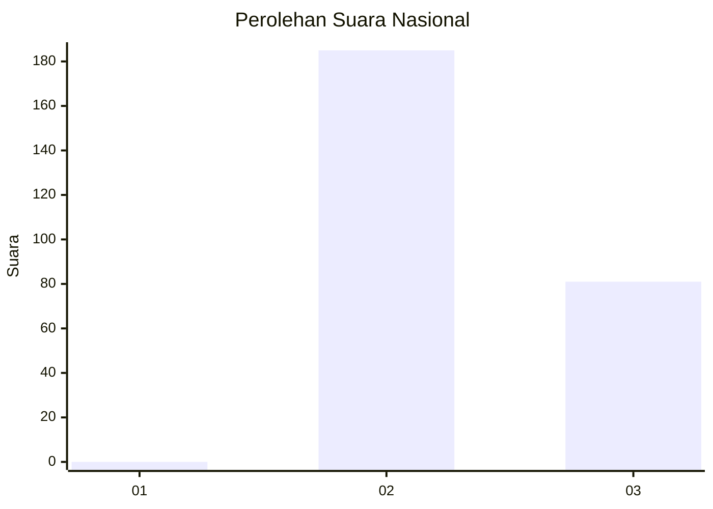
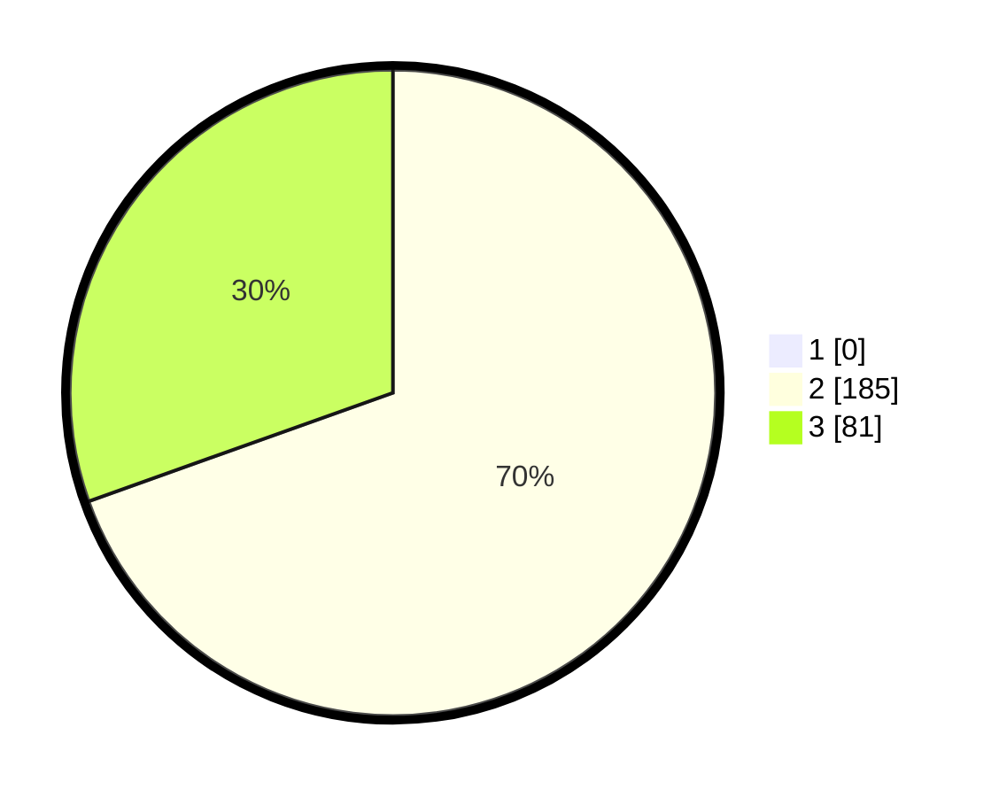

# Hasil

## Grafik

## Tabel

| No. | Nama Paslon    | Suara | Suara (raw) | Persentase |
|:--- |:-------------- | -----:| -----------:| ----------:|
| 1   | ANIES MUHAIMIN | 0     | [0][p-1]    | 0,00       |
| 2   | PRABOWO GIBRAN | 185   | [185][p-2]  | 69,55      |
| 3   | GANJAR MAHFUD  | 81    | [81][p-3]   | 30,45      |

[p-1]: https://github.com/gigit-pemilu/pemilu-2024/blob/main/pilpres/hitung-suara/sub/51-bali/sub/04-gianyar/sub/04-tampaksiring/sub/2002-sanding/sub/011-tps/sub/paslon-1.txt
[p-2]: https://github.com/gigit-pemilu/pemilu-2024/blob/main/pilpres/hitung-suara/sub/51-bali/sub/04-gianyar/sub/04-tampaksiring/sub/2002-sanding/sub/011-tps/sub/paslon-2.txt
[p-3]: https://github.com/gigit-pemilu/pemilu-2024/blob/main/pilpres/hitung-suara/sub/51-bali/sub/04-gianyar/sub/04-tampaksiring/sub/2002-sanding/sub/011-tps/sub/paslon-3.txt

## Foto C Plano

https://sirekap-obj-formc.kpu.go.id/f315/pemilu/ppwp/51/04/04/20/02/5104042002011-20240215-210320--723296ce-994a-4f13-9163-334c45198bd2.jpg

https://sirekap-obj-formc.kpu.go.id/f315/pemilu/ppwp/51/04/04/20/02/5104042002011-20240215-210333--570db873-4b38-4eac-ae78-7e9970ae66be.jpg

https://sirekap-obj-formc.kpu.go.id/f315/pemilu/ppwp/51/04/04/20/02/5104042002011-20240215-210338--255e50a9-4471-41ea-8c26-e1b461651db9.jpg

## Metadata

| Key        | Value               |
| ---------- | ------------------- |
| Time Stamp | 2024-02-16 12:51:22 |

