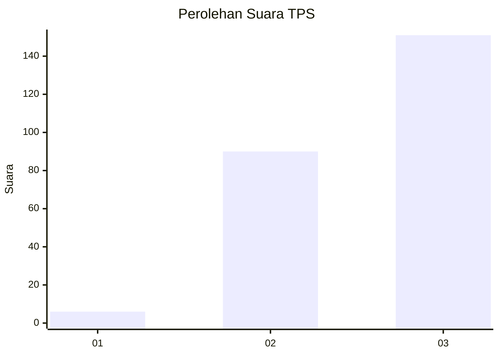
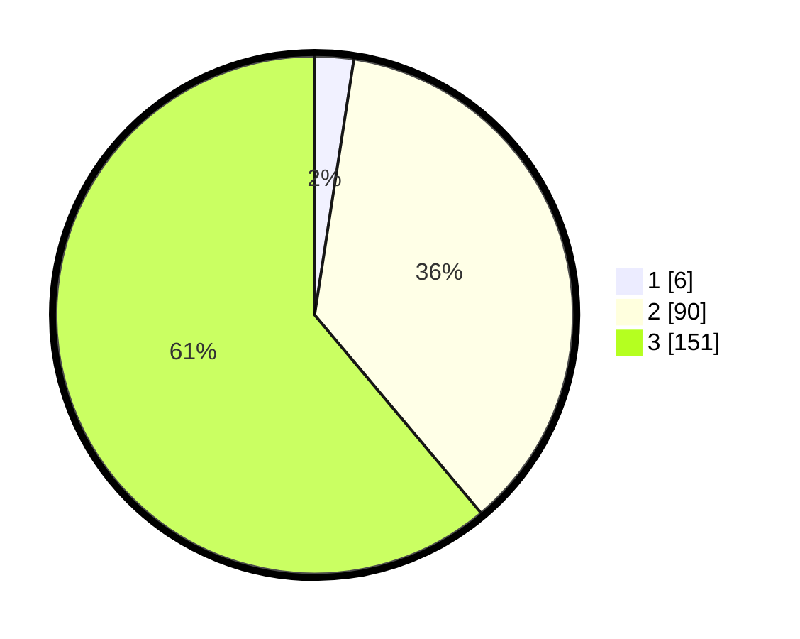

# Hasil

## Grafik

## Tabel

| No. | Nama Paslon    | Suara | Suara (raw) | Persentase |
|:--- |:-------------- | -----:| -----------:| ----------:|
| 1   | ANIES MUHAIMIN | 6     | [6][p-1]    | 2,43       |
| 2   | PRABOWO GIBRAN | 90    | [90][p-2]   | 36,44      |
| 3   | GANJAR MAHFUD  | 151   | [151][p-3]  | 61,13      |

[p-1]: https://github.com/gigit-pemilu/pemilu-2024-51-bali/blob/main/pilpres/hitung-suara/sub/51-bali/sub/04-gianyar/sub/04-tampaksiring/sub/2003-tampaksiring/sub/006-tps/sub/paslon-1.txt
[p-2]: https://github.com/gigit-pemilu/pemilu-2024-51-bali/blob/main/pilpres/hitung-suara/sub/51-bali/sub/04-gianyar/sub/04-tampaksiring/sub/2003-tampaksiring/sub/006-tps/sub/paslon-2.txt
[p-3]: https://github.com/gigit-pemilu/pemilu-2024-51-bali/blob/main/pilpres/hitung-suara/sub/51-bali/sub/04-gianyar/sub/04-tampaksiring/sub/2003-tampaksiring/sub/006-tps/sub/paslon-3.txt

## Foto C Plano

https://sirekap-obj-formc.kpu.go.id/a123/pemilu/ppwp/51/04/04/20/03/5104042003006-20240215-200310--93c5fe3d-26fd-44dc-9b2f-231c98d35f2c.jpg

https://sirekap-obj-formc.kpu.go.id/a123/pemilu/ppwp/51/04/04/20/03/5104042003006-20240215-200336--d8dcd060-af0d-4c9c-ba11-f4b19ccbbab2.jpg

https://sirekap-obj-formc.kpu.go.id/a123/pemilu/ppwp/51/04/04/20/03/5104042003006-20240215-200322--7946be67-1572-4753-9c18-661a98eab457.jpg

## Metadata

| Key        | Value               |
| ---------- | ------------------- |
| Time Stamp | 2024-02-15 20:30:46 |

## DATA PEMILIH TETAP

Jumlah pemilih dalam DPT: **262**.
 * L: **127**.
 * P: **135**.

## DATA PENGGUNA HAK PILIH

Jumlah pengguna hak pilih dalam DPT: **247**.
 * L: **121**.
 * P: **126**.

Jumlah pengguna hak pilih dalam DPTb: **0**.
 * L: **0**.
 * P: **0**.

Jumlah pengguna hak pilih dalam DPK: **2**.
 * L: **1**.
 * P: **1**.

Jumlah pengguna hak pilih: **249**.
 * L: **122**.
 * P: **127**.

## JUMLAH SUARA SAH DAN TIDAK SAH

JUMLAH SELURUH SUARA SAH: **247**.

JUMLAH SUARA TIDAK SAH: **2**.

JUMLAH SELURUH SUARA SAH DAN SUARA TIDAK SAH: **249**.

