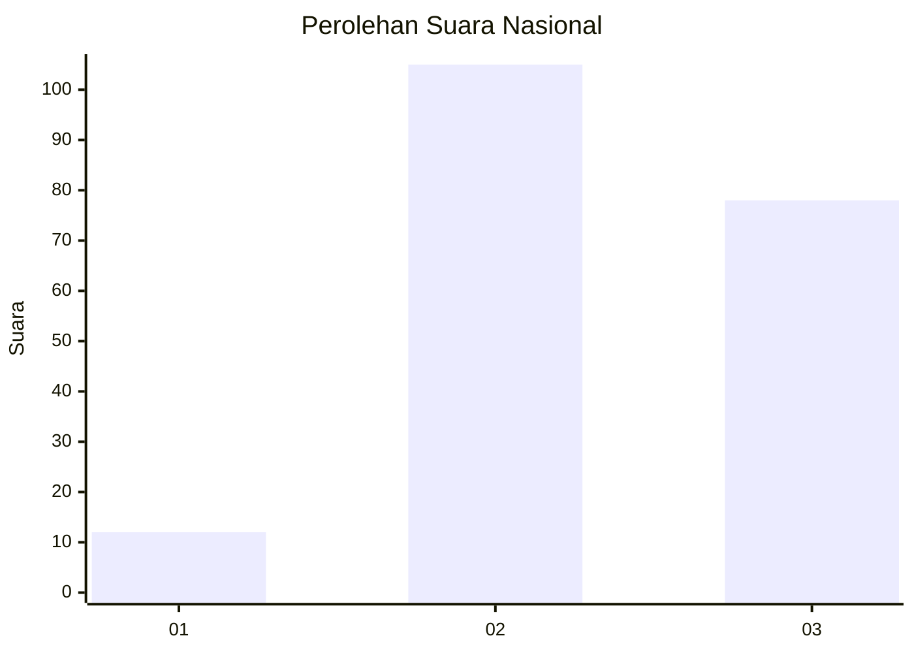
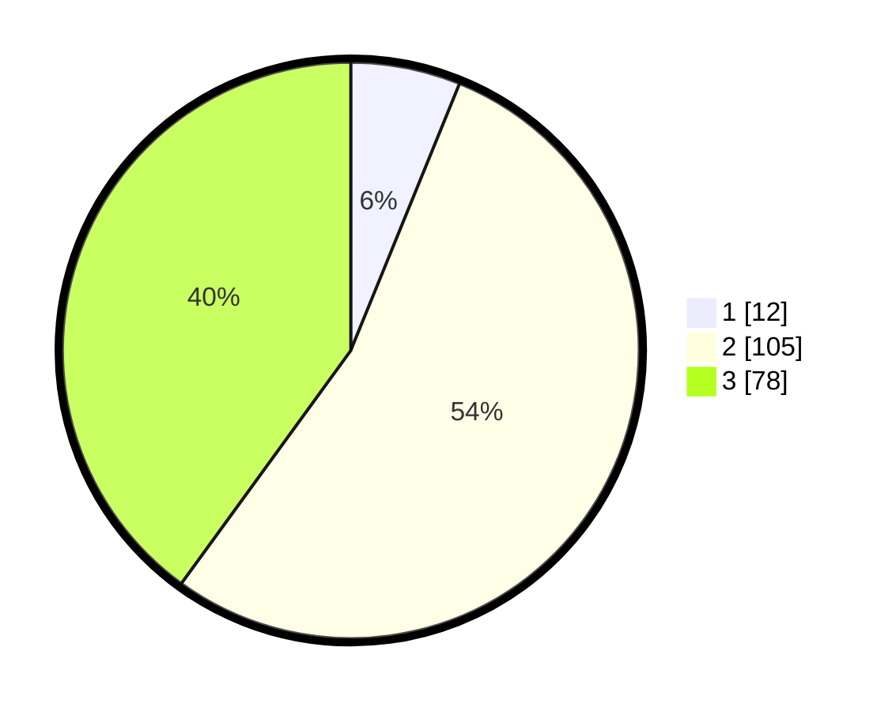

# Hasil

## Grafik

## Tabel

| No. | Nama Paslon    | Suara | Suara (raw) | Persentase |
|:--- |:-------------- | -----:| -----------:| ----------:|
| 1   | ANIES MUHAIMIN | 12    | [12][p-1]   | 6,15       |
| 2   | PRABOWO GIBRAN | 105   | [105][p-2]  | 53,85      |
| 3   | GANJAR MAHFUD  | 78    | [78][p-3]   | 40,00      |

[p-1]: https://github.com/gigit-pemilu/pemilu-2024/blob/main/pilpres/hitung-suara/sub/51-bali/sub/04-gianyar/sub/04-tampaksiring/sub/2003-tampaksiring/sub/029-tps/sub/paslon-1.txt
[p-2]: https://github.com/gigit-pemilu/pemilu-2024/blob/main/pilpres/hitung-suara/sub/51-bali/sub/04-gianyar/sub/04-tampaksiring/sub/2003-tampaksiring/sub/029-tps/sub/paslon-2.txt
[p-3]: https://github.com/gigit-pemilu/pemilu-2024/blob/main/pilpres/hitung-suara/sub/51-bali/sub/04-gianyar/sub/04-tampaksiring/sub/2003-tampaksiring/sub/029-tps/sub/paslon-3.txt

## Foto C Plano

https://sirekap-obj-formc.kpu.go.id/9659/pemilu/ppwp/51/04/04/20/03/5104042003029-20240216-033231--bc87f4d6-cb54-46ea-85b8-97f7e7e80628.jpg

https://sirekap-obj-formc.kpu.go.id/9659/pemilu/ppwp/51/04/04/20/03/5104042003029-20240214-141044--76ea1b1e-c4b2-4b47-9594-f9d3da6ac581.jpg

https://sirekap-obj-formc.kpu.go.id/9659/pemilu/ppwp/51/04/04/20/03/5104042003029-20240216-033232--32eaa186-98a8-48f6-8b16-0ab3a34bfdf6.jpg

## Metadata

| Key        | Value               |
| ---------- | ------------------- |
| Time Stamp | 2024-02-16 04:00:27 |

## DATA PEMILIH TETAP

Jumlah pemilih dalam DPT: **221**.
 * L: **106**.
 * P: **115**.

## DATA PENGGUNA HAK PILIH

Jumlah pengguna hak pilih dalam DPT: **197**.
 * L: **93**.
 * P: **104**.

Jumlah pengguna hak pilih dalam DPTb: **0**.
 * L: **0**.
 * P: **0**.

Jumlah pengguna hak pilih dalam DPK: **0**.
 * L: **0**.
 * P: **0**.

Jumlah pengguna hak pilih: **197**.
 * L: **93**.
 * P: **104**.

## JUMLAH SUARA SAH DAN TIDAK SAH

JUMLAH SELURUH SUARA SAH: **195**.

JUMLAH SUARA TIDAK SAH: **2**.

JUMLAH SELURUH SUARA SAH DAN SUARA TIDAK SAH: **197**.

