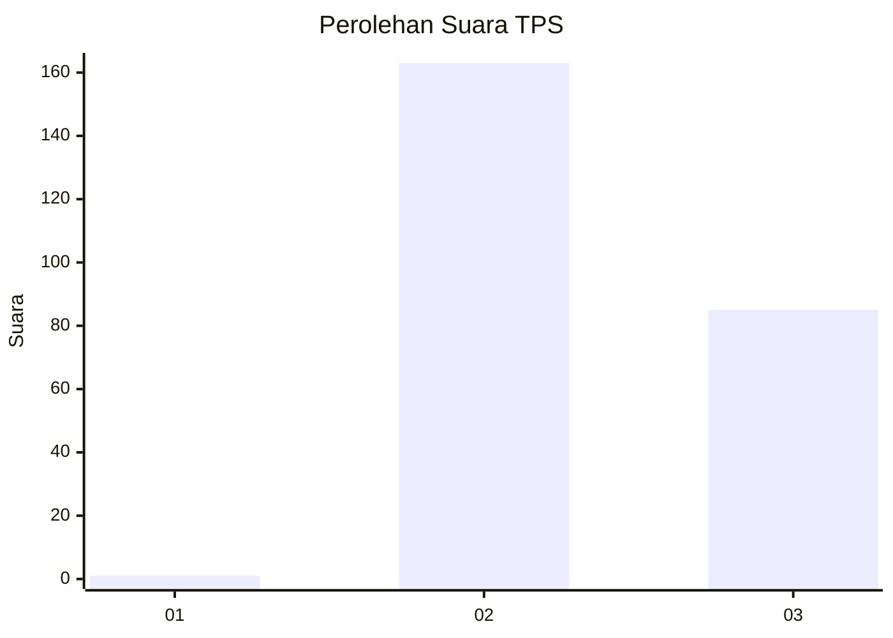
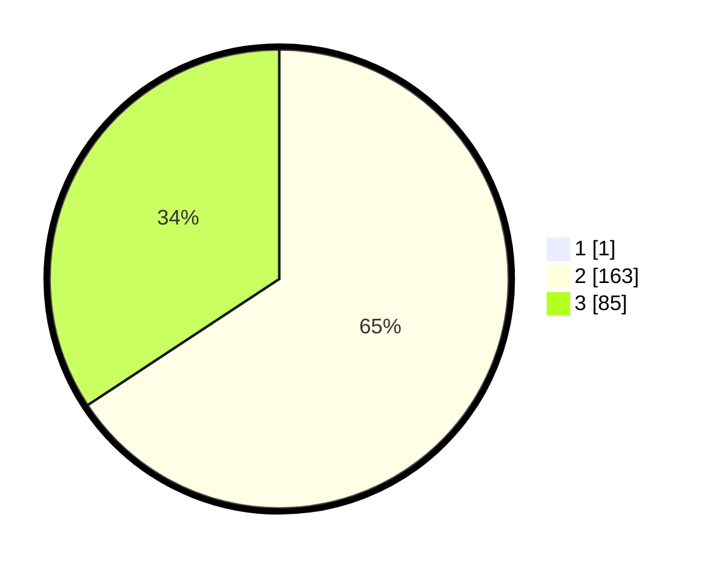

# Hasil

## Grafik

## Tabel

| No. | Nama Paslon    | Suara | Suara (raw) | Persentase |
|:--- |:-------------- | -----:| -----------:| ----------:|
| 1   | ANIES MUHAIMIN | 1     | [1][p-1]    | 0,40       |
| 2   | PRABOWO GIBRAN | 163   | [163][p-2]  | 65,46      |
| 3   | GANJAR MAHFUD  | 85    | [85][p-3]   | 34,14      |

[p-1]: https://github.com/gigit-pemilu/pemilu-2024-51-bali/blob/main/pilpres/hitung-suara/sub/51-bali/sub/04-gianyar/sub/04-tampaksiring/sub/2004-manukaya/sub/001-tps/sub/paslon-1.txt
[p-2]: https://github.com/gigit-pemilu/pemilu-2024-51-bali/blob/main/pilpres/hitung-suara/sub/51-bali/sub/04-gianyar/sub/04-tampaksiring/sub/2004-manukaya/sub/001-tps/sub/paslon-2.txt
[p-3]: https://github.com/gigit-pemilu/pemilu-2024-51-bali/blob/main/pilpres/hitung-suara/sub/51-bali/sub/04-gianyar/sub/04-tampaksiring/sub/2004-manukaya/sub/001-tps/sub/paslon-3.txt

## Foto C Plano

https://sirekap-obj-formc.kpu.go.id/a356/pemilu/ppwp/51/04/04/20/04/5104042004001-20240216-103031--a51d6cf3-8565-4e18-9d9d-47ec562c9e4d.jpg

https://sirekap-obj-formc.kpu.go.id/a356/pemilu/ppwp/51/04/04/20/04/5104042004001-20240216-103709--ede99fe9-2b21-4ecd-8089-115e9650dc4b.jpg

https://sirekap-obj-formc.kpu.go.id/a356/pemilu/ppwp/51/04/04/20/04/5104042004001-20240216-104012--92b5b2ae-28a9-475b-85c0-1377310170f5.jpg

## Metadata

| Key        | Value               |
| ---------- | ------------------- |
| Time Stamp | 2024-02-16 14:30:33 |

## DATA PEMILIH TETAP

Jumlah pemilih dalam DPT: **296**.
 * L: **149**.
 * P: **147**.

## DATA PENGGUNA HAK PILIH

Jumlah pengguna hak pilih dalam DPT: **263**.
 * L: **130**.
 * P: **133**.

Jumlah pengguna hak pilih dalam DPTb: **5**.
 * L: **3**.
 * P: **2**.

Jumlah pengguna hak pilih dalam DPK: **0**.
 * L: **0**.
 * P: **0**.

Jumlah pengguna hak pilih: **268**.
 * L: **133**.
 * P: **135**.

## JUMLAH SUARA SAH DAN TIDAK SAH

JUMLAH SELURUH SUARA SAH: **249**.

JUMLAH SUARA TIDAK SAH: **19**.

JUMLAH SELURUH SUARA SAH DAN SUARA TIDAK SAH: **268**.

