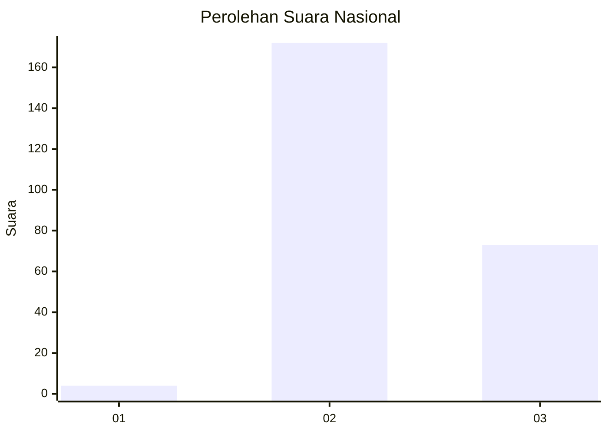

# Hasil

## Grafik

## Tabel

| No. | Nama Paslon    | Suara | Suara (raw) | Persentase |
|:--- |:-------------- | -----:| -----------:| ----------:|
| 1   | ANIES MUHAIMIN | 4     | [4][p-1]    | 1,61       |
| 2   | PRABOWO GIBRAN | 172   | [172][p-2]  | 69,08      |
| 3   | GANJAR MAHFUD  | 73    | [73][p-3]   | 29,32      |

[p-1]: https://github.com/gigit-pemilu/pemilu-2024/blob/main/pilpres/hitung-suara/sub/51-bali/sub/04-gianyar/sub/04-tampaksiring/sub/2004-manukaya/sub/002-tps/sub/paslon-1.txt
[p-2]: https://github.com/gigit-pemilu/pemilu-2024/blob/main/pilpres/hitung-suara/sub/51-bali/sub/04-gianyar/sub/04-tampaksiring/sub/2004-manukaya/sub/002-tps/sub/paslon-2.txt
[p-3]: https://github.com/gigit-pemilu/pemilu-2024/blob/main/pilpres/hitung-suara/sub/51-bali/sub/04-gianyar/sub/04-tampaksiring/sub/2004-manukaya/sub/002-tps/sub/paslon-3.txt

## Foto C Plano

https://sirekap-obj-formc.kpu.go.id/75fe/pemilu/ppwp/51/04/04/20/04/5104042004002-20240217-102928--5f2bdf79-6bc2-4eb6-8a5d-36b9f9dae22c.jpg

https://sirekap-obj-formc.kpu.go.id/75fe/pemilu/ppwp/51/04/04/20/04/5104042004002-20240217-102940--06014ab5-4877-4ab9-9267-5b059b3d6a02.jpg

https://sirekap-obj-formc.kpu.go.id/75fe/pemilu/ppwp/51/04/04/20/04/5104042004002-20240217-102950--7d482254-8000-4bd9-b509-a851f35e6ce7.jpg

## Metadata

| Key        | Value               |
| ---------- | ------------------- |
| Time Stamp | 2024-02-24 22:31:28 |

## DATA PEMILIH TETAP

Jumlah pemilih dalam DPT: **302**.
 * L: **157**.
 * P: **145**.

## DATA PENGGUNA HAK PILIH

Jumlah pengguna hak pilih dalam DPT: **256**.
 * L: **136**.
 * P: **120**.

Jumlah pengguna hak pilih dalam DPTb: **6**.
 * L: **5**.
 * P: **1**.

Jumlah pengguna hak pilih dalam DPK: **0**.
 * L: **0**.
 * P: **0**.

Jumlah pengguna hak pilih: **262**.
 * L: **141**.
 * P: **121**.

## JUMLAH SUARA SAH DAN TIDAK SAH

JUMLAH SELURUH SUARA SAH: **249**.

JUMLAH SUARA TIDAK SAH: **13**.

JUMLAH SELURUH SUARA SAH DAN SUARA TIDAK SAH: **262**.

