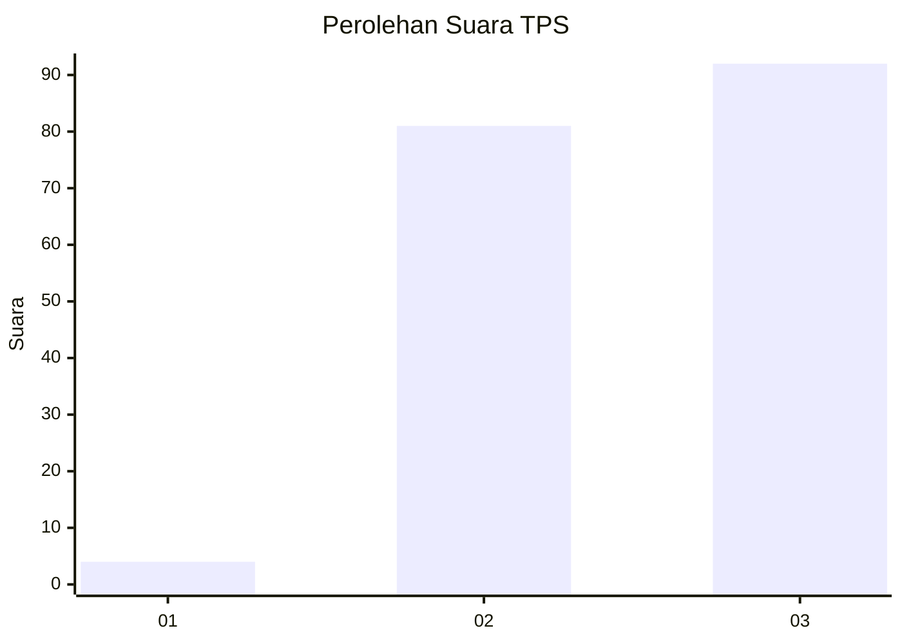
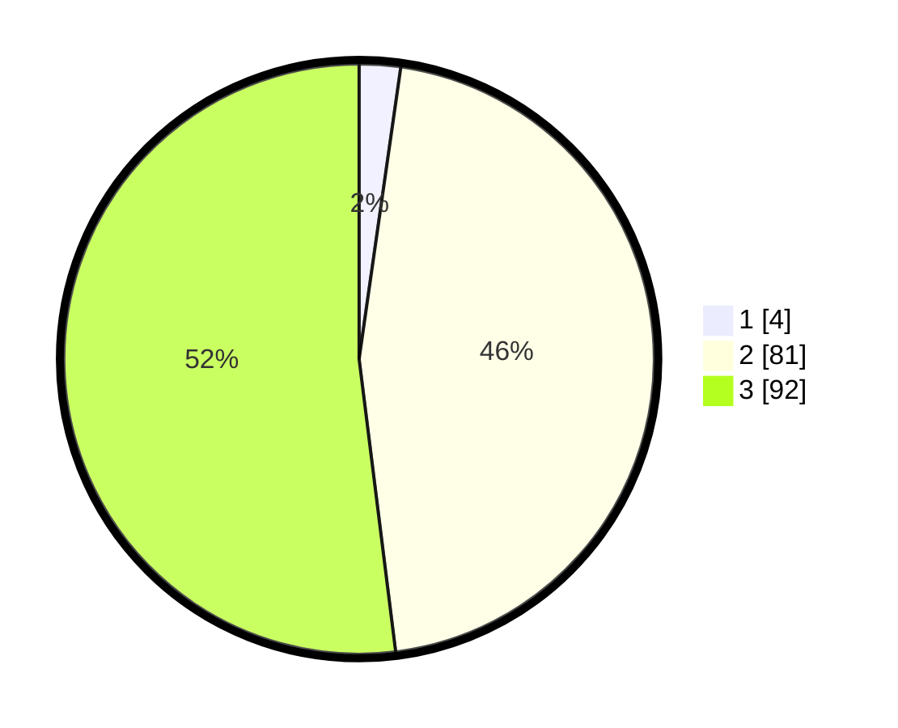

# Hasil

## Grafik

## Tabel

| No. | Nama Paslon    | Suara | Suara (raw) | Persentase |
|:--- |:-------------- | -----:| -----------:| ----------:|
| 1   | ANIES MUHAIMIN | 4     | [4][p-1]    | 2,26       |
| 2   | PRABOWO GIBRAN | 81    | [81][p-2]   | 45,76      |
| 3   | GANJAR MAHFUD  | 92    | [92][p-3]   | 51,98      |

[p-1]: https://github.com/gigit-pemilu/pemilu-2024-51-bali/blob/main/pilpres/hitung-suara/sub/51-bali/sub/04-gianyar/sub/04-tampaksiring/sub/2004-manukaya/sub/004-tps/sub/paslon-1.txt
[p-2]: https://github.com/gigit-pemilu/pemilu-2024-51-bali/blob/main/pilpres/hitung-suara/sub/51-bali/sub/04-gianyar/sub/04-tampaksiring/sub/2004-manukaya/sub/004-tps/sub/paslon-2.txt
[p-3]: https://github.com/gigit-pemilu/pemilu-2024-51-bali/blob/main/pilpres/hitung-suara/sub/51-bali/sub/04-gianyar/sub/04-tampaksiring/sub/2004-manukaya/sub/004-tps/sub/paslon-3.txt

## Foto C Plano

https://sirekap-obj-formc.kpu.go.id/9171/pemilu/ppwp/51/04/04/20/04/5104042004004-20240217-085714--15af5643-a67f-49ef-9eae-20c27fb50919.jpg

https://sirekap-obj-formc.kpu.go.id/9171/pemilu/ppwp/51/04/04/20/04/5104042004004-20240217-085716--7f917cac-05f4-4e38-9d3d-9e6fa11d63f3.jpg

https://sirekap-obj-formc.kpu.go.id/9171/pemilu/ppwp/51/04/04/20/04/5104042004004-20240217-085715--b2c63c58-5feb-48ce-a8aa-7194e0686c53.jpg

## Metadata

| Key        | Value               |
| ---------- | ------------------- |
| Time Stamp | 2024-02-17 12:00:00 |

## DATA PEMILIH TETAP

Jumlah pemilih dalam DPT: **223**.
 * L: **109**.
 * P: **114**.

## DATA PENGGUNA HAK PILIH

Jumlah pengguna hak pilih dalam DPT: **179**.
 * L: **92**.
 * P: **87**.

Jumlah pengguna hak pilih dalam DPTb: **3**.
 * L: **1**.
 * P: **2**.

Jumlah pengguna hak pilih dalam DPK: **0**.
 * L: **0**.
 * P: **0**.

Jumlah pengguna hak pilih: **182**.
 * L: **93**.
 * P: **89**.

## JUMLAH SUARA SAH DAN TIDAK SAH

JUMLAH SELURUH SUARA SAH: **178**.

JUMLAH SUARA TIDAK SAH: **4**.

JUMLAH SELURUH SUARA SAH DAN SUARA TIDAK SAH: **182**.

