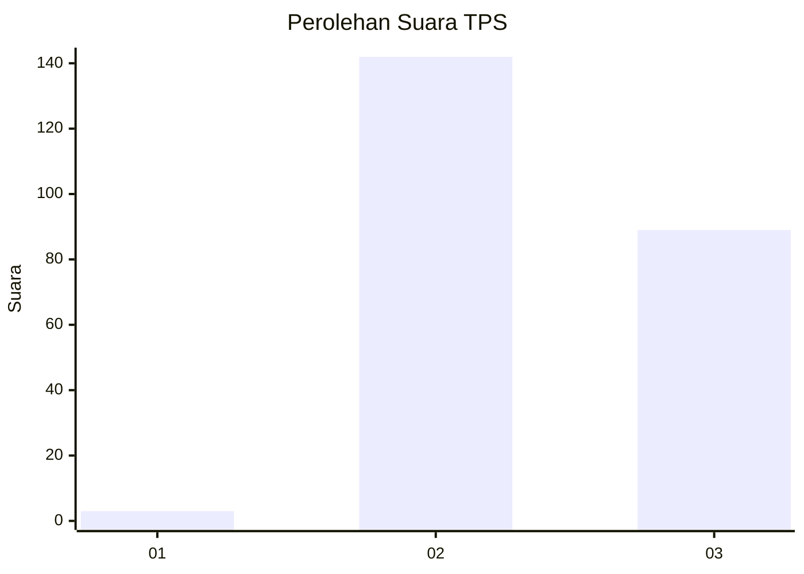
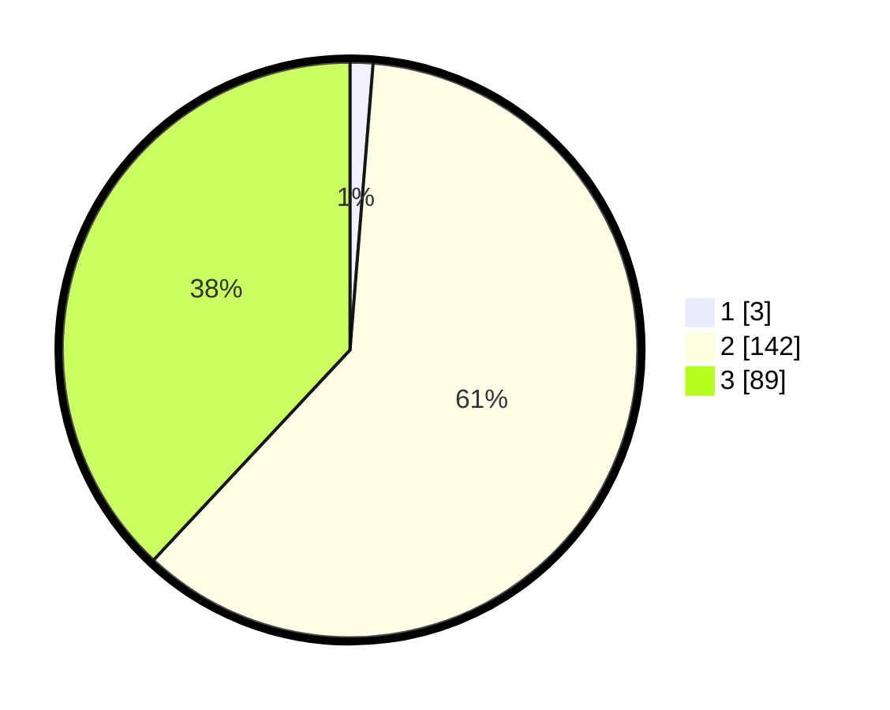

# Hasil

## Grafik

## Tabel

| No. | Nama Paslon    | Suara | Suara (raw) | Persentase |
|:--- |:-------------- | -----:| -----------:| ----------:|
| 1   | ANIES MUHAIMIN | 3     | [3][p-1]    | 1,28       |
| 2   | PRABOWO GIBRAN | 142   | [142][p-2]  | 60,68      |
| 3   | GANJAR MAHFUD  | 89    | [89][p-3]   | 38,03      |

[p-1]: https://github.com/gigit-pemilu/pemilu-2024-51-bali/blob/main/pilpres/hitung-suara/sub/51-bali/sub/04-gianyar/sub/04-tampaksiring/sub/2004-manukaya/sub/014-tps/sub/paslon-1.txt
[p-2]: https://github.com/gigit-pemilu/pemilu-2024-51-bali/blob/main/pilpres/hitung-suara/sub/51-bali/sub/04-gianyar/sub/04-tampaksiring/sub/2004-manukaya/sub/014-tps/sub/paslon-2.txt
[p-3]: https://github.com/gigit-pemilu/pemilu-2024-51-bali/blob/main/pilpres/hitung-suara/sub/51-bali/sub/04-gianyar/sub/04-tampaksiring/sub/2004-manukaya/sub/014-tps/sub/paslon-3.txt

## Foto C Plano

https://sirekap-obj-formc.kpu.go.id/0fa4/pemilu/ppwp/51/04/04/20/04/5104042004014-20240214-200252--811f7055-6b76-435e-a3c5-96d766ba779f.jpg

https://sirekap-obj-formc.kpu.go.id/0fa4/pemilu/ppwp/51/04/04/20/04/5104042004014-20240214-200309--3e37f410-23d3-4747-93ee-69114ac257c3.jpg

https://sirekap-obj-formc.kpu.go.id/0fa4/pemilu/ppwp/51/04/04/20/04/5104042004014-20240214-195315--4b8c724f-26e5-4a05-81be-a47bd6620209.jpg

## Metadata

| Key        | Value               |
| ---------- | ------------------- |
| Time Stamp | 2024-02-15 15:00:29 |

