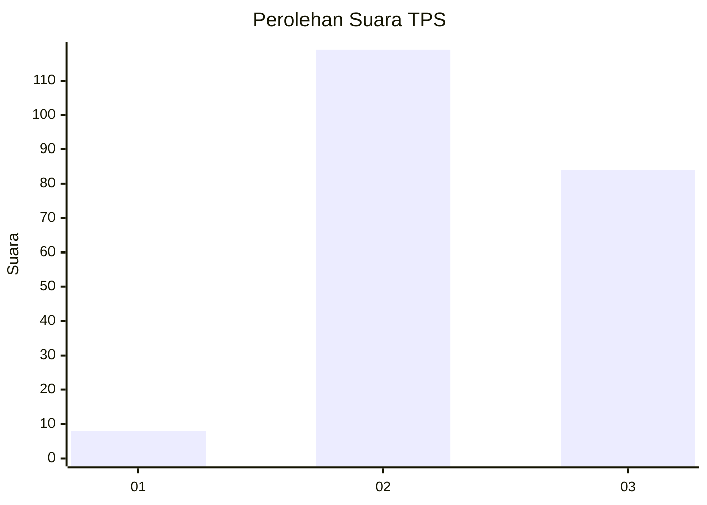
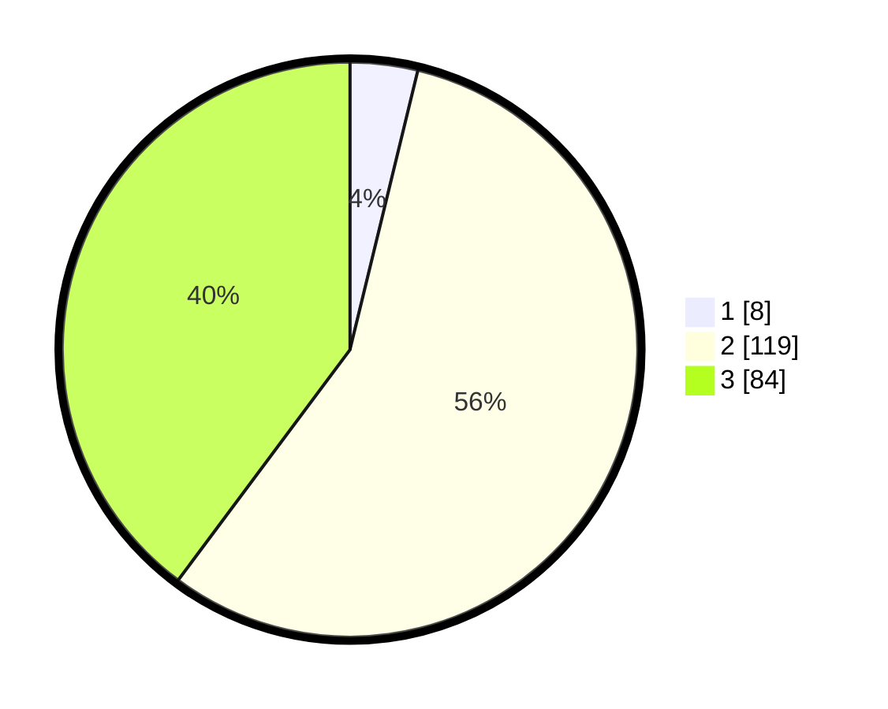

# Hasil

## Grafik

## Tabel

| No. | Nama Paslon    | Suara | Suara (raw) | Persentase |
|:--- |:-------------- | -----:| -----------:| ----------:|
| 1   | ANIES MUHAIMIN | 8     | [8][p-1]    | 3,79       |
| 2   | PRABOWO GIBRAN | 119   | [119][p-2]  | 56,40      |
| 3   | GANJAR MAHFUD  | 84    | [84][p-3]   | 39,81      |

[p-1]: https://github.com/gigit-pemilu/pemilu-2024-51-bali/blob/main/pilpres/hitung-suara/sub/51-bali/sub/04-gianyar/sub/04-tampaksiring/sub/2004-manukaya/sub/015-tps/sub/paslon-1.txt
[p-2]: https://github.com/gigit-pemilu/pemilu-2024-51-bali/blob/main/pilpres/hitung-suara/sub/51-bali/sub/04-gianyar/sub/04-tampaksiring/sub/2004-manukaya/sub/015-tps/sub/paslon-2.txt
[p-3]: https://github.com/gigit-pemilu/pemilu-2024-51-bali/blob/main/pilpres/hitung-suara/sub/51-bali/sub/04-gianyar/sub/04-tampaksiring/sub/2004-manukaya/sub/015-tps/sub/paslon-3.txt

## Foto C Plano

https://sirekap-obj-formc.kpu.go.id/6275/pemilu/ppwp/51/04/04/20/04/5104042004015-20240214-224609--e4ce38ce-7b67-4cbc-90ba-5dc54ab19aa1.jpg

https://sirekap-obj-formc.kpu.go.id/6275/pemilu/ppwp/51/04/04/20/04/5104042004015-20240214-224700--dfa577ce-27e9-4994-9f9a-0dfdea0b5ed0.jpg

https://sirekap-obj-formc.kpu.go.id/6275/pemilu/ppwp/51/04/04/20/04/5104042004015-20240214-224734--89d9c183-a3eb-4c78-a687-8a89b021abc1.jpg

## Metadata

| Key        | Value               |
| ---------- | ------------------- |
| Time Stamp | 2024-02-15 15:00:29 |

