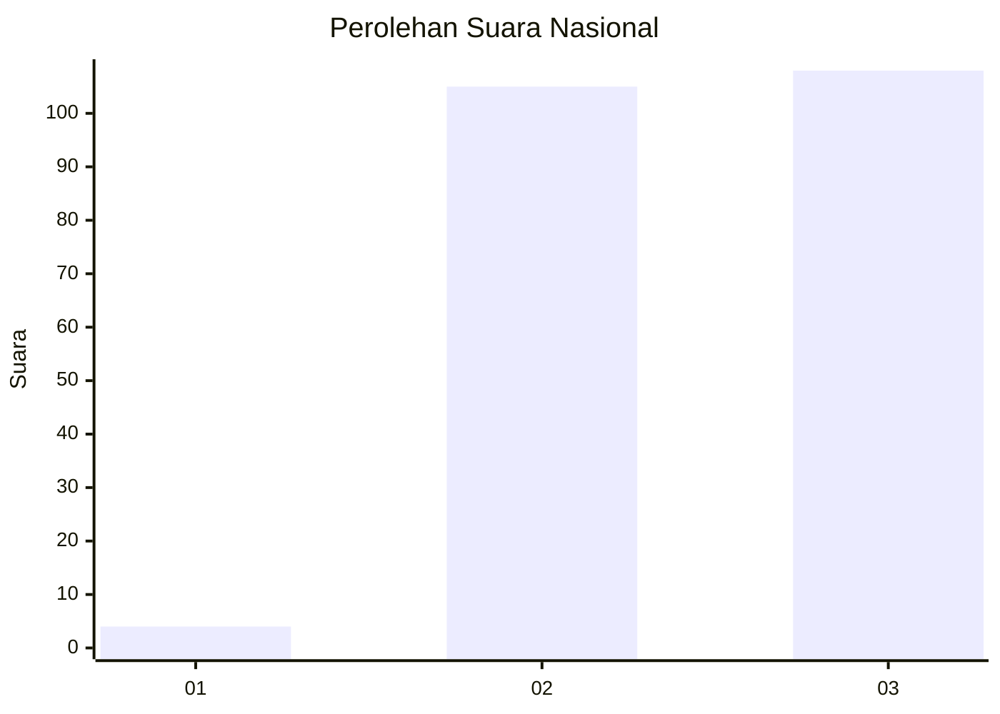
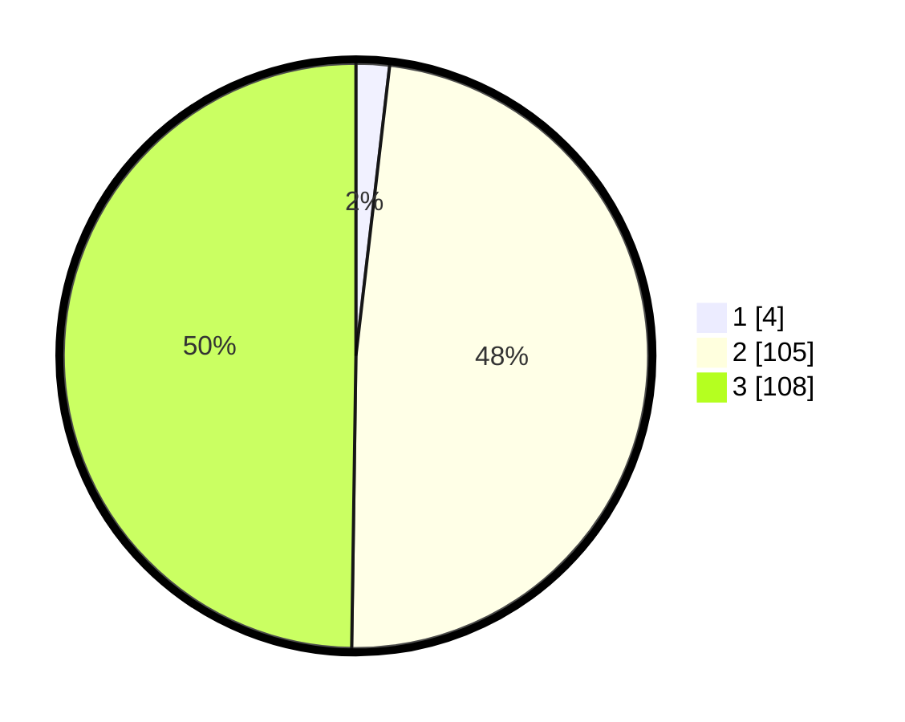

# Hasil

## Grafik

## Tabel

| No. | Nama Paslon    | Suara | Suara (raw) | Persentase |
|:--- |:-------------- | -----:| -----------:| ----------:|
| 1   | ANIES MUHAIMIN | 4     | [4][p-1]    | 1,84       |
| 2   | PRABOWO GIBRAN | 105   | [105][p-2]  | 48,39      |
| 3   | GANJAR MAHFUD  | 108   | [108][p-3]  | 49,77      |

[p-1]: https://github.com/gigit-pemilu/pemilu-2024/blob/main/pilpres/hitung-suara/sub/51-bali/sub/04-gianyar/sub/04-tampaksiring/sub/2004-manukaya/sub/016-tps/sub/paslon-1.txt
[p-2]: https://github.com/gigit-pemilu/pemilu-2024/blob/main/pilpres/hitung-suara/sub/51-bali/sub/04-gianyar/sub/04-tampaksiring/sub/2004-manukaya/sub/016-tps/sub/paslon-2.txt
[p-3]: https://github.com/gigit-pemilu/pemilu-2024/blob/main/pilpres/hitung-suara/sub/51-bali/sub/04-gianyar/sub/04-tampaksiring/sub/2004-manukaya/sub/016-tps/sub/paslon-3.txt

## Foto C Plano

https://sirekap-obj-formc.kpu.go.id/a401/pemilu/ppwp/51/04/04/20/04/5104042004016-20240214-185911--bc239098-da2d-4412-b734-7b5c33a650d3.jpg

https://sirekap-obj-formc.kpu.go.id/a401/pemilu/ppwp/51/04/04/20/04/5104042004016-20240214-185852--95b86d12-03ac-4a89-aca5-912d0801136d.jpg

https://sirekap-obj-formc.kpu.go.id/a401/pemilu/ppwp/51/04/04/20/04/5104042004016-20240214-185822--b85de6f2-cd56-4096-b7f3-40b4176c8a06.jpg

## Metadata

| Key        | Value               |
| ---------- | ------------------- |
| Time Stamp | 2024-02-17 10:30:03 |

## DATA PEMILIH TETAP

Jumlah pemilih dalam DPT: **268**.
 * L: **140**.
 * P: **128**.

## DATA PENGGUNA HAK PILIH

Jumlah pengguna hak pilih dalam DPT: **228**.
 * L: **122**.
 * P: **106**.

Jumlah pengguna hak pilih dalam DPTb: **0**.
 * L: **0**.
 * P: **0**.

Jumlah pengguna hak pilih dalam DPK: **0**.
 * L: **0**.
 * P: **0**.

Jumlah pengguna hak pilih: **228**.
 * L: **122**.
 * P: **106**.

## JUMLAH SUARA SAH DAN TIDAK SAH

JUMLAH SELURUH SUARA SAH: **217**.

JUMLAH SUARA TIDAK SAH: **11**.

JUMLAH SELURUH SUARA SAH DAN SUARA TIDAK SAH: **228**.

