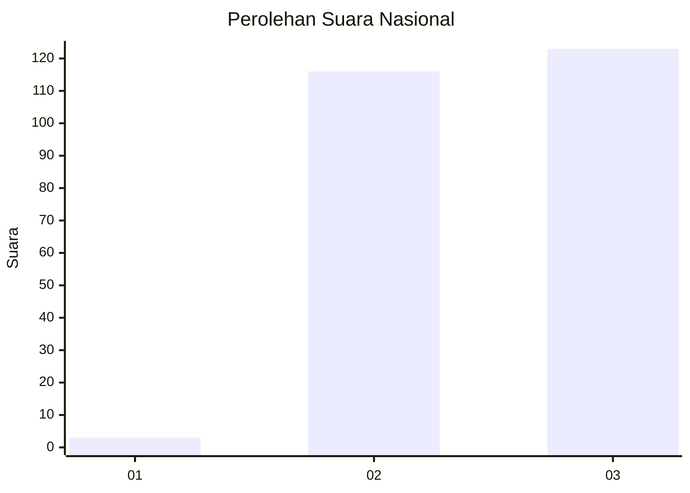
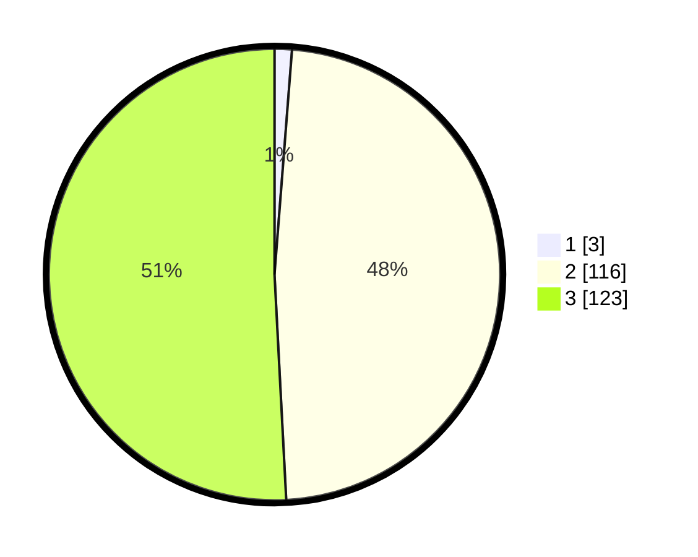

# Hasil

## Grafik

## Tabel

| No. | Nama Paslon    | Suara | Suara (raw) | Persentase |
|:--- |:-------------- | -----:| -----------:| ----------:|
| 1   | ANIES MUHAIMIN | 3     | [3][p-1]    | 1,24       |
| 2   | PRABOWO GIBRAN | 116   | [116][p-2]  | 47,93      |
| 3   | GANJAR MAHFUD  | 123   | [123][p-3]  | 50,83      |

[p-1]: https://github.com/gigit-pemilu/pemilu-2024/blob/main/pilpres/hitung-suara/sub/51-bali/sub/04-gianyar/sub/04-tampaksiring/sub/2004-manukaya/sub/023-tps/sub/paslon-1.txt
[p-2]: https://github.com/gigit-pemilu/pemilu-2024/blob/main/pilpres/hitung-suara/sub/51-bali/sub/04-gianyar/sub/04-tampaksiring/sub/2004-manukaya/sub/023-tps/sub/paslon-2.txt
[p-3]: https://github.com/gigit-pemilu/pemilu-2024/blob/main/pilpres/hitung-suara/sub/51-bali/sub/04-gianyar/sub/04-tampaksiring/sub/2004-manukaya/sub/023-tps/sub/paslon-3.txt

## Foto C Plano

https://sirekap-obj-formc.kpu.go.id/cf10/pemilu/ppwp/51/04/04/20/04/5104042004023-20240214-222349--ac768b37-0b78-44be-89ae-40736f9171c8.jpg

https://sirekap-obj-formc.kpu.go.id/cf10/pemilu/ppwp/51/04/04/20/04/5104042004023-20240214-223101--2b9b28ab-34f6-49b1-9367-cab9bb170f8b.jpg

https://sirekap-obj-formc.kpu.go.id/cf10/pemilu/ppwp/51/04/04/20/04/5104042004023-20240214-223308--c484049c-4389-4871-a0ff-3df1c57a6abf.jpg

## Metadata

| Key        | Value               |
| ---------- | ------------------- |
| Time Stamp | 2024-02-15 15:30:25 |

