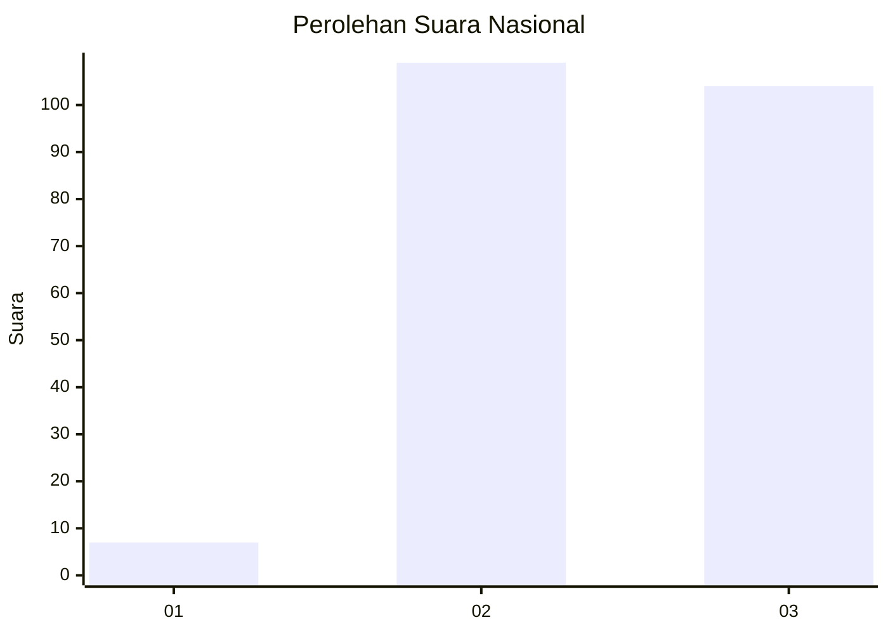
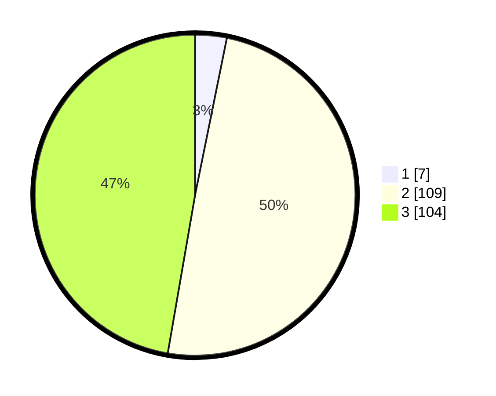

# Hasil

## Grafik

## Tabel

| No. | Nama Paslon    | Suara | Suara (raw) | Persentase |
|:--- |:-------------- | -----:| -----------:| ----------:|
| 1   | ANIES MUHAIMIN | 7     | [7][p-1]    | 3,18       |
| 2   | PRABOWO GIBRAN | 109   | [109][p-2]  | 49,55      |
| 3   | GANJAR MAHFUD  | 104   | [104][p-3]  | 47,27      |

[p-1]: https://github.com/gigit-pemilu/pemilu-2024/blob/main/pilpres/hitung-suara/sub/51-bali/sub/04-gianyar/sub/04-tampaksiring/sub/2004-manukaya/sub/026-tps/sub/paslon-1.txt
[p-2]: https://github.com/gigit-pemilu/pemilu-2024/blob/main/pilpres/hitung-suara/sub/51-bali/sub/04-gianyar/sub/04-tampaksiring/sub/2004-manukaya/sub/026-tps/sub/paslon-2.txt
[p-3]: https://github.com/gigit-pemilu/pemilu-2024/blob/main/pilpres/hitung-suara/sub/51-bali/sub/04-gianyar/sub/04-tampaksiring/sub/2004-manukaya/sub/026-tps/sub/paslon-3.txt

## Foto C Plano

https://sirekap-obj-formc.kpu.go.id/74f4/pemilu/ppwp/51/04/04/20/04/5104042004026-20240214-222639--46cf68e7-0f36-4eaa-83ae-09cf20a03970.jpg

https://sirekap-obj-formc.kpu.go.id/74f4/pemilu/ppwp/51/04/04/20/04/5104042004026-20240214-222851--f62de21c-8b88-45fc-b3ff-97f5ae511fcb.jpg

https://sirekap-obj-formc.kpu.go.id/74f4/pemilu/ppwp/51/04/04/20/04/5104042004026-20240214-222954--d9e236a2-ce03-40d3-8fb8-df24b1621f56.jpg

## Metadata

| Key        | Value               |
| ---------- | ------------------- |
| Time Stamp | 2024-02-15 15:00:29 |

