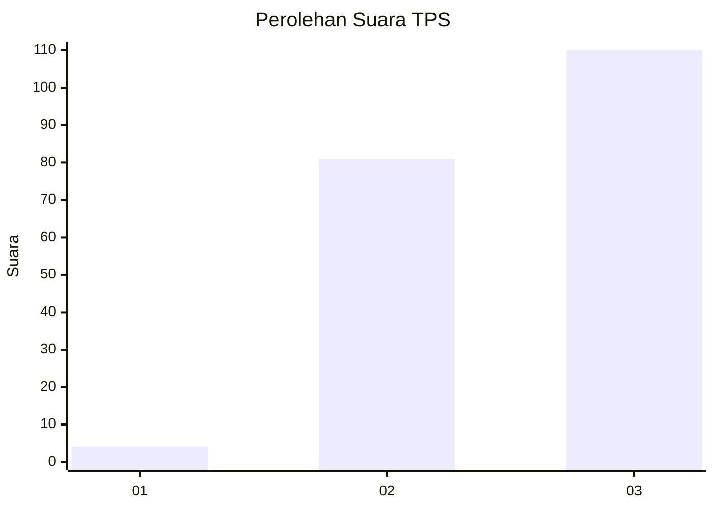
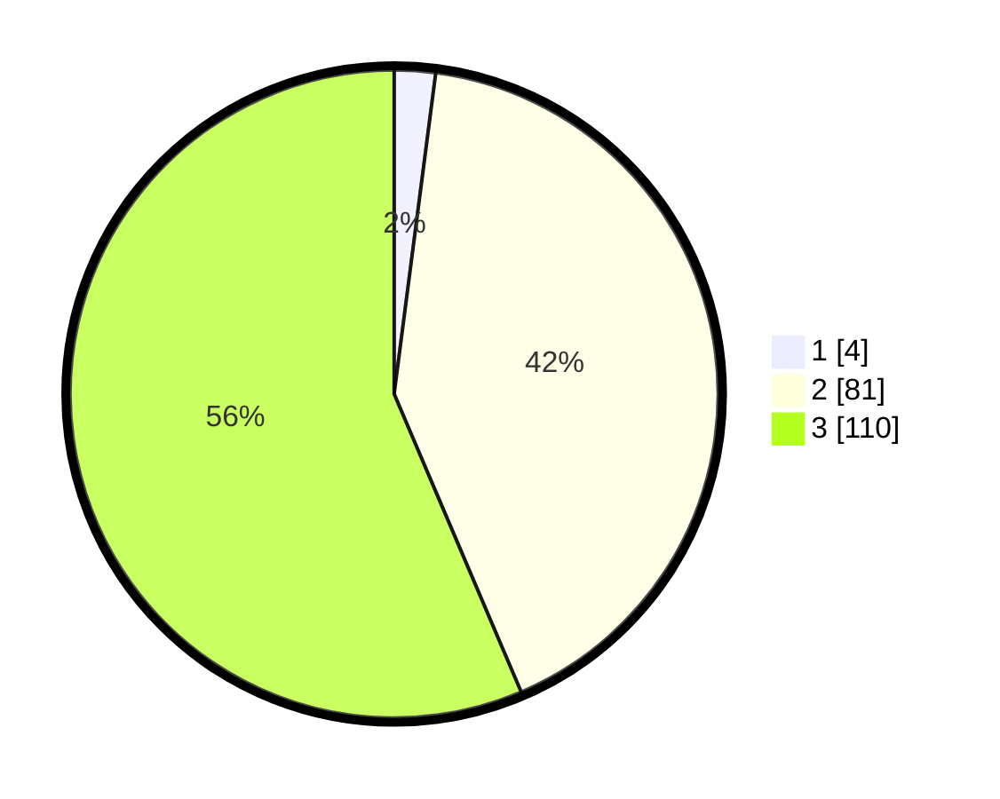

# Hasil

## Grafik

## Tabel

| No. | Nama Paslon    | Suara | Suara (raw) | Persentase |
|:--- |:-------------- | -----:| -----------:| ----------:|
| 1   | ANIES MUHAIMIN | 4     | [4][p-1]    | 2,05       |
| 2   | PRABOWO GIBRAN | 81    | [81][p-2]   | 41,54      |
| 3   | GANJAR MAHFUD  | 110   | [110][p-3]  | 56,41      |

[p-1]: https://github.com/gigit-pemilu/pemilu-2024-51-bali/blob/main/pilpres/hitung-suara/sub/51-bali/sub/04-gianyar/sub/04-tampaksiring/sub/2004-manukaya/sub/029-tps/sub/paslon-1.txt
[p-2]: https://github.com/gigit-pemilu/pemilu-2024-51-bali/blob/main/pilpres/hitung-suara/sub/51-bali/sub/04-gianyar/sub/04-tampaksiring/sub/2004-manukaya/sub/029-tps/sub/paslon-2.txt
[p-3]: https://github.com/gigit-pemilu/pemilu-2024-51-bali/blob/main/pilpres/hitung-suara/sub/51-bali/sub/04-gianyar/sub/04-tampaksiring/sub/2004-manukaya/sub/029-tps/sub/paslon-3.txt

## Foto C Plano

https://sirekap-obj-formc.kpu.go.id/95c6/pemilu/ppwp/51/04/04/20/04/5104042004029-20240217-095231--43bb7dc0-5145-43e4-bd93-a2e5e567686c.jpg

https://sirekap-obj-formc.kpu.go.id/95c6/pemilu/ppwp/51/04/04/20/04/5104042004029-20240217-095232--6e3ade71-ce06-4bb1-9b22-099b694bba14.jpg

https://sirekap-obj-formc.kpu.go.id/95c6/pemilu/ppwp/51/04/04/20/04/5104042004029-20240217-095232--690428d1-47a7-45d1-a109-8c471899955a.jpg

## Metadata

| Key        | Value               |
| ---------- | ------------------- |
| Time Stamp | 2024-02-17 13:37:34 |

## DATA PEMILIH TETAP

Jumlah pemilih dalam DPT: **250**.
 * L: **127**.
 * P: **123**.

## DATA PENGGUNA HAK PILIH

Jumlah pengguna hak pilih dalam DPT: **203**.
 * L: **108**.
 * P: **95**.

Jumlah pengguna hak pilih dalam DPTb: **0**.
 * L: **0**.
 * P: **0**.

Jumlah pengguna hak pilih dalam DPK: **0**.
 * L: **0**.
 * P: **0**.

Jumlah pengguna hak pilih: **203**.
 * L: **108**.
 * P: **95**.

## JUMLAH SUARA SAH DAN TIDAK SAH

JUMLAH SELURUH SUARA SAH: **195**.

JUMLAH SUARA TIDAK SAH: **8**.

JUMLAH SELURUH SUARA SAH DAN SUARA TIDAK SAH: **203**.

