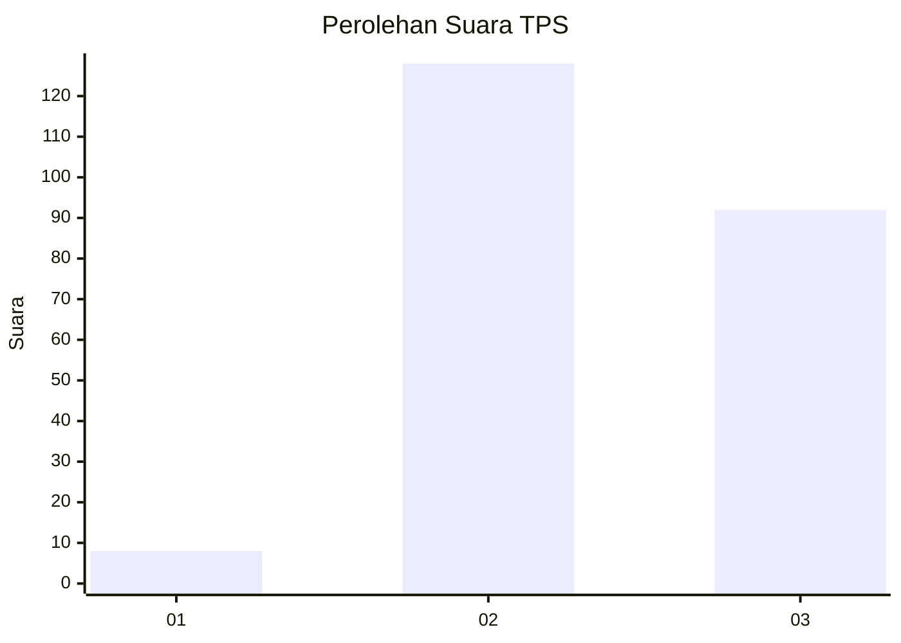
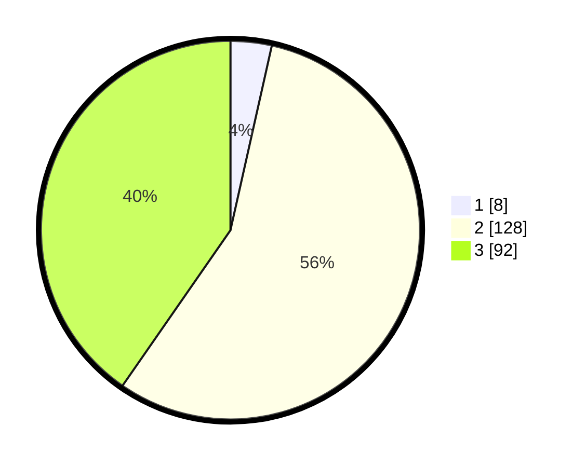

# Hasil

## Grafik

## Tabel

| No. | Nama Paslon    | Suara | Suara (raw) | Persentase |
|:--- |:-------------- | -----:| -----------:| ----------:|
| 1   | ANIES MUHAIMIN | 8     | [8][p-1]    | 3,51       |
| 2   | PRABOWO GIBRAN | 128   | [128][p-2]  | 56,14      |
| 3   | GANJAR MAHFUD  | 92    | [92][p-3]   | 40,35      |

[p-1]: https://github.com/gigit-pemilu/pemilu-2024-51-bali/blob/main/pilpres/hitung-suara/sub/51-bali/sub/04-gianyar/sub/04-tampaksiring/sub/2004-manukaya/sub/035-tps/sub/paslon-1.txt
[p-2]: https://github.com/gigit-pemilu/pemilu-2024-51-bali/blob/main/pilpres/hitung-suara/sub/51-bali/sub/04-gianyar/sub/04-tampaksiring/sub/2004-manukaya/sub/035-tps/sub/paslon-2.txt
[p-3]: https://github.com/gigit-pemilu/pemilu-2024-51-bali/blob/main/pilpres/hitung-suara/sub/51-bali/sub/04-gianyar/sub/04-tampaksiring/sub/2004-manukaya/sub/035-tps/sub/paslon-3.txt

## Foto C Plano

https://sirekap-obj-formc.kpu.go.id/311c/pemilu/ppwp/51/04/04/20/04/5104042004035-20240217-085427--a9182bb6-0372-44f7-8b10-5ca48e7e3b32.jpg

https://sirekap-obj-formc.kpu.go.id/311c/pemilu/ppwp/51/04/04/20/04/5104042004035-20240217-085429--520b356d-d4e4-4081-99e1-57153f573d4f.jpg

https://sirekap-obj-formc.kpu.go.id/311c/pemilu/ppwp/51/04/04/20/04/5104042004035-20240217-085428--37862e21-cb87-441d-a430-a858da0073e1.jpg

## Metadata

| Key        | Value               |
| ---------- | ------------------- |
| Time Stamp | 2024-02-17 13:37:34 |

## DATA PEMILIH TETAP

Jumlah pemilih dalam DPT: **256**.
 * L: **128**.
 * P: **128**.

## DATA PENGGUNA HAK PILIH

Jumlah pengguna hak pilih dalam DPT: **230**.
 * L: **117**.
 * P: **113**.

Jumlah pengguna hak pilih dalam DPTb: **0**.
 * L: **0**.
 * P: **0**.

Jumlah pengguna hak pilih dalam DPK: **0**.
 * L: **0**.
 * P: **0**.

Jumlah pengguna hak pilih: **230**.
 * L: **117**.
 * P: **113**.

## JUMLAH SUARA SAH DAN TIDAK SAH

JUMLAH SELURUH SUARA SAH: **228**.

JUMLAH SUARA TIDAK SAH: **2**.

JUMLAH SELURUH SUARA SAH DAN SUARA TIDAK SAH: **230**.

