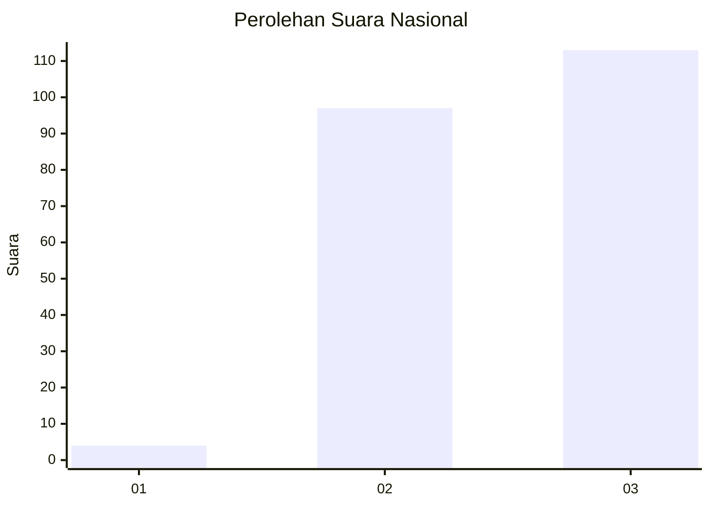
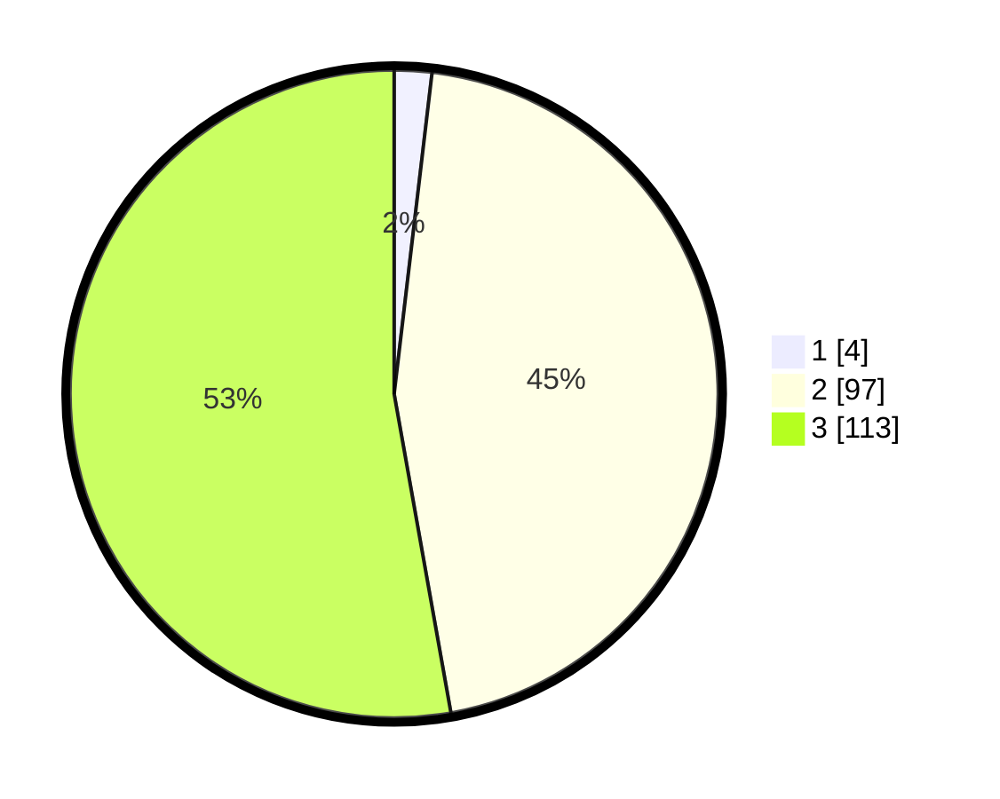

# Hasil

## Grafik

## Tabel

| No. | Nama Paslon    | Suara | Suara (raw) | Persentase |
|:--- |:-------------- | -----:| -----------:| ----------:|
| 1   | ANIES MUHAIMIN | 4     | [4][p-1]    | 1,87       |
| 2   | PRABOWO GIBRAN | 97    | [97][p-2]   | 45,33      |
| 3   | GANJAR MAHFUD  | 113   | [113][p-3]  | 52,80      |

[p-1]: https://github.com/gigit-pemilu/pemilu-2024/blob/main/pilpres/hitung-suara/sub/51-bali/sub/04-gianyar/sub/04-tampaksiring/sub/2004-manukaya/sub/037-tps/sub/paslon-1.txt
[p-2]: https://github.com/gigit-pemilu/pemilu-2024/blob/main/pilpres/hitung-suara/sub/51-bali/sub/04-gianyar/sub/04-tampaksiring/sub/2004-manukaya/sub/037-tps/sub/paslon-2.txt
[p-3]: https://github.com/gigit-pemilu/pemilu-2024/blob/main/pilpres/hitung-suara/sub/51-bali/sub/04-gianyar/sub/04-tampaksiring/sub/2004-manukaya/sub/037-tps/sub/paslon-3.txt

## Foto C Plano

https://sirekap-obj-formc.kpu.go.id/8396/pemilu/ppwp/51/04/04/20/04/5104042004037-20240217-090702--01b11d38-3664-4188-84d2-deb48a82683c.jpg

https://sirekap-obj-formc.kpu.go.id/8396/pemilu/ppwp/51/04/04/20/04/5104042004037-20240217-090703--9c66e9cc-01e1-44f8-933a-f9570ba47ce7.jpg

https://sirekap-obj-formc.kpu.go.id/8396/pemilu/ppwp/51/04/04/20/04/5104042004037-20240217-090702--4cd17a02-f5f1-4a3b-b67b-8c18bd3e7311.jpg

## Metadata

| Key        | Value               |
| ---------- | ------------------- |
| Time Stamp | 2024-02-17 13:37:34 |

## DATA PEMILIH TETAP

Jumlah pemilih dalam DPT: **253**.
 * L: **125**.
 * P: **128**.

## DATA PENGGUNA HAK PILIH

Jumlah pengguna hak pilih dalam DPT: **218**.
 * L: **107**.
 * P: **111**.

Jumlah pengguna hak pilih dalam DPTb: **0**.
 * L: **0**.
 * P: **0**.

Jumlah pengguna hak pilih dalam DPK: **2**.
 * L: **1**.
 * P: **1**.

Jumlah pengguna hak pilih: **220**.
 * L: **108**.
 * P: **112**.

## JUMLAH SUARA SAH DAN TIDAK SAH

JUMLAH SELURUH SUARA SAH: **214**.

JUMLAH SUARA TIDAK SAH: **6**.

JUMLAH SELURUH SUARA SAH DAN SUARA TIDAK SAH: **220**.

