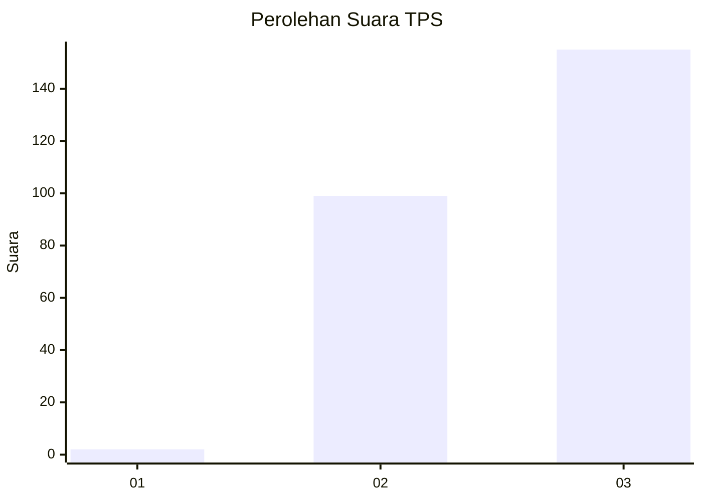
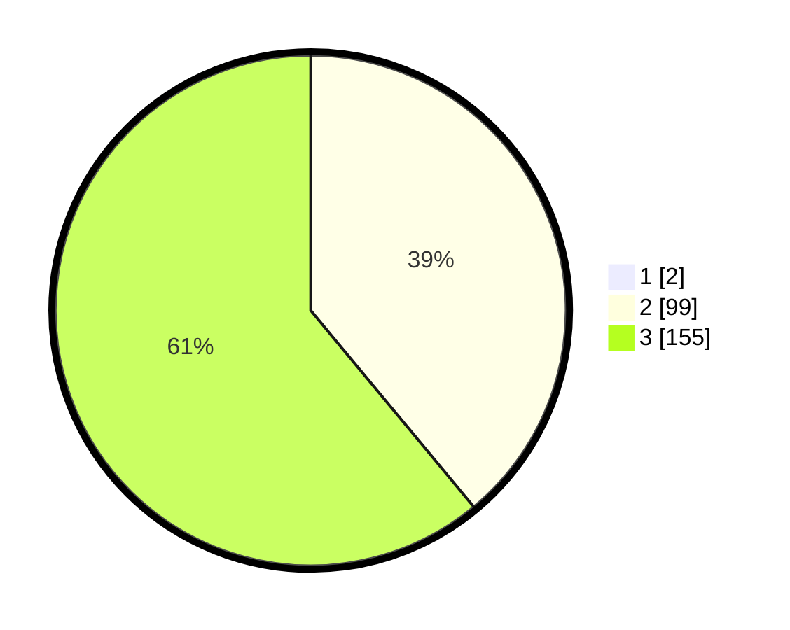

# Hasil

## Grafik

## Tabel

| No. | Nama Paslon    | Suara | Suara (raw) | Persentase |
|:--- |:-------------- | -----:| -----------:| ----------:|
| 1   | ANIES MUHAIMIN | 2     | [2][p-1]    | 0,78       |
| 2   | PRABOWO GIBRAN | 99    | [99][p-2]   | 38,67      |
| 3   | GANJAR MAHFUD  | 155   | [155][p-3]  | 60,55      |

[p-1]: https://github.com/gigit-pemilu/pemilu-2024-51-bali/blob/main/pilpres/hitung-suara/sub/51-bali/sub/04-gianyar/sub/04-tampaksiring/sub/2005-pejeng-kawan/sub/001-tps/sub/paslon-1.txt
[p-2]: https://github.com/gigit-pemilu/pemilu-2024-51-bali/blob/main/pilpres/hitung-suara/sub/51-bali/sub/04-gianyar/sub/04-tampaksiring/sub/2005-pejeng-kawan/sub/001-tps/sub/paslon-2.txt
[p-3]: https://github.com/gigit-pemilu/pemilu-2024-51-bali/blob/main/pilpres/hitung-suara/sub/51-bali/sub/04-gianyar/sub/04-tampaksiring/sub/2005-pejeng-kawan/sub/001-tps/sub/paslon-3.txt

## Foto C Plano

https://sirekap-obj-formc.kpu.go.id/50a2/pemilu/ppwp/51/04/04/20/05/5104042005001-20240214-185008--0cde62d5-9aed-46d3-ae8b-3757a1012389.jpg

https://sirekap-obj-formc.kpu.go.id/50a2/pemilu/ppwp/51/04/04/20/05/5104042005001-20240214-185030--5060579b-f22d-4a27-a4a4-cf1d9784e096.jpg

https://sirekap-obj-formc.kpu.go.id/50a2/pemilu/ppwp/51/04/04/20/05/5104042005001-20240214-185019--474438a4-1b15-42f2-a135-24b2b139c977.jpg

## Metadata

| Key        | Value               |
| ---------- | ------------------- |
| Time Stamp | 2024-02-15 12:00:28 |

## DATA PEMILIH TETAP

Jumlah pemilih dalam DPT: **260**.
 * L: **129**.
 * P: **131**.

## DATA PENGGUNA HAK PILIH

Jumlah pengguna hak pilih dalam DPT: **251**.
 * L: **130**.
 * P: **121**.

Jumlah pengguna hak pilih dalam DPTb: **8**.
 * L: **2**.
 * P: **6**.

Jumlah pengguna hak pilih dalam DPK: **0**.
 * L: **0**.
 * P: **0**.

Jumlah pengguna hak pilih: **259**.
 * L: **132**.
 * P: **127**.

## JUMLAH SUARA SAH DAN TIDAK SAH

JUMLAH SELURUH SUARA SAH: **256**.

JUMLAH SUARA TIDAK SAH: **3**.

JUMLAH SELURUH SUARA SAH DAN SUARA TIDAK SAH: **259**.

