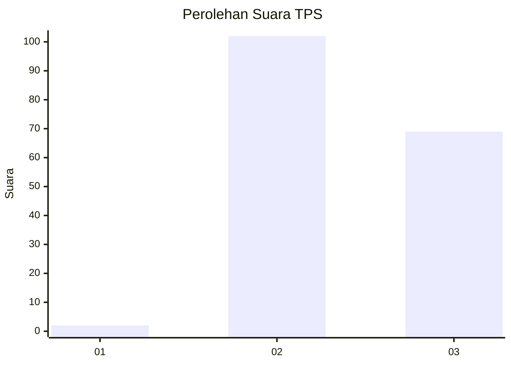
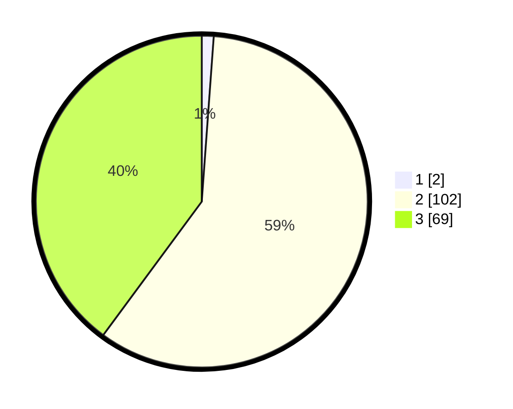

# Hasil

## Grafik

## Tabel

| No. | Nama Paslon    | Suara | Suara (raw) | Persentase |
|:--- |:-------------- | -----:| -----------:| ----------:|
| 1   | ANIES MUHAIMIN | 2     | [2][p-1]    | 1,16       |
| 2   | PRABOWO GIBRAN | 102   | [102][p-2]  | 58,96      |
| 3   | GANJAR MAHFUD  | 69    | [69][p-3]   | 39,88      |

[p-1]: https://github.com/gigit-pemilu/pemilu-2024-51-bali/blob/main/pilpres/hitung-suara/sub/51-bali/sub/04-gianyar/sub/04-tampaksiring/sub/2005-pejeng-kawan/sub/004-tps/sub/paslon-1.txt
[p-2]: https://github.com/gigit-pemilu/pemilu-2024-51-bali/blob/main/pilpres/hitung-suara/sub/51-bali/sub/04-gianyar/sub/04-tampaksiring/sub/2005-pejeng-kawan/sub/004-tps/sub/paslon-2.txt
[p-3]: https://github.com/gigit-pemilu/pemilu-2024-51-bali/blob/main/pilpres/hitung-suara/sub/51-bali/sub/04-gianyar/sub/04-tampaksiring/sub/2005-pejeng-kawan/sub/004-tps/sub/paslon-3.txt

## Foto C Plano

https://sirekap-obj-formc.kpu.go.id/96fb/pemilu/ppwp/51/04/04/20/05/5104042005004-20240214-131811--ccb90a12-7680-4ec4-b32c-8b75d92f830c.jpg

https://sirekap-obj-formc.kpu.go.id/96fb/pemilu/ppwp/51/04/04/20/05/5104042005004-20240214-132052--d6e63d08-725f-4564-bca1-b6a79e49f891.jpg

https://sirekap-obj-formc.kpu.go.id/96fb/pemilu/ppwp/51/04/04/20/05/5104042005004-20240214-132154--ae795fa2-097e-4dec-93e7-c30a2a136c18.jpg

## Metadata

| Key        | Value               |
| ---------- | ------------------- |
| Time Stamp | 2024-02-14 21:46:01 |

## DATA PEMILIH TETAP

Jumlah pemilih dalam DPT: **198**.
 * L: **98**.
 * P: **100**.

## DATA PENGGUNA HAK PILIH

Jumlah pengguna hak pilih dalam DPT: **173**.
 * L: **86**.
 * P: **87**.

Jumlah pengguna hak pilih dalam DPTb: **2**.
 * L: **1**.
 * P: **1**.

Jumlah pengguna hak pilih dalam DPK: **1**.
 * L: **0**.
 * P: **1**.

Jumlah pengguna hak pilih: **176**.
 * L: **87**.
 * P: **89**.

## JUMLAH SUARA SAH DAN TIDAK SAH

JUMLAH SELURUH SUARA SAH: **173**.

JUMLAH SUARA TIDAK SAH: **3**.

JUMLAH SELURUH SUARA SAH DAN SUARA TIDAK SAH: **176**.

