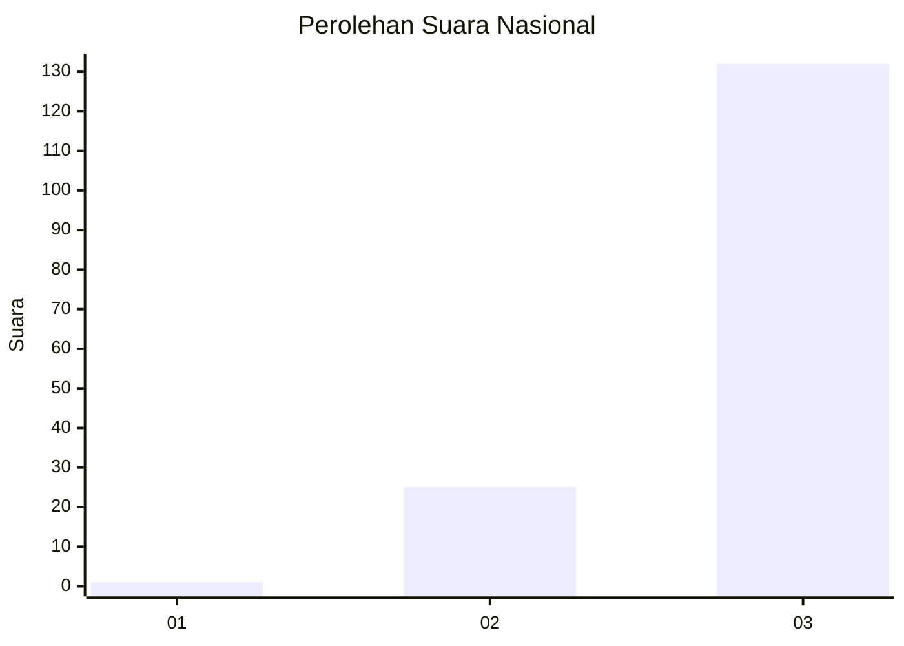
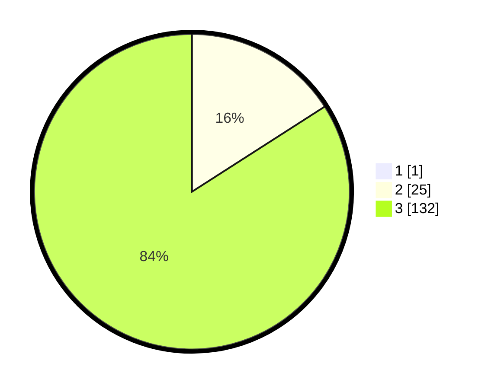

# Hasil

## Grafik

## Tabel

| No. | Nama Paslon    | Suara | Suara (raw) | Persentase |
|:--- |:-------------- | -----:| -----------:| ----------:|
| 1   | ANIES MUHAIMIN | 1     | [1][p-1]    | 0,63       |
| 2   | PRABOWO GIBRAN | 25    | [25][p-2]   | 15,82      |
| 3   | GANJAR MAHFUD  | 132   | [132][p-3]  | 83,54      |

[p-1]: https://github.com/gigit-pemilu/pemilu-2024/blob/main/pilpres/hitung-suara/sub/51-bali/sub/04-gianyar/sub/04-tampaksiring/sub/2006-pejeng-kaja/sub/001-tps/sub/paslon-1.txt
[p-2]: https://github.com/gigit-pemilu/pemilu-2024/blob/main/pilpres/hitung-suara/sub/51-bali/sub/04-gianyar/sub/04-tampaksiring/sub/2006-pejeng-kaja/sub/001-tps/sub/paslon-2.txt
[p-3]: https://github.com/gigit-pemilu/pemilu-2024/blob/main/pilpres/hitung-suara/sub/51-bali/sub/04-gianyar/sub/04-tampaksiring/sub/2006-pejeng-kaja/sub/001-tps/sub/paslon-3.txt

## Foto C Plano

https://sirekap-obj-formc.kpu.go.id/7dde/pemilu/ppwp/51/04/04/20/06/5104042006001-20240214-132327--a0a3bdfc-f3ff-409d-b27a-a90127c6d690.jpg

https://sirekap-obj-formc.kpu.go.id/7dde/pemilu/ppwp/51/04/04/20/06/5104042006001-20240214-133036--ff37646a-7e71-41db-9678-ef3e6afc3d7b.jpg

https://sirekap-obj-formc.kpu.go.id/7dde/pemilu/ppwp/51/04/04/20/06/5104042006001-20240214-133106--d32b1af6-ecce-4684-be54-f93cc73f78bb.jpg

## Metadata

| Key        | Value               |
| ---------- | ------------------- |
| Time Stamp | 2024-02-14 21:46:01 |

