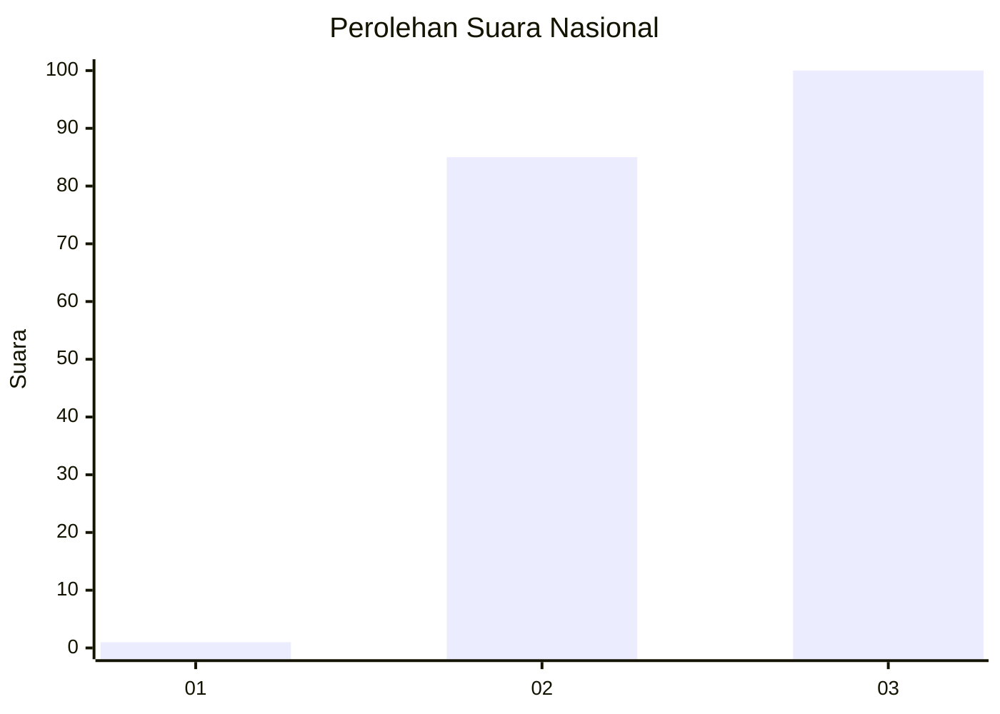
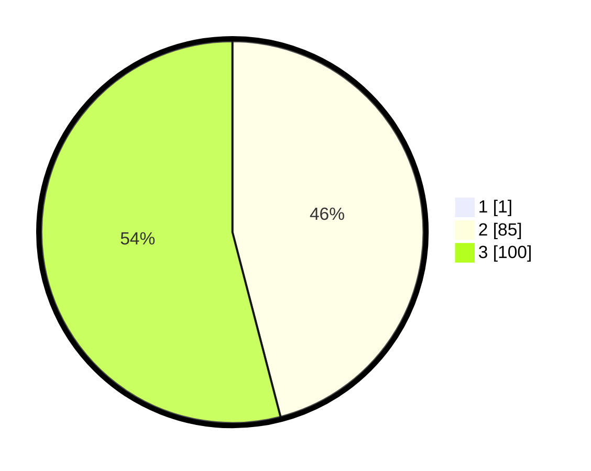

# Hasil

## Grafik

## Tabel

| No. | Nama Paslon    | Suara | Suara (raw) | Persentase |
|:--- |:-------------- | -----:| -----------:| ----------:|
| 1   | ANIES MUHAIMIN | 1     | [1][p-1]    | 0,54       |
| 2   | PRABOWO GIBRAN | 85    | [85][p-2]   | 45,70      |
| 3   | GANJAR MAHFUD  | 100   | [100][p-3]  | 53,76      |

[p-1]: https://github.com/gigit-pemilu/pemilu-2024/blob/main/pilpres/hitung-suara/sub/51-bali/sub/04-gianyar/sub/04-tampaksiring/sub/2006-pejeng-kaja/sub/003-tps/sub/paslon-1.txt
[p-2]: https://github.com/gigit-pemilu/pemilu-2024/blob/main/pilpres/hitung-suara/sub/51-bali/sub/04-gianyar/sub/04-tampaksiring/sub/2006-pejeng-kaja/sub/003-tps/sub/paslon-2.txt
[p-3]: https://github.com/gigit-pemilu/pemilu-2024/blob/main/pilpres/hitung-suara/sub/51-bali/sub/04-gianyar/sub/04-tampaksiring/sub/2006-pejeng-kaja/sub/003-tps/sub/paslon-3.txt

## Foto C Plano

https://sirekap-obj-formc.kpu.go.id/66aa/pemilu/ppwp/51/04/04/20/06/5104042006003-20240214-211250--5631a02a-b89f-40d2-805a-e09e7f8e5275.jpg

https://sirekap-obj-formc.kpu.go.id/66aa/pemilu/ppwp/51/04/04/20/06/5104042006003-20240214-211539--65ce01c1-0891-413f-8fe4-edc11e5b56aa.jpg

https://sirekap-obj-formc.kpu.go.id/66aa/pemilu/ppwp/51/04/04/20/06/5104042006003-20240214-211900--603c4b1b-3ffb-4964-b81a-542100cdf8a8.jpg

## Metadata

| Key        | Value               |
| ---------- | ------------------- |
| Time Stamp | 2024-02-15 15:00:29 |

