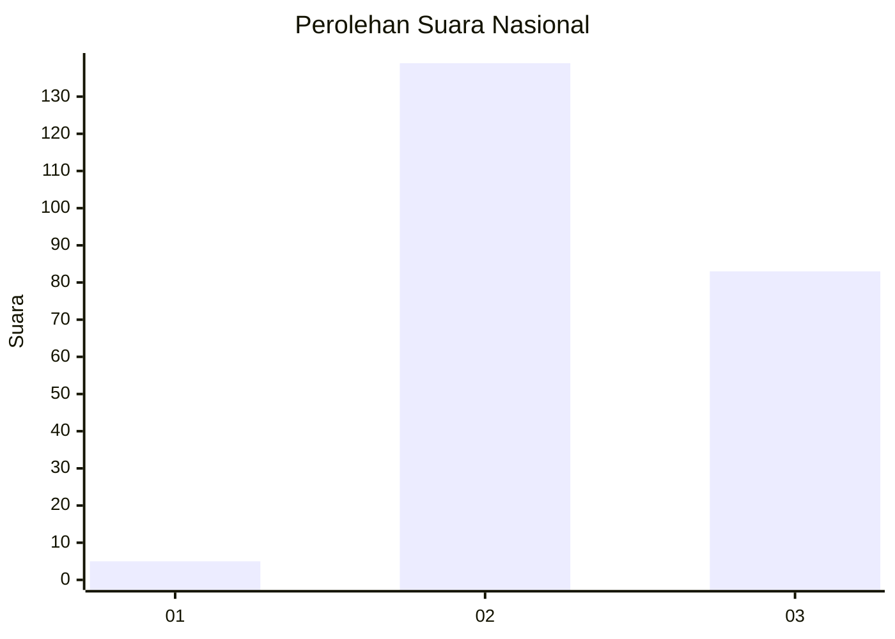
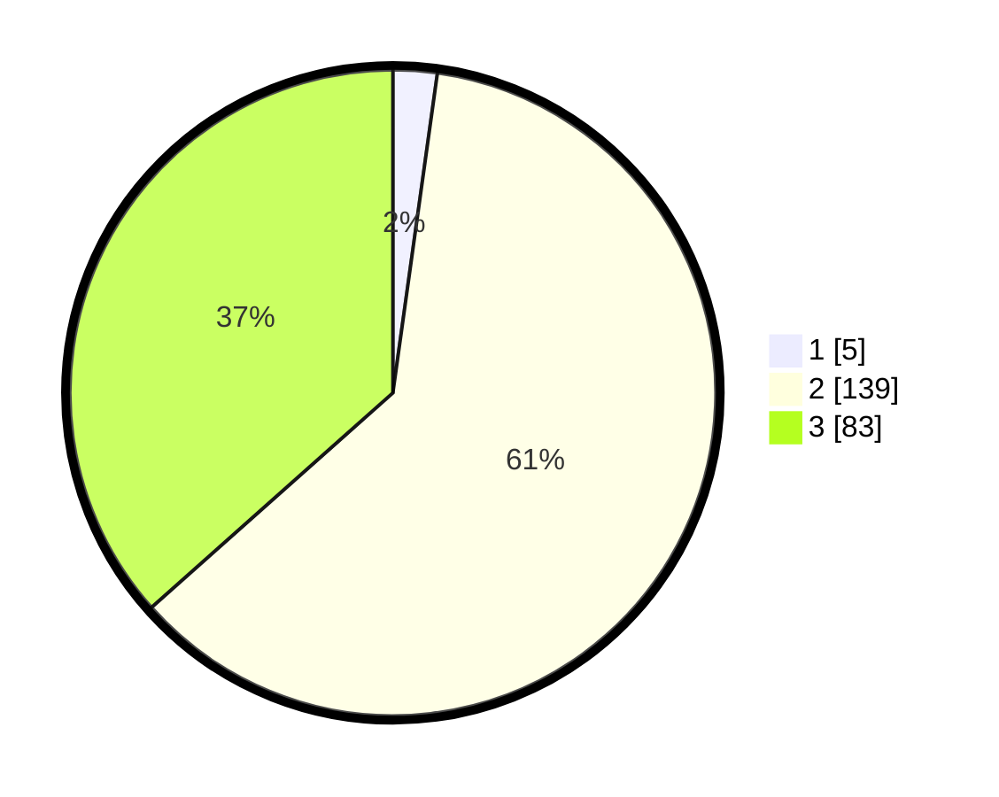

# Hasil

## Grafik

## Tabel

| No. | Nama Paslon    | Suara | Suara (raw) | Persentase |
|:--- |:-------------- | -----:| -----------:| ----------:|
| 1   | ANIES MUHAIMIN | 5     | [5][p-1]    | 2,20       |
| 2   | PRABOWO GIBRAN | 139   | [139][p-2]  | 61,23      |
| 3   | GANJAR MAHFUD  | 83    | [83][p-3]   | 36,56      |

[p-1]: https://github.com/gigit-pemilu/pemilu-2024/blob/main/pilpres/hitung-suara/sub/51-bali/sub/04-gianyar/sub/04-tampaksiring/sub/2006-pejeng-kaja/sub/005-tps/sub/paslon-1.txt
[p-2]: https://github.com/gigit-pemilu/pemilu-2024/blob/main/pilpres/hitung-suara/sub/51-bali/sub/04-gianyar/sub/04-tampaksiring/sub/2006-pejeng-kaja/sub/005-tps/sub/paslon-2.txt
[p-3]: https://github.com/gigit-pemilu/pemilu-2024/blob/main/pilpres/hitung-suara/sub/51-bali/sub/04-gianyar/sub/04-tampaksiring/sub/2006-pejeng-kaja/sub/005-tps/sub/paslon-3.txt

## Foto C Plano

https://sirekap-obj-formc.kpu.go.id/5ee6/pemilu/ppwp/51/04/04/20/06/5104042006005-20240214-141520--e801544b-4113-45ef-924a-7dd7c70bec33.jpg

https://sirekap-obj-formc.kpu.go.id/5ee6/pemilu/ppwp/51/04/04/20/06/5104042006005-20240214-141848--be3ed280-eb38-411a-8bcd-0c99a449a180.jpg

https://sirekap-obj-formc.kpu.go.id/5ee6/pemilu/ppwp/51/04/04/20/06/5104042006005-20240216-132604--d1f23ce2-96b6-4102-bec3-4a8b0e9d159f.jpg

## Metadata

| Key        | Value               |
| ---------- | ------------------- |
| Time Stamp | 2024-02-16 13:30:32 |

## DATA PEMILIH TETAP

Jumlah pemilih dalam DPT: **237**.
 * L: **124**.
 * P: **113**.

## DATA PENGGUNA HAK PILIH

Jumlah pengguna hak pilih dalam DPT: **224**.
 * L: **121**.
 * P: **103**.

Jumlah pengguna hak pilih dalam DPTb: **0**.
 * L: **0**.
 * P: **0**.

Jumlah pengguna hak pilih dalam DPK: **4**.
 * L: **2**.
 * P: **2**.

Jumlah pengguna hak pilih: **228**.
 * L: **123**.
 * P: **105**.

## JUMLAH SUARA SAH DAN TIDAK SAH

JUMLAH SELURUH SUARA SAH: **0**.

JUMLAH SUARA TIDAK SAH: **0**.

JUMLAH SELURUH SUARA SAH DAN SUARA TIDAK SAH: **0**.

