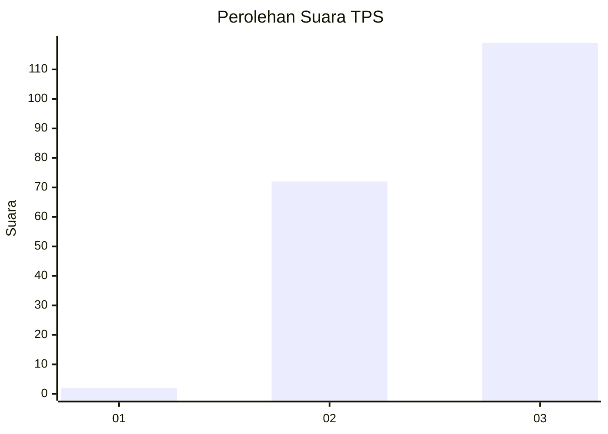
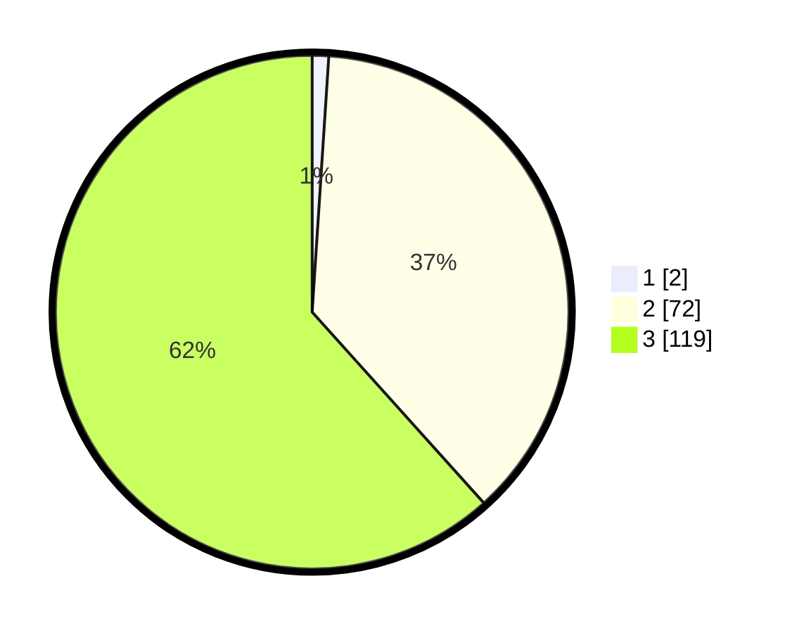

# Hasil

## Grafik

## Tabel

| No. | Nama Paslon    | Suara | Suara (raw) | Persentase |
|:--- |:-------------- | -----:| -----------:| ----------:|
| 1   | ANIES MUHAIMIN | 2     | [2][p-1]    | 1,04       |
| 2   | PRABOWO GIBRAN | 72    | [72][p-2]   | 37,31      |
| 3   | GANJAR MAHFUD  | 119   | [119][p-3]  | 61,66      |

[p-1]: https://github.com/gigit-pemilu/pemilu-2024-51-bali/blob/main/pilpres/hitung-suara/sub/51-bali/sub/04-gianyar/sub/04-tampaksiring/sub/2006-pejeng-kaja/sub/008-tps/sub/paslon-1.txt
[p-2]: https://github.com/gigit-pemilu/pemilu-2024-51-bali/blob/main/pilpres/hitung-suara/sub/51-bali/sub/04-gianyar/sub/04-tampaksiring/sub/2006-pejeng-kaja/sub/008-tps/sub/paslon-2.txt
[p-3]: https://github.com/gigit-pemilu/pemilu-2024-51-bali/blob/main/pilpres/hitung-suara/sub/51-bali/sub/04-gianyar/sub/04-tampaksiring/sub/2006-pejeng-kaja/sub/008-tps/sub/paslon-3.txt

## Foto C Plano

https://sirekap-obj-formc.kpu.go.id/03be/pemilu/ppwp/51/04/04/20/06/5104042006008-20240214-215156--6dfb3f85-9fdf-4161-920c-adb8240ce0c5.jpg

https://sirekap-obj-formc.kpu.go.id/03be/pemilu/ppwp/51/04/04/20/06/5104042006008-20240214-215200--cc0e6d81-1259-4139-9187-dfda486ea436.jpg

https://sirekap-obj-formc.kpu.go.id/03be/pemilu/ppwp/51/04/04/20/06/5104042006008-20240214-215204--7fb2840f-7eea-409c-b10d-531ce8a90eca.jpg

## Metadata

| Key        | Value               |
| ---------- | ------------------- |
| Time Stamp | 2024-02-15 15:00:29 |

