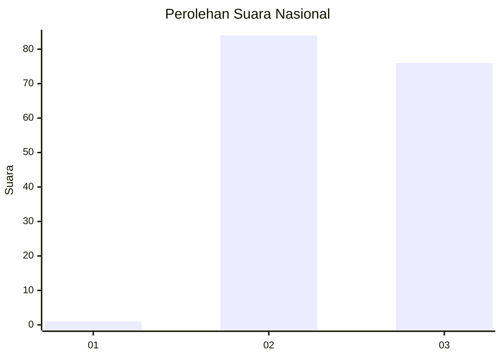
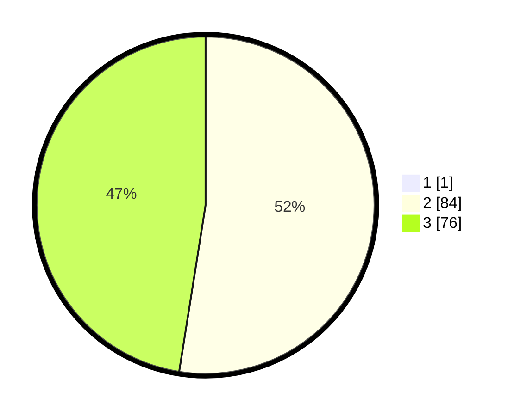

# Hasil

## Grafik

## Tabel

| No. | Nama Paslon    | Suara | Suara (raw) | Persentase |
|:--- |:-------------- | -----:| -----------:| ----------:|
| 1   | ANIES MUHAIMIN | 1     | [1][p-1]    | 0,62       |
| 2   | PRABOWO GIBRAN | 84    | [84][p-2]   | 52,17      |
| 3   | GANJAR MAHFUD  | 76    | [76][p-3]   | 47,20      |

[p-1]: https://github.com/gigit-pemilu/pemilu-2024/blob/main/pilpres/hitung-suara/sub/51-bali/sub/04-gianyar/sub/04-tampaksiring/sub/2006-pejeng-kaja/sub/014-tps/sub/paslon-1.txt
[p-2]: https://github.com/gigit-pemilu/pemilu-2024/blob/main/pilpres/hitung-suara/sub/51-bali/sub/04-gianyar/sub/04-tampaksiring/sub/2006-pejeng-kaja/sub/014-tps/sub/paslon-2.txt
[p-3]: https://github.com/gigit-pemilu/pemilu-2024/blob/main/pilpres/hitung-suara/sub/51-bali/sub/04-gianyar/sub/04-tampaksiring/sub/2006-pejeng-kaja/sub/014-tps/sub/paslon-3.txt

## Foto C Plano

https://sirekap-obj-formc.kpu.go.id/b989/pemilu/ppwp/51/04/04/20/06/5104042006014-20240214-193631--c29e4cdc-ac00-4b39-b6a1-1dfde5643e09.jpg

https://sirekap-obj-formc.kpu.go.id/b989/pemilu/ppwp/51/04/04/20/06/5104042006014-20240214-192459--b2f2448a-fdd6-40f0-a963-94e2a461ceb9.jpg

https://sirekap-obj-formc.kpu.go.id/b989/pemilu/ppwp/51/04/04/20/06/5104042006014-20240214-191629--affb976c-c8f8-44ef-9ab9-f3d5a2a80dc9.jpg

## Metadata

| Key        | Value               |
| ---------- | ------------------- |
| Time Stamp | 2024-02-21 21:00:04 |

