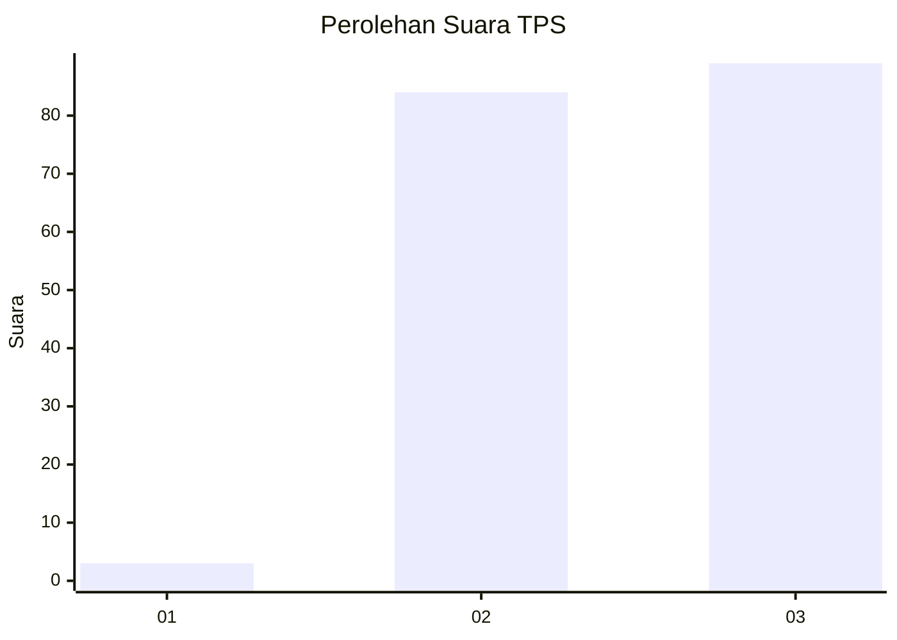
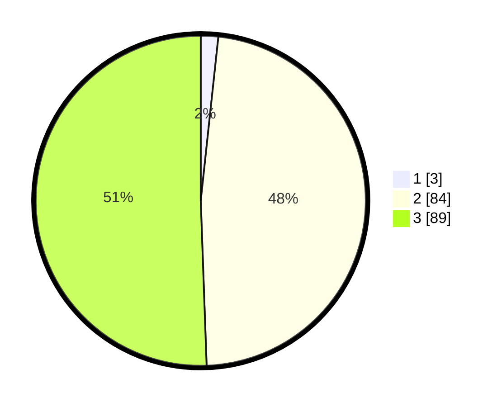

# Hasil

## Grafik

## Tabel

| No. | Nama Paslon    | Suara | Suara (raw) | Persentase |
|:--- |:-------------- | -----:| -----------:| ----------:|
| 1   | ANIES MUHAIMIN | 3     | [3][p-1]    | 1,70       |
| 2   | PRABOWO GIBRAN | 84    | [84][p-2]   | 47,73      |
| 3   | GANJAR MAHFUD  | 89    | [89][p-3]   | 50,57      |

[p-1]: https://github.com/gigit-pemilu/pemilu-2024-51-bali/blob/main/pilpres/hitung-suara/sub/51-bali/sub/04-gianyar/sub/04-tampaksiring/sub/2007-pejeng-kangin/sub/001-tps/sub/paslon-1.txt
[p-2]: https://github.com/gigit-pemilu/pemilu-2024-51-bali/blob/main/pilpres/hitung-suara/sub/51-bali/sub/04-gianyar/sub/04-tampaksiring/sub/2007-pejeng-kangin/sub/001-tps/sub/paslon-2.txt
[p-3]: https://github.com/gigit-pemilu/pemilu-2024-51-bali/blob/main/pilpres/hitung-suara/sub/51-bali/sub/04-gianyar/sub/04-tampaksiring/sub/2007-pejeng-kangin/sub/001-tps/sub/paslon-3.txt

## Foto C Plano

https://sirekap-obj-formc.kpu.go.id/2b1f/pemilu/ppwp/51/04/04/20/07/5104042007001-20240214-141430--8e5e158c-0a8a-49ca-89f0-98b042436ea9.jpg

https://sirekap-obj-formc.kpu.go.id/2b1f/pemilu/ppwp/51/04/04/20/07/5104042007001-20240214-141434--25906ebc-319b-4885-8885-de316d334400.jpg

https://sirekap-obj-formc.kpu.go.id/2b1f/pemilu/ppwp/51/04/04/20/07/5104042007001-20240214-141438--d2661153-699b-46c6-8d10-b72a17118f30.jpg

## Metadata

| Key        | Value               |
| ---------- | ------------------- |
| Time Stamp | 2024-02-14 21:46:01 |

