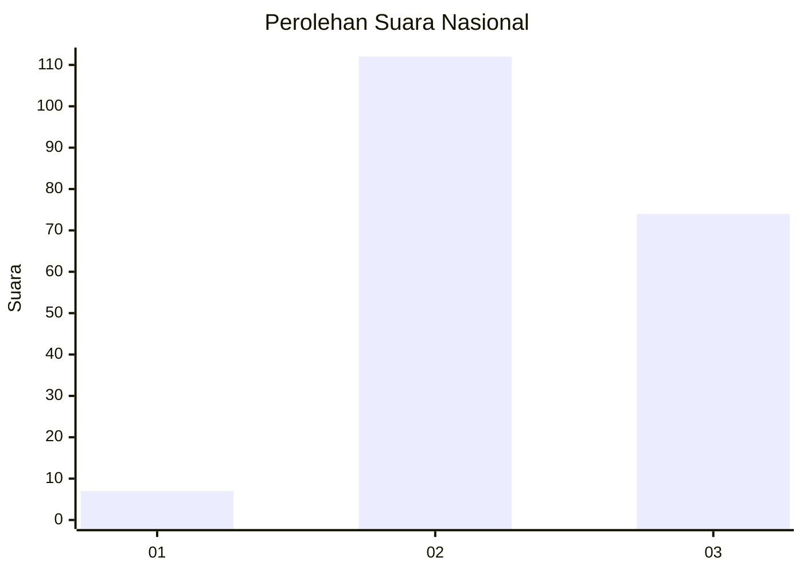
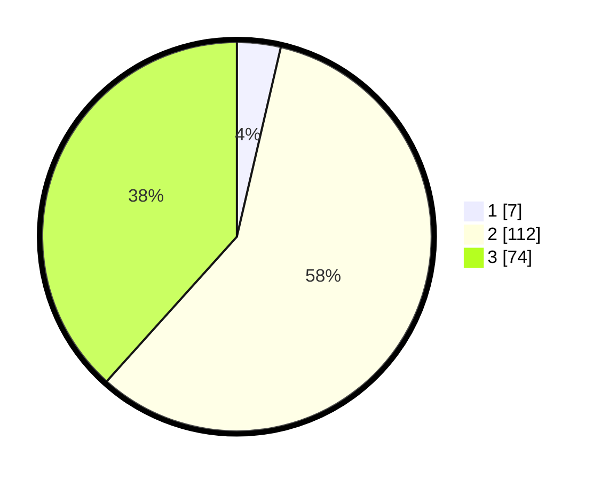

# Hasil

## Grafik

## Tabel

| No. | Nama Paslon    | Suara | Suara (raw) | Persentase |
|:--- |:-------------- | -----:| -----------:| ----------:|
| 1   | ANIES MUHAIMIN | 7     | [7][p-1]    | 3,63       |
| 2   | PRABOWO GIBRAN | 112   | [112][p-2]  | 58,03      |
| 3   | GANJAR MAHFUD  | 74    | [74][p-3]   | 38,34      |

[p-1]: https://github.com/gigit-pemilu/pemilu-2024/blob/main/pilpres/hitung-suara/sub/51-bali/sub/04-gianyar/sub/04-tampaksiring/sub/2007-pejeng-kangin/sub/004-tps/sub/paslon-1.txt
[p-2]: https://github.com/gigit-pemilu/pemilu-2024/blob/main/pilpres/hitung-suara/sub/51-bali/sub/04-gianyar/sub/04-tampaksiring/sub/2007-pejeng-kangin/sub/004-tps/sub/paslon-2.txt
[p-3]: https://github.com/gigit-pemilu/pemilu-2024/blob/main/pilpres/hitung-suara/sub/51-bali/sub/04-gianyar/sub/04-tampaksiring/sub/2007-pejeng-kangin/sub/004-tps/sub/paslon-3.txt

## Foto C Plano

https://sirekap-obj-formc.kpu.go.id/04c3/pemilu/ppwp/51/04/04/20/07/5104042007004-20240214-224052--eb02e2b2-7549-47a8-a637-59349608da8d.jpg

https://sirekap-obj-formc.kpu.go.id/04c3/pemilu/ppwp/51/04/04/20/07/5104042007004-20240214-224124--f8d09fce-dab7-42b7-8a47-a7a09dde164a.jpg

## Metadata

| Key        | Value               |
| ---------- | ------------------- |
| Time Stamp | 2024-02-24 22:31:28 |

