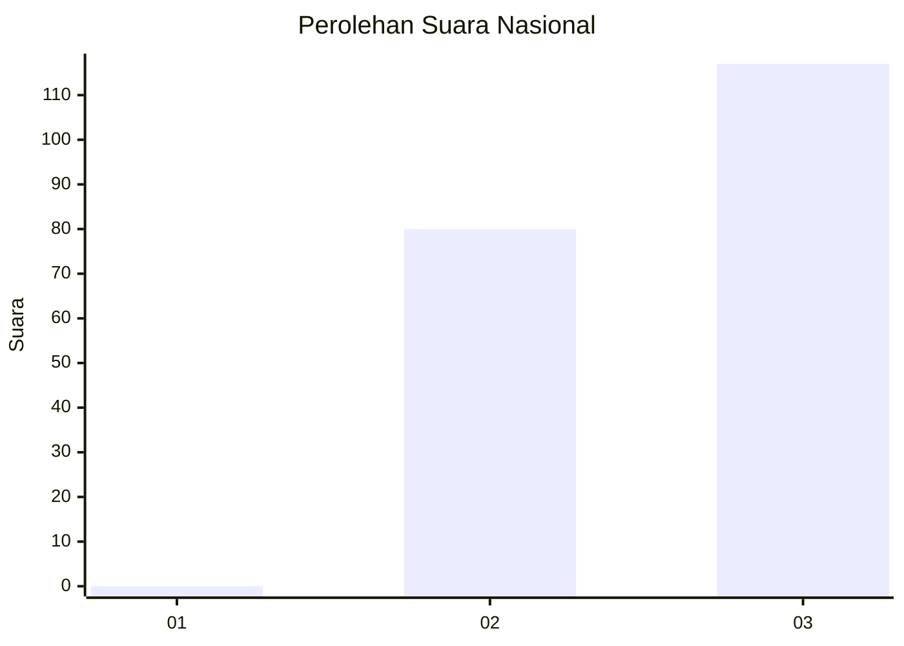
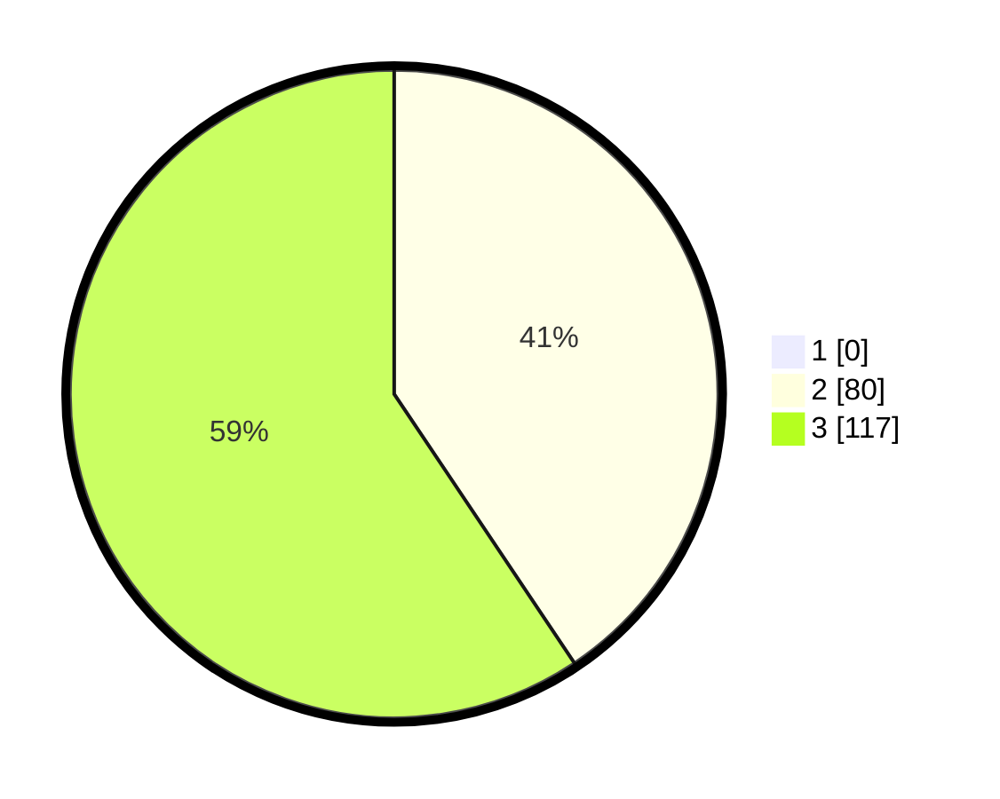

# Hasil

## Grafik

## Tabel

| No. | Nama Paslon    | Suara | Suara (raw) | Persentase |
|:--- |:-------------- | -----:| -----------:| ----------:|
| 1   | ANIES MUHAIMIN | 0     | [0][p-1]    | 0,00       |
| 2   | PRABOWO GIBRAN | 80    | [80][p-2]   | 40,61      |
| 3   | GANJAR MAHFUD  | 117   | [117][p-3]  | 59,39      |

[p-1]: https://github.com/gigit-pemilu/pemilu-2024/blob/main/pilpres/hitung-suara/sub/51-bali/sub/04-gianyar/sub/04-tampaksiring/sub/2007-pejeng-kangin/sub/006-tps/sub/paslon-1.txt
[p-2]: https://github.com/gigit-pemilu/pemilu-2024/blob/main/pilpres/hitung-suara/sub/51-bali/sub/04-gianyar/sub/04-tampaksiring/sub/2007-pejeng-kangin/sub/006-tps/sub/paslon-2.txt
[p-3]: https://github.com/gigit-pemilu/pemilu-2024/blob/main/pilpres/hitung-suara/sub/51-bali/sub/04-gianyar/sub/04-tampaksiring/sub/2007-pejeng-kangin/sub/006-tps/sub/paslon-3.txt

## Foto C Plano

https://sirekap-obj-formc.kpu.go.id/b771/pemilu/ppwp/51/04/04/20/07/5104042007006-20240214-225718--1d8debcf-447f-4413-b1ca-2bad6d6937b1.jpg

https://sirekap-obj-formc.kpu.go.id/b771/pemilu/ppwp/51/04/04/20/07/5104042007006-20240214-225815--3486ff18-5469-4956-907a-de5c332c2835.jpg

https://sirekap-obj-formc.kpu.go.id/b771/pemilu/ppwp/51/04/04/20/07/5104042007006-20240214-230125--ce5bd010-157c-4fe4-8cc3-61519d1f3ae6.jpg

## Metadata

| Key        | Value               |
| ---------- | ------------------- |
| Time Stamp | 2024-02-15 15:30:25 |

