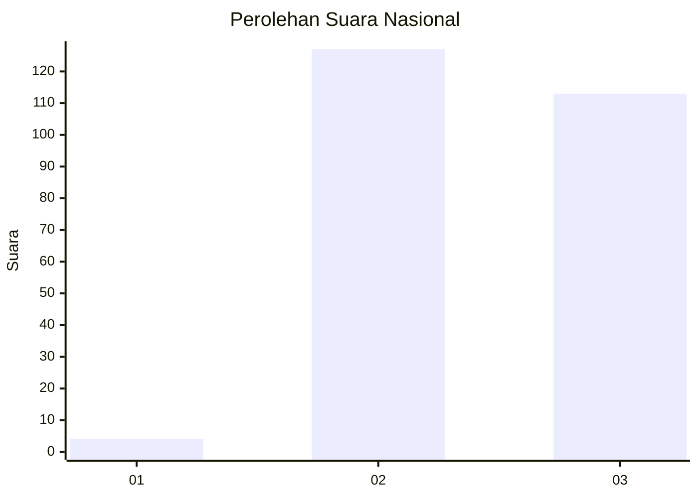
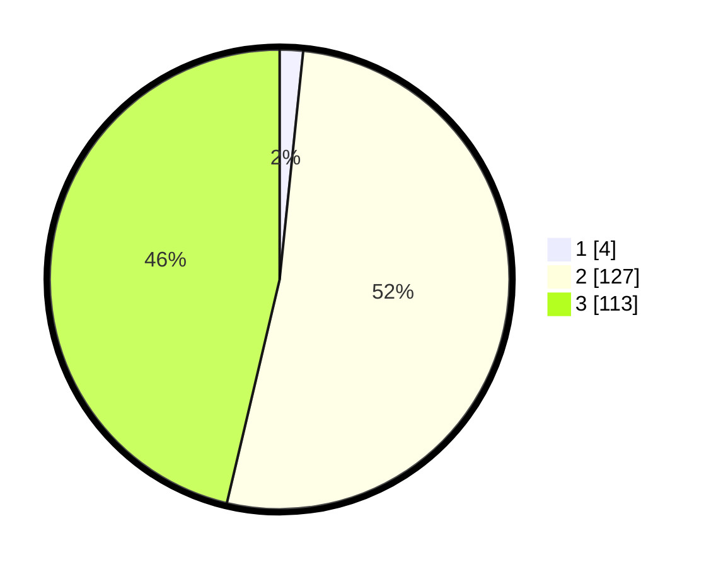

# Hasil

## Grafik

## Tabel

| No. | Nama Paslon    | Suara | Suara (raw) | Persentase |
|:--- |:-------------- | -----:| -----------:| ----------:|
| 1   | ANIES MUHAIMIN | 4     | [4][p-1]    | 1,64       |
| 2   | PRABOWO GIBRAN | 127   | [127][p-2]  | 52,05      |
| 3   | GANJAR MAHFUD  | 113   | [113][p-3]  | 46,31      |

[p-1]: https://github.com/gigit-pemilu/pemilu-2024/blob/main/pilpres/hitung-suara/sub/51-bali/sub/04-gianyar/sub/04-tampaksiring/sub/2007-pejeng-kangin/sub/010-tps/sub/paslon-1.txt
[p-2]: https://github.com/gigit-pemilu/pemilu-2024/blob/main/pilpres/hitung-suara/sub/51-bali/sub/04-gianyar/sub/04-tampaksiring/sub/2007-pejeng-kangin/sub/010-tps/sub/paslon-2.txt
[p-3]: https://github.com/gigit-pemilu/pemilu-2024/blob/main/pilpres/hitung-suara/sub/51-bali/sub/04-gianyar/sub/04-tampaksiring/sub/2007-pejeng-kangin/sub/010-tps/sub/paslon-3.txt

## Foto C Plano

https://sirekap-obj-formc.kpu.go.id/d8a3/pemilu/ppwp/51/04/04/20/07/5104042007010-20240214-221001--b28c5661-d40e-4011-9223-226265e37383.jpg

https://sirekap-obj-formc.kpu.go.id/d8a3/pemilu/ppwp/51/04/04/20/07/5104042007010-20240214-221017--c9e9ad31-7a6c-4079-bc05-139be627837c.jpg

https://sirekap-obj-formc.kpu.go.id/d8a3/pemilu/ppwp/51/04/04/20/07/5104042007010-20240214-221028--72e4de24-6e4e-4d99-9002-e8caae820851.jpg

## Metadata

| Key        | Value               |
| ---------- | ------------------- |
| Time Stamp | 2024-02-15 15:00:29 |

