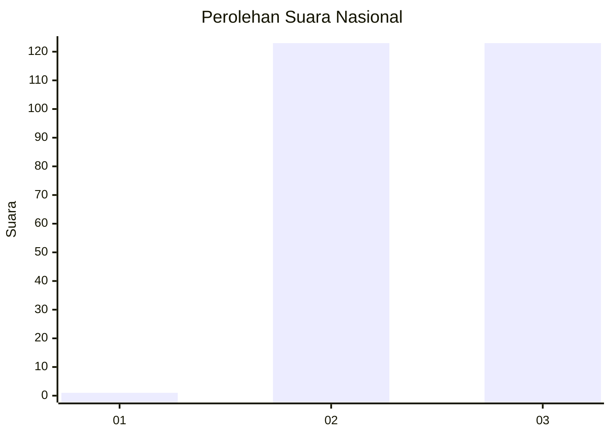
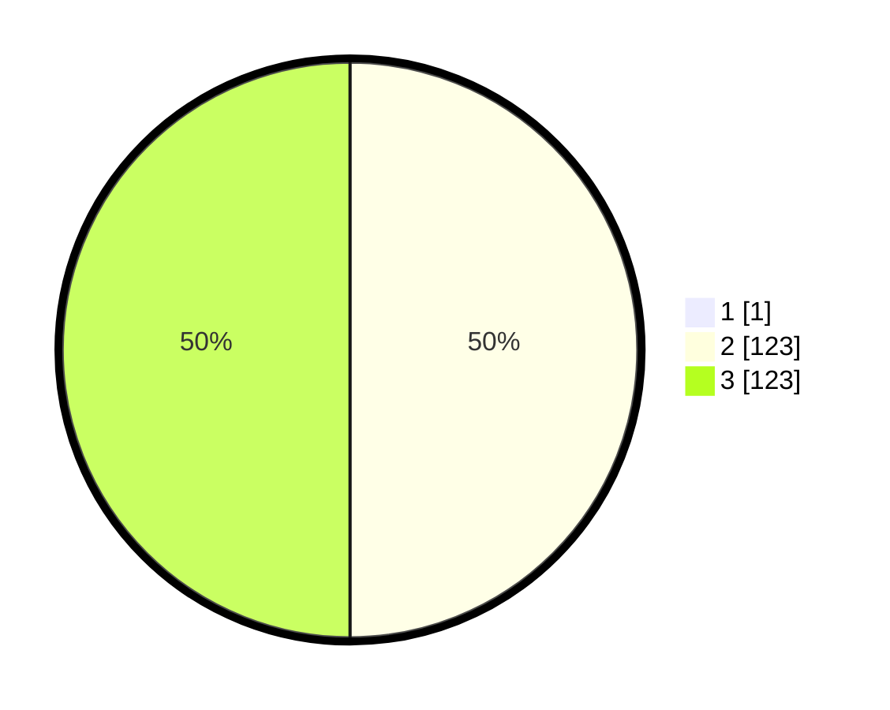

# Hasil

## Grafik

## Tabel

| No. | Nama Paslon    | Suara | Suara (raw) | Persentase |
|:--- |:-------------- | -----:| -----------:| ----------:|
| 1   | ANIES MUHAIMIN | 1     | [1][p-1]    | 0,40       |
| 2   | PRABOWO GIBRAN | 123   | [123][p-2]  | 49,80      |
| 3   | GANJAR MAHFUD  | 123   | [123][p-3]  | 49,80      |

[p-1]: https://github.com/gigit-pemilu/pemilu-2024/blob/main/pilpres/hitung-suara/sub/51-bali/sub/04-gianyar/sub/04-tampaksiring/sub/2007-pejeng-kangin/sub/011-tps/sub/paslon-1.txt
[p-2]: https://github.com/gigit-pemilu/pemilu-2024/blob/main/pilpres/hitung-suara/sub/51-bali/sub/04-gianyar/sub/04-tampaksiring/sub/2007-pejeng-kangin/sub/011-tps/sub/paslon-2.txt
[p-3]: https://github.com/gigit-pemilu/pemilu-2024/blob/main/pilpres/hitung-suara/sub/51-bali/sub/04-gianyar/sub/04-tampaksiring/sub/2007-pejeng-kangin/sub/011-tps/sub/paslon-3.txt

## Foto C Plano

https://sirekap-obj-formc.kpu.go.id/4558/pemilu/ppwp/51/04/04/20/07/5104042007011-20240215-005418--8387cad8-398a-4a96-8898-455ef4fc8854.jpg

https://sirekap-obj-formc.kpu.go.id/4558/pemilu/ppwp/51/04/04/20/07/5104042007011-20240215-005441--0fd0ebc5-5f68-415b-9612-5405d8fd0856.jpg

https://sirekap-obj-formc.kpu.go.id/4558/pemilu/ppwp/51/04/04/20/07/5104042007011-20240215-005454--228c797f-c374-41e7-b6dd-bcc313edef25.jpg

## Metadata

| Key        | Value               |
| ---------- | ------------------- |
| Time Stamp | 2024-02-15 15:30:25 |

