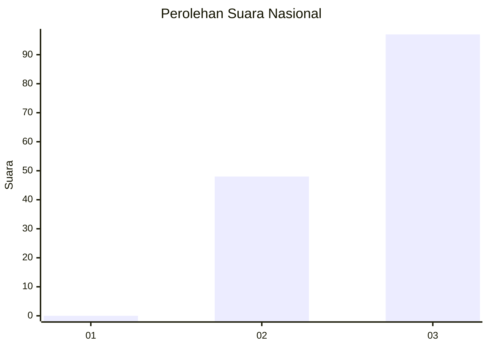
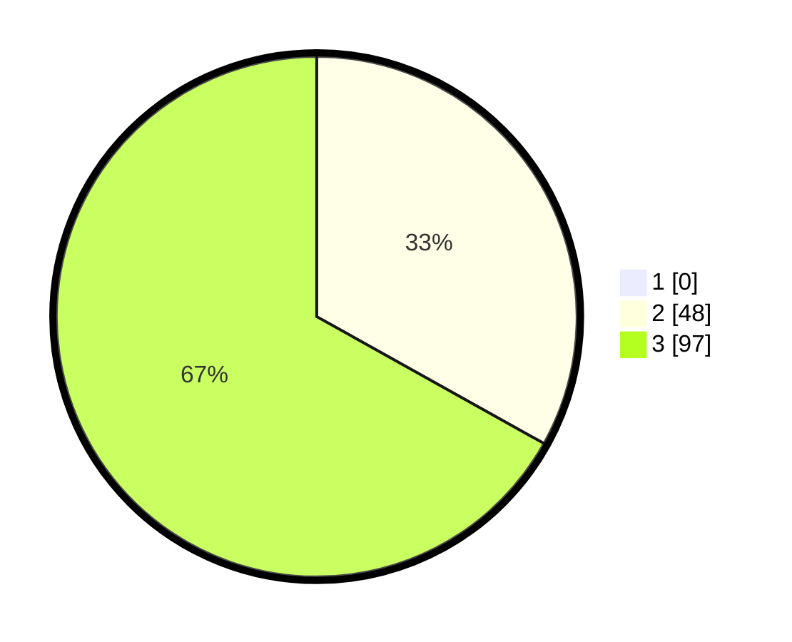

# Hasil

## Grafik

## Tabel

| No. | Nama Paslon    | Suara | Suara (raw) | Persentase |
|:--- |:-------------- | -----:| -----------:| ----------:|
| 1   | ANIES MUHAIMIN | 0     | [0][p-1]    | 0,00       |
| 2   | PRABOWO GIBRAN | 48    | [48][p-2]   | 33,10      |
| 3   | GANJAR MAHFUD  | 97    | [97][p-3]   | 66,90      |

[p-1]: https://github.com/gigit-pemilu/pemilu-2024/blob/main/pilpres/hitung-suara/sub/51-bali/sub/04-gianyar/sub/04-tampaksiring/sub/2007-pejeng-kangin/sub/013-tps/sub/paslon-1.txt
[p-2]: https://github.com/gigit-pemilu/pemilu-2024/blob/main/pilpres/hitung-suara/sub/51-bali/sub/04-gianyar/sub/04-tampaksiring/sub/2007-pejeng-kangin/sub/013-tps/sub/paslon-2.txt
[p-3]: https://github.com/gigit-pemilu/pemilu-2024/blob/main/pilpres/hitung-suara/sub/51-bali/sub/04-gianyar/sub/04-tampaksiring/sub/2007-pejeng-kangin/sub/013-tps/sub/paslon-3.txt

## Foto C Plano

https://sirekap-obj-formc.kpu.go.id/562c/pemilu/ppwp/51/04/04/20/07/5104042007013-20240214-222305--e1dac7e2-cad8-48e1-a925-44ed8971d118.jpg

https://sirekap-obj-formc.kpu.go.id/562c/pemilu/ppwp/51/04/04/20/07/5104042007013-20240214-211526--180e66ae-844a-485d-a93b-22b9d8603f8d.jpg

https://sirekap-obj-formc.kpu.go.id/562c/pemilu/ppwp/51/04/04/20/07/5104042007013-20240214-211530--f64d3b07-0486-4b54-8e59-0d52df0073c9.jpg

## Metadata

| Key        | Value               |
| ---------- | ------------------- |
| Time Stamp | 2024-02-15 00:41:44 |

