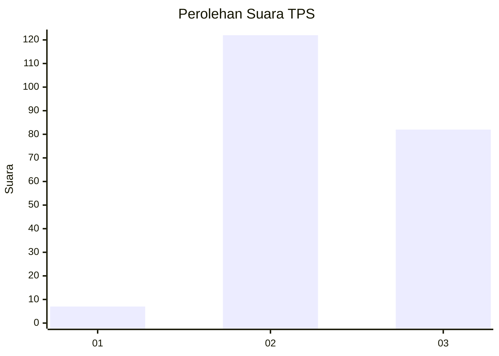
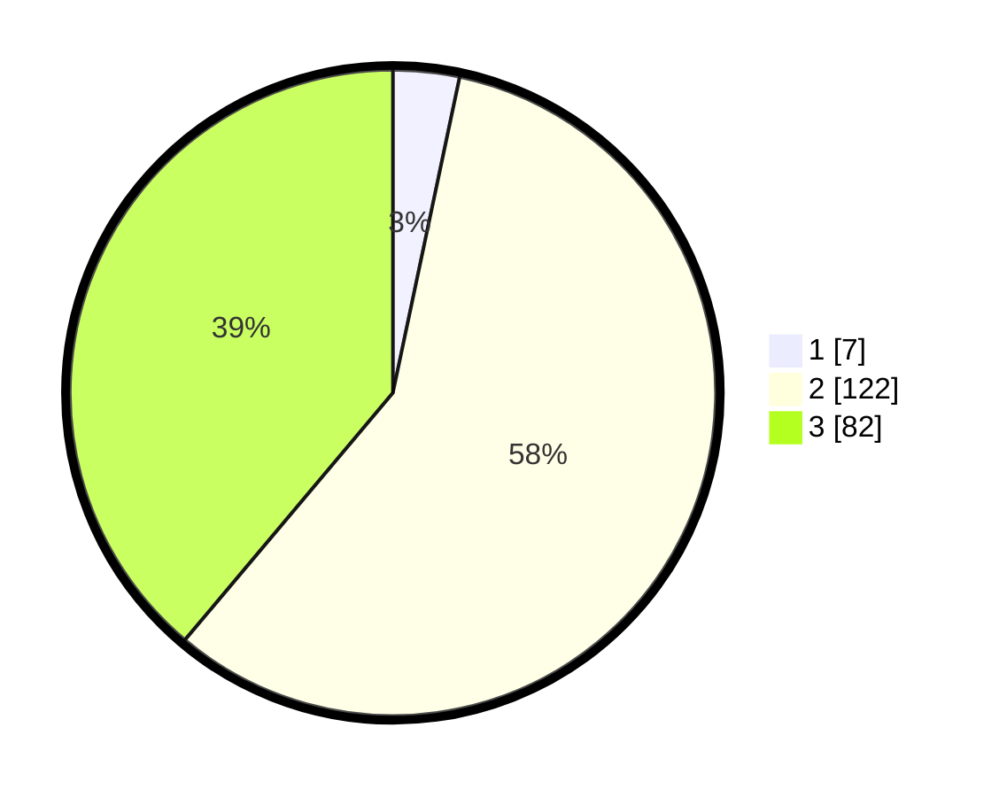

# Hasil

## Grafik

## Tabel

| No. | Nama Paslon    | Suara | Suara (raw) | Persentase |
|:--- |:-------------- | -----:| -----------:| ----------:|
| 1   | ANIES MUHAIMIN | 7     | [7][p-1]    | 3,32       |
| 2   | PRABOWO GIBRAN | 122   | [122][p-2]  | 57,82      |
| 3   | GANJAR MAHFUD  | 82    | [82][p-3]   | 38,86      |

[p-1]: https://github.com/gigit-pemilu/pemilu-2024-51-bali/blob/main/pilpres/hitung-suara/sub/51-bali/sub/04-gianyar/sub/04-tampaksiring/sub/2007-pejeng-kangin/sub/016-tps/sub/paslon-1.txt
[p-2]: https://github.com/gigit-pemilu/pemilu-2024-51-bali/blob/main/pilpres/hitung-suara/sub/51-bali/sub/04-gianyar/sub/04-tampaksiring/sub/2007-pejeng-kangin/sub/016-tps/sub/paslon-2.txt
[p-3]: https://github.com/gigit-pemilu/pemilu-2024-51-bali/blob/main/pilpres/hitung-suara/sub/51-bali/sub/04-gianyar/sub/04-tampaksiring/sub/2007-pejeng-kangin/sub/016-tps/sub/paslon-3.txt

## Foto C Plano

https://sirekap-obj-formc.kpu.go.id/0a12/pemilu/ppwp/51/04/04/20/07/5104042007016-20240214-211428--38996c98-6ef6-446c-aab1-d70e05314807.jpg

https://sirekap-obj-formc.kpu.go.id/0a12/pemilu/ppwp/51/04/04/20/07/5104042007016-20240214-211445--1d984426-01b8-4dc4-8b83-9adc1f9049d3.jpg

https://sirekap-obj-formc.kpu.go.id/0a12/pemilu/ppwp/51/04/04/20/07/5104042007016-20240214-211504--79982653-e962-472a-957b-3b5bb836a6cc.jpg

## Metadata

| Key        | Value               |
| ---------- | ------------------- |
| Time Stamp | 2024-02-15 15:30:25 |

