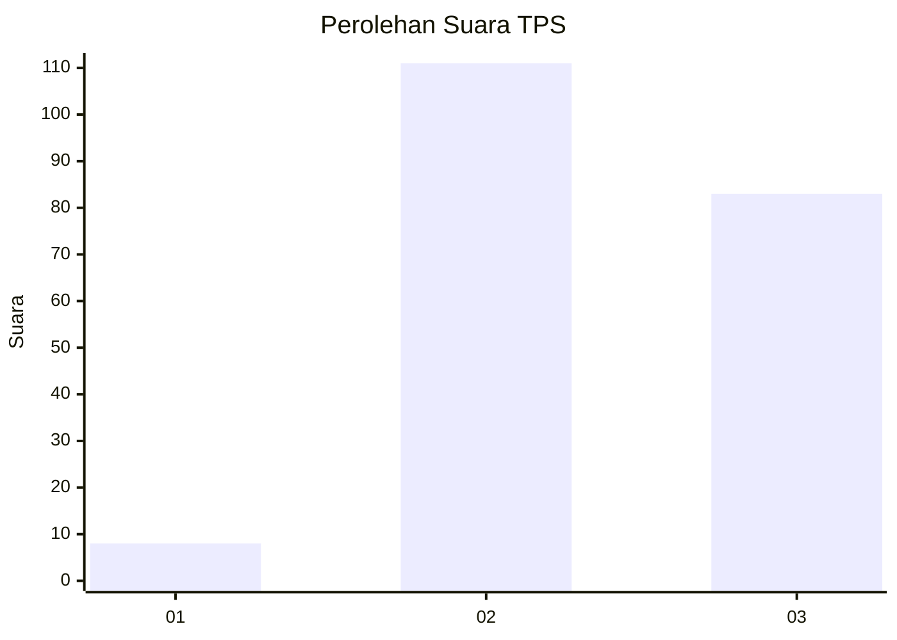
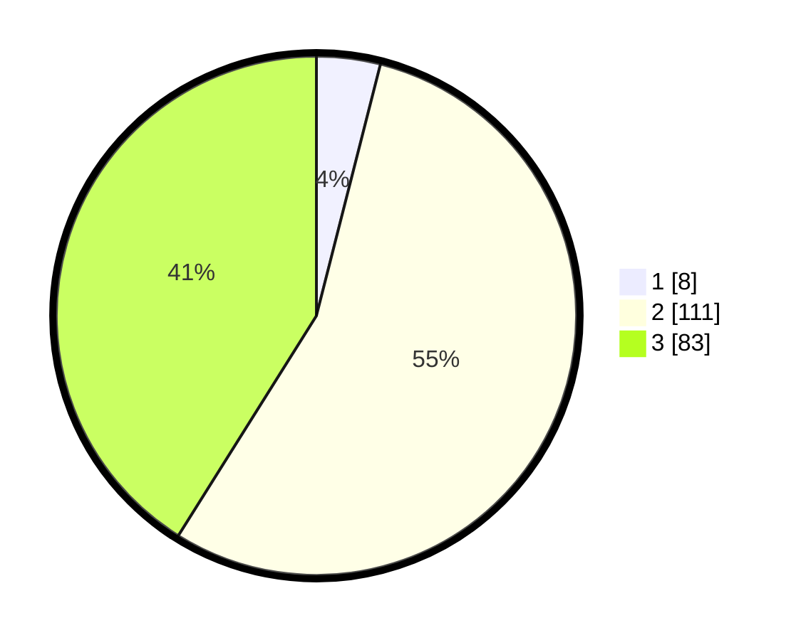

# Hasil

## Grafik

## Tabel

| No. | Nama Paslon    | Suara | Suara (raw) | Persentase |
|:--- |:-------------- | -----:| -----------:| ----------:|
| 1   | ANIES MUHAIMIN | 8     | [8][p-1]    | 3,96       |
| 2   | PRABOWO GIBRAN | 111   | [111][p-2]  | 54,95      |
| 3   | GANJAR MAHFUD  | 83    | [83][p-3]   | 41,09      |

[p-1]: https://github.com/gigit-pemilu/pemilu-2024-51-bali/blob/main/pilpres/hitung-suara/sub/51-bali/sub/04-gianyar/sub/04-tampaksiring/sub/2007-pejeng-kangin/sub/017-tps/sub/paslon-1.txt
[p-2]: https://github.com/gigit-pemilu/pemilu-2024-51-bali/blob/main/pilpres/hitung-suara/sub/51-bali/sub/04-gianyar/sub/04-tampaksiring/sub/2007-pejeng-kangin/sub/017-tps/sub/paslon-2.txt
[p-3]: https://github.com/gigit-pemilu/pemilu-2024-51-bali/blob/main/pilpres/hitung-suara/sub/51-bali/sub/04-gianyar/sub/04-tampaksiring/sub/2007-pejeng-kangin/sub/017-tps/sub/paslon-3.txt

## Foto C Plano

https://sirekap-obj-formc.kpu.go.id/b3bd/pemilu/ppwp/51/04/04/20/07/5104042007017-20240214-141706--41726561-0ac2-4f36-b92f-6ad24ee12235.jpg

https://sirekap-obj-formc.kpu.go.id/b3bd/pemilu/ppwp/51/04/04/20/07/5104042007017-20240214-141656--f63be03d-50e9-4727-b409-351ce9716422.jpg

https://sirekap-obj-formc.kpu.go.id/b3bd/pemilu/ppwp/51/04/04/20/07/5104042007017-20240214-141645--1024aad4-2f7b-4711-95ef-5d16f195ddf2.jpg

## Metadata

| Key        | Value               |
| ---------- | ------------------- |
| Time Stamp | 2024-02-15 15:00:29 |

