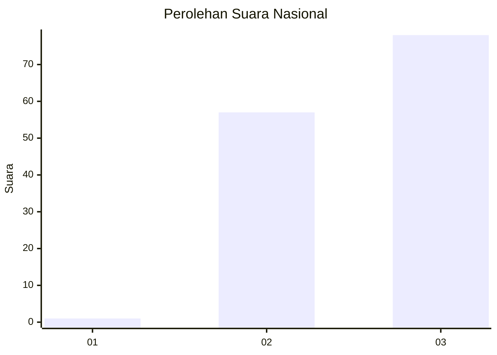
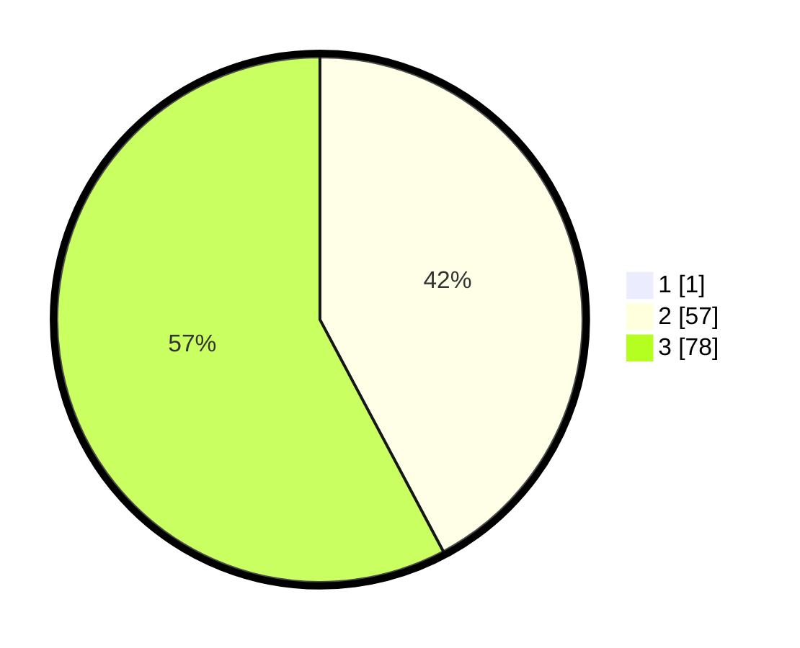

# Hasil

## Grafik

## Tabel

| No. | Nama Paslon    | Suara | Suara (raw) | Persentase |
|:--- |:-------------- | -----:| -----------:| ----------:|
| 1   | ANIES MUHAIMIN | 1     | [1][p-1]    | 0,74       |
| 2   | PRABOWO GIBRAN | 57    | [57][p-2]   | 41,91      |
| 3   | GANJAR MAHFUD  | 78    | [78][p-3]   | 57,35      |

[p-1]: https://github.com/gigit-pemilu/pemilu-2024/blob/main/pilpres/hitung-suara/sub/51-bali/sub/04-gianyar/sub/04-tampaksiring/sub/2008-pejeng-kelod/sub/001-tps/sub/paslon-1.txt
[p-2]: https://github.com/gigit-pemilu/pemilu-2024/blob/main/pilpres/hitung-suara/sub/51-bali/sub/04-gianyar/sub/04-tampaksiring/sub/2008-pejeng-kelod/sub/001-tps/sub/paslon-2.txt
[p-3]: https://github.com/gigit-pemilu/pemilu-2024/blob/main/pilpres/hitung-suara/sub/51-bali/sub/04-gianyar/sub/04-tampaksiring/sub/2008-pejeng-kelod/sub/001-tps/sub/paslon-3.txt

## Foto C Plano

https://sirekap-obj-formc.kpu.go.id/df22/pemilu/ppwp/51/04/04/20/08/5104042008001-20240216-042148--e0d374a8-99a4-4606-9ee7-9e9db8942068.jpg

https://sirekap-obj-formc.kpu.go.id/df22/pemilu/ppwp/51/04/04/20/08/5104042008001-20240216-042149--0acae855-8332-47e1-b806-b7713ff85b18.jpg

https://sirekap-obj-formc.kpu.go.id/df22/pemilu/ppwp/51/04/04/20/08/5104042008001-20240216-042148--c6c3b8f9-3000-4468-91b4-3319cbe9471a.jpg

## Metadata

| Key        | Value               |
| ---------- | ------------------- |
| Time Stamp | 2024-02-16 10:00:28 |

## DATA PEMILIH TETAP

Jumlah pemilih dalam DPT: **151**.
 * L: **81**.
 * P: **70**.

## DATA PENGGUNA HAK PILIH

Jumlah pengguna hak pilih dalam DPT: **135**.
 * L: **73**.
 * P: **62**.

Jumlah pengguna hak pilih dalam DPTb: **1**.
 * L: **0**.
 * P: **1**.

Jumlah pengguna hak pilih dalam DPK: **1**.
 * L: **0**.
 * P: **1**.

Jumlah pengguna hak pilih: **137**.
 * L: **73**.
 * P: **64**.

## JUMLAH SUARA SAH DAN TIDAK SAH

JUMLAH SELURUH SUARA SAH: **136**.

JUMLAH SUARA TIDAK SAH: **1**.

JUMLAH SELURUH SUARA SAH DAN SUARA TIDAK SAH: **137**.

