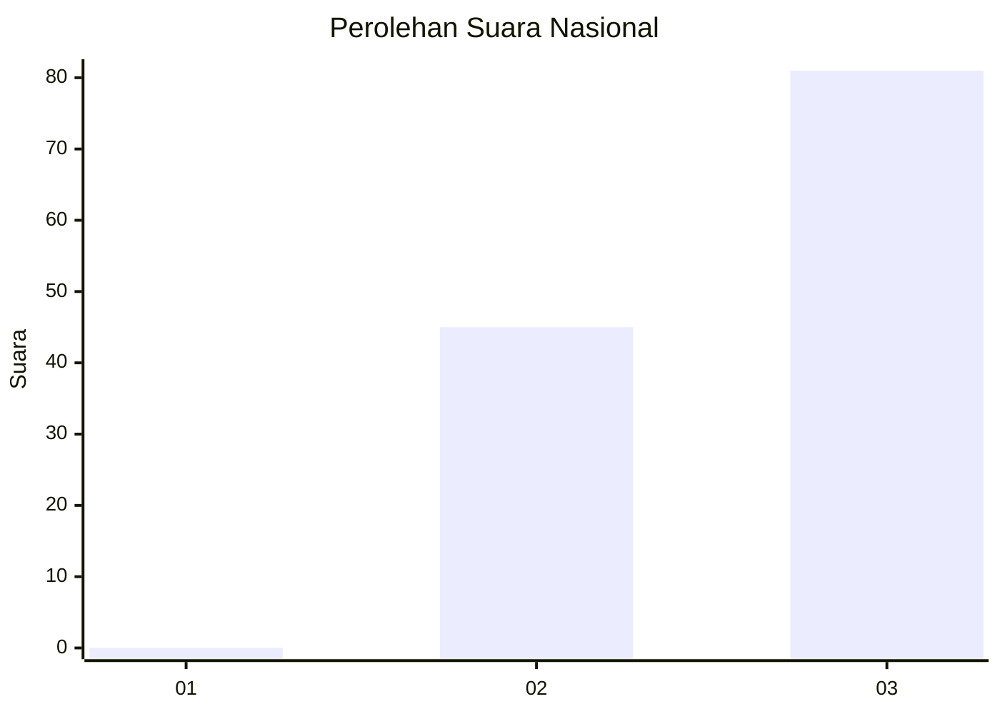
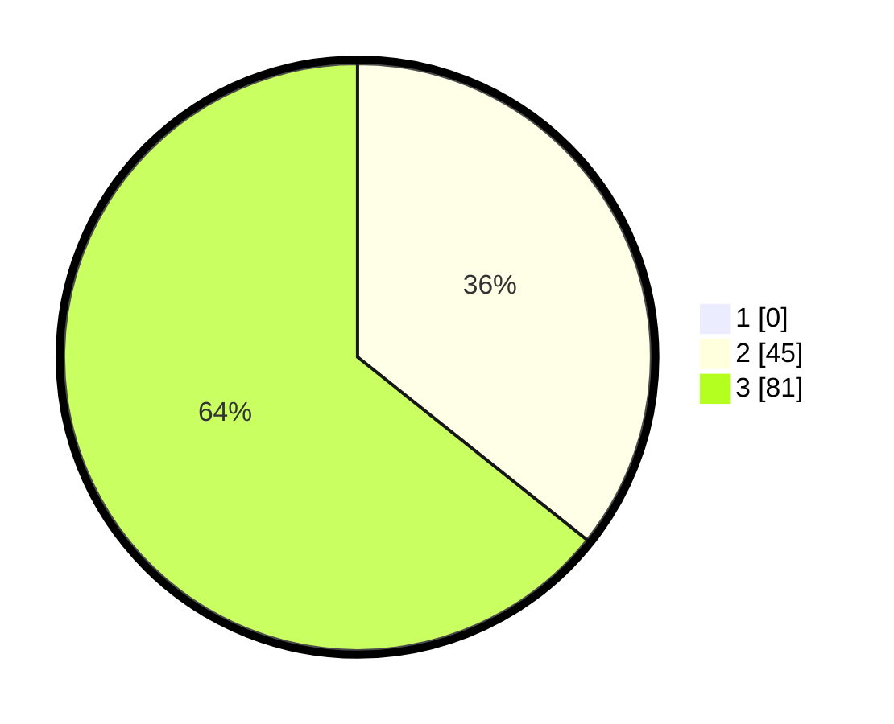

# Hasil

## Grafik

## Tabel

| No. | Nama Paslon    | Suara | Suara (raw) | Persentase |
|:--- |:-------------- | -----:| -----------:| ----------:|
| 1   | ANIES MUHAIMIN | 0     | [0][p-1]    | 0,00       |
| 2   | PRABOWO GIBRAN | 45    | [45][p-2]   | 35,71      |
| 3   | GANJAR MAHFUD  | 81    | [81][p-3]   | 64,29      |

[p-1]: https://github.com/gigit-pemilu/pemilu-2024/blob/main/pilpres/hitung-suara/sub/51-bali/sub/04-gianyar/sub/04-tampaksiring/sub/2008-pejeng-kelod/sub/002-tps/sub/paslon-1.txt
[p-2]: https://github.com/gigit-pemilu/pemilu-2024/blob/main/pilpres/hitung-suara/sub/51-bali/sub/04-gianyar/sub/04-tampaksiring/sub/2008-pejeng-kelod/sub/002-tps/sub/paslon-2.txt
[p-3]: https://github.com/gigit-pemilu/pemilu-2024/blob/main/pilpres/hitung-suara/sub/51-bali/sub/04-gianyar/sub/04-tampaksiring/sub/2008-pejeng-kelod/sub/002-tps/sub/paslon-3.txt

## Foto C Plano

https://sirekap-obj-formc.kpu.go.id/40ed/pemilu/ppwp/51/04/04/20/08/5104042008002-20240216-144225--00acef16-c04e-4b2f-82df-f25839480ae0.jpg

https://sirekap-obj-formc.kpu.go.id/40ed/pemilu/ppwp/51/04/04/20/08/5104042008002-20240216-144227--718449dd-099d-4f50-a612-131a3c2c1013.jpg

https://sirekap-obj-formc.kpu.go.id/40ed/pemilu/ppwp/51/04/04/20/08/5104042008002-20240216-144226--d516beff-f1e7-49f3-a94e-b1a17bbd661d.jpg

## Metadata

| Key        | Value               |
| ---------- | ------------------- |
| Time Stamp | 2024-02-16 16:25:10 |

## DATA PEMILIH TETAP

Jumlah pemilih dalam DPT: **152**.
 * L: **74**.
 * P: **78**.

## DATA PENGGUNA HAK PILIH

Jumlah pengguna hak pilih dalam DPT: **126**.
 * L: **67**.
 * P: **59**.

Jumlah pengguna hak pilih dalam DPTb: **0**.
 * L: **0**.
 * P: **0**.

Jumlah pengguna hak pilih dalam DPK: **0**.
 * L: **0**.
 * P: **0**.

Jumlah pengguna hak pilih: **126**.
 * L: **67**.
 * P: **59**.

## JUMLAH SUARA SAH DAN TIDAK SAH

JUMLAH SELURUH SUARA SAH: **126**.

JUMLAH SUARA TIDAK SAH: **0**.

JUMLAH SELURUH SUARA SAH DAN SUARA TIDAK SAH: **126**.

