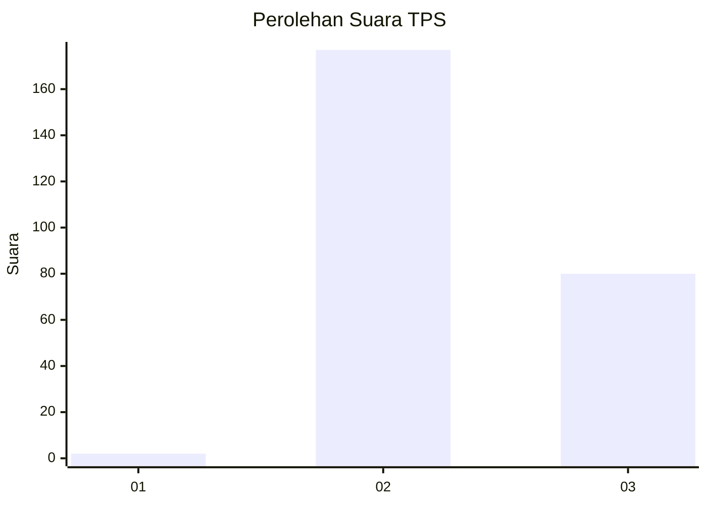
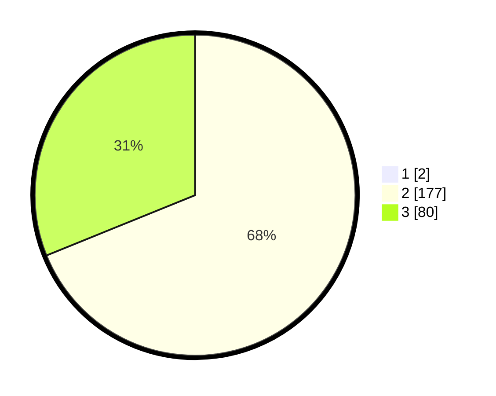

# Hasil

## Grafik

## Tabel

| No. | Nama Paslon    | Suara | Suara (raw) | Persentase |
|:--- |:-------------- | -----:| -----------:| ----------:|
| 1   | ANIES MUHAIMIN | 2     | [2][p-1]    | 0,77       |
| 2   | PRABOWO GIBRAN | 177   | [177][p-2]  | 68,34      |
| 3   | GANJAR MAHFUD  | 80    | [80][p-3]   | 30,89      |

[p-1]: https://github.com/gigit-pemilu/pemilu-2024-51-bali/blob/main/pilpres/hitung-suara/sub/51-bali/sub/04-gianyar/sub/05-ubud/sub/1005-ubud/sub/001-tps/sub/paslon-1.txt
[p-2]: https://github.com/gigit-pemilu/pemilu-2024-51-bali/blob/main/pilpres/hitung-suara/sub/51-bali/sub/04-gianyar/sub/05-ubud/sub/1005-ubud/sub/001-tps/sub/paslon-2.txt
[p-3]: https://github.com/gigit-pemilu/pemilu-2024-51-bali/blob/main/pilpres/hitung-suara/sub/51-bali/sub/04-gianyar/sub/05-ubud/sub/1005-ubud/sub/001-tps/sub/paslon-3.txt

## Foto C Plano

https://sirekap-obj-formc.kpu.go.id/ee79/pemilu/ppwp/51/04/05/10/05/5104051005001-20240214-192733--036510f2-ca60-4401-af89-6fbfa653154d.jpg

https://sirekap-obj-formc.kpu.go.id/ee79/pemilu/ppwp/51/04/05/10/05/5104051005001-20240214-200707--2438f977-40a3-4878-a462-ef41ddea0fa7.jpg

https://sirekap-obj-formc.kpu.go.id/ee79/pemilu/ppwp/51/04/05/10/05/5104051005001-20240215-105210--395a7ba6-07f5-4ca4-ae88-32f658435a55.jpg

## Metadata

| Key        | Value               |
| ---------- | ------------------- |
| Time Stamp | 2024-02-15 22:00:27 |

## DATA PEMILIH TETAP

Jumlah pemilih dalam DPT: **294**.
 * L: **130**.
 * P: **164**.

## DATA PENGGUNA HAK PILIH

Jumlah pengguna hak pilih dalam DPT: **261**.
 * L: **116**.
 * P: **145**.

Jumlah pengguna hak pilih dalam DPTb: **1**.
 * L: **0**.
 * P: **1**.

Jumlah pengguna hak pilih dalam DPK: **0**.
 * L: **0**.
 * P: **0**.

Jumlah pengguna hak pilih: **262**.
 * L: **116**.
 * P: **146**.

## JUMLAH SUARA SAH DAN TIDAK SAH

JUMLAH SELURUH SUARA SAH: **259**.

JUMLAH SUARA TIDAK SAH: **3**.

JUMLAH SELURUH SUARA SAH DAN SUARA TIDAK SAH: **262**.

