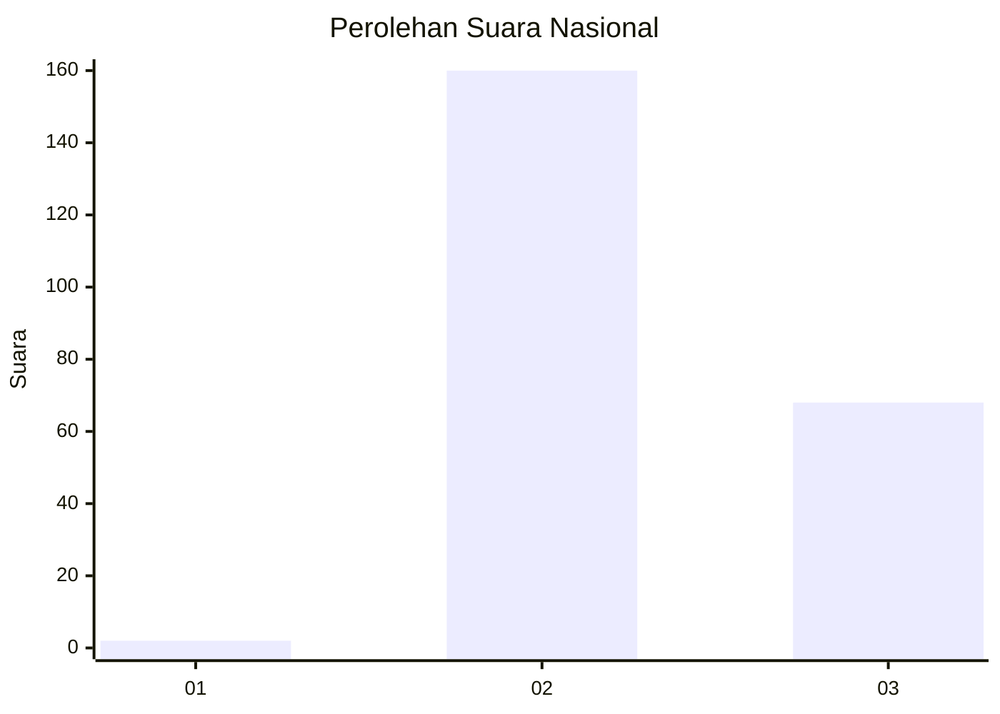
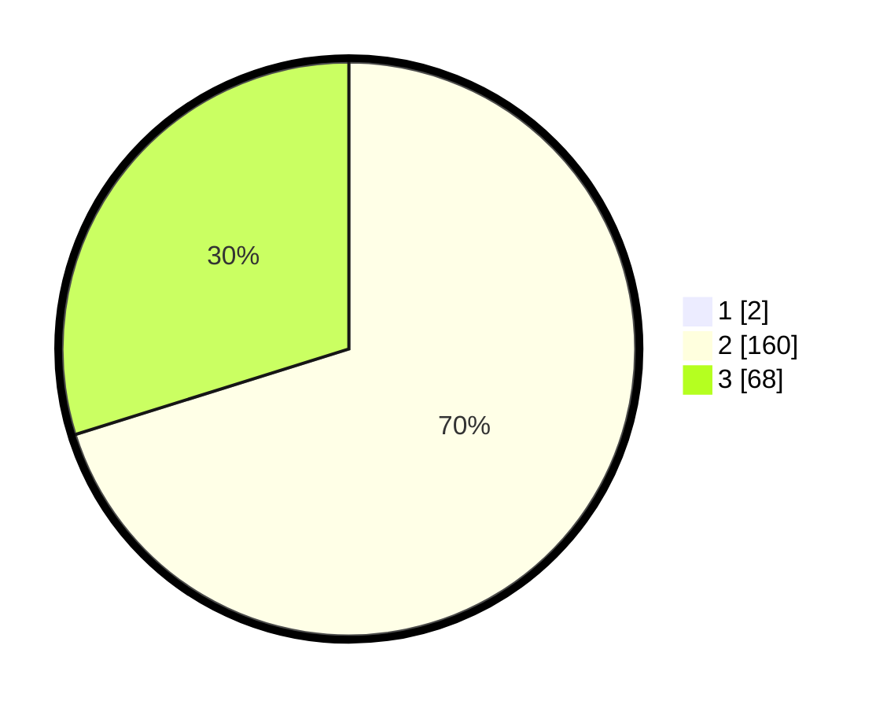

# Hasil

## Grafik

## Tabel

| No. | Nama Paslon    | Suara | Suara (raw) | Persentase |
|:--- |:-------------- | -----:| -----------:| ----------:|
| 1   | ANIES MUHAIMIN | 2     | [2][p-1]    | 0,87       |
| 2   | PRABOWO GIBRAN | 160   | [160][p-2]  | 69,57      |
| 3   | GANJAR MAHFUD  | 68    | [68][p-3]   | 29,57      |

[p-1]: https://github.com/gigit-pemilu/pemilu-2024/blob/main/pilpres/hitung-suara/sub/51-bali/sub/04-gianyar/sub/05-ubud/sub/1005-ubud/sub/008-tps/sub/paslon-1.txt
[p-2]: https://github.com/gigit-pemilu/pemilu-2024/blob/main/pilpres/hitung-suara/sub/51-bali/sub/04-gianyar/sub/05-ubud/sub/1005-ubud/sub/008-tps/sub/paslon-2.txt
[p-3]: https://github.com/gigit-pemilu/pemilu-2024/blob/main/pilpres/hitung-suara/sub/51-bali/sub/04-gianyar/sub/05-ubud/sub/1005-ubud/sub/008-tps/sub/paslon-3.txt

## Foto C Plano

https://sirekap-obj-formc.kpu.go.id/00e5/pemilu/ppwp/51/04/05/10/05/5104051005008-20240214-201727--1359a132-8d2a-4192-8d94-55aa50f93cfd.jpg

https://sirekap-obj-formc.kpu.go.id/00e5/pemilu/ppwp/51/04/05/10/05/5104051005008-20240214-202227--62288175-c5fc-40ea-8f2b-d88f4242ea2c.jpg

https://sirekap-obj-formc.kpu.go.id/00e5/pemilu/ppwp/51/04/05/10/05/5104051005008-20240214-202605--48249193-0f1f-4a35-9ebd-545bdc97b474.jpg

## Metadata

| Key        | Value               |
| ---------- | ------------------- |
| Time Stamp | 2024-02-15 15:00:29 |

