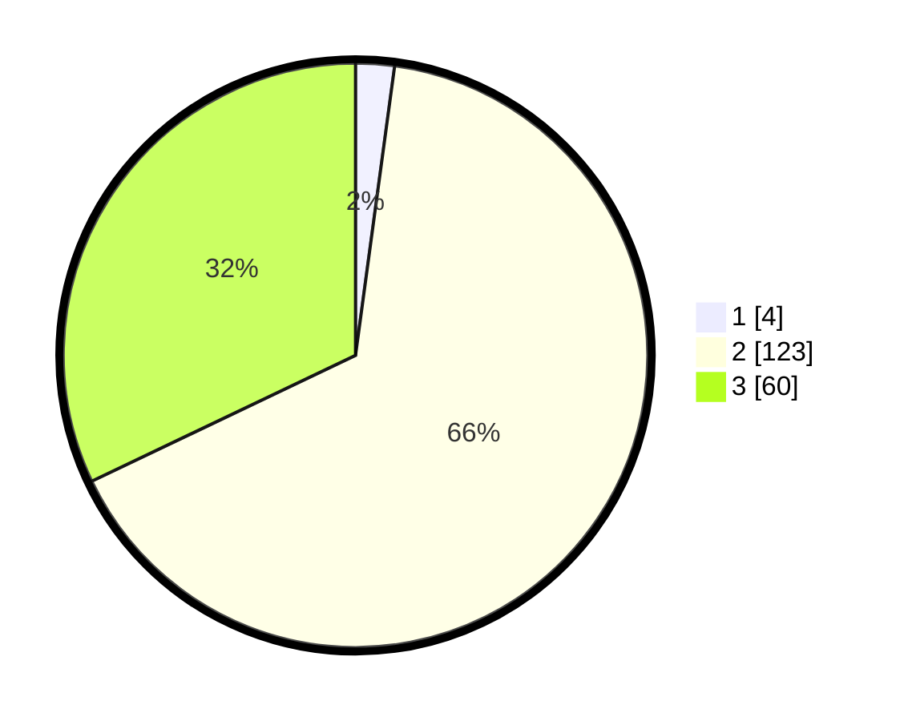

# Hasil

## Grafik

## Tabel

| No. | Nama Paslon    | Suara | Suara (raw) | Persentase |
|:--- |:-------------- | -----:| -----------:| ----------:|
| 1   | ANIES MUHAIMIN | 4     | [4][p-1]    | 2,14       |
| 2   | PRABOWO GIBRAN | 123   | [123][p-2]  | 65,78      |
| 3   | GANJAR MAHFUD  | 60    | [60][p-3]   | 32,09      |

[p-1]: https://github.com/gigit-pemilu/pemilu-2024-51-bali/blob/main/pilpres/hitung-suara/sub/51-bali/sub/04-gianyar/sub/05-ubud/sub/1005-ubud/sub/016-tps/sub/paslon-1.txt
[p-2]: https://github.com/gigit-pemilu/pemilu-2024-51-bali/blob/main/pilpres/hitung-suara/sub/51-bali/sub/04-gianyar/sub/05-ubud/sub/1005-ubud/sub/016-tps/sub/paslon-2.txt
[p-3]: https://github.com/gigit-pemilu/pemilu-2024-51-bali/blob/main/pilpres/hitung-suara/sub/51-bali/sub/04-gianyar/sub/05-ubud/sub/1005-ubud/sub/016-tps/sub/paslon-3.txt

## Foto C Plano

https://sirekap-obj-formc.kpu.go.id/da50/pemilu/ppwp/51/04/05/10/05/5104051005016-20240214-220048--7278dcc4-e498-45d0-a454-760f410c8eb5.jpg

https://sirekap-obj-formc.kpu.go.id/da50/pemilu/ppwp/51/04/05/10/05/5104051005016-20240214-220254--597563d9-f477-4d2e-a906-72f7959c5cda.jpg

https://sirekap-obj-formc.kpu.go.id/da50/pemilu/ppwp/51/04/05/10/05/5104051005016-20240214-220342--22610e01-6968-4125-812c-ff31cc60cce4.jpg

## Metadata

| Key        | Value               |
| ---------- | ------------------- |
| Time Stamp | 2024-02-15 15:00:29 |

