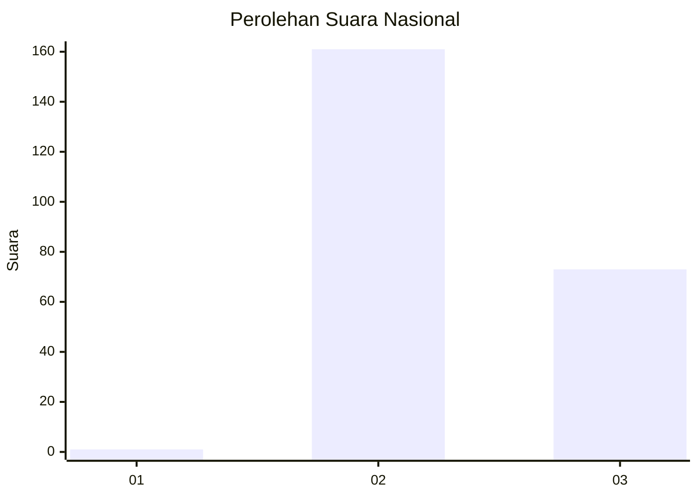
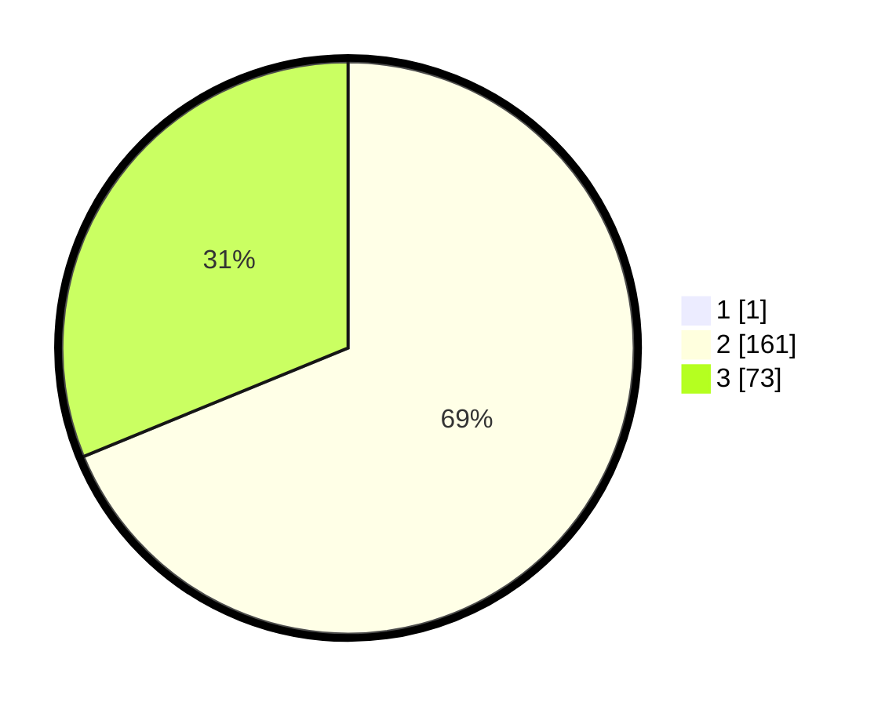

# Hasil

## Grafik

## Tabel

| No. | Nama Paslon    | Suara | Suara (raw) | Persentase |
|:--- |:-------------- | -----:| -----------:| ----------:|
| 1   | ANIES MUHAIMIN | 1     | [1][p-1]    | 0,43       |
| 2   | PRABOWO GIBRAN | 161   | [161][p-2]  | 68,51      |
| 3   | GANJAR MAHFUD  | 73    | [73][p-3]   | 31,06      |

[p-1]: https://github.com/gigit-pemilu/pemilu-2024/blob/main/pilpres/hitung-suara/sub/51-bali/sub/04-gianyar/sub/05-ubud/sub/1005-ubud/sub/021-tps/sub/paslon-1.txt
[p-2]: https://github.com/gigit-pemilu/pemilu-2024/blob/main/pilpres/hitung-suara/sub/51-bali/sub/04-gianyar/sub/05-ubud/sub/1005-ubud/sub/021-tps/sub/paslon-2.txt
[p-3]: https://github.com/gigit-pemilu/pemilu-2024/blob/main/pilpres/hitung-suara/sub/51-bali/sub/04-gianyar/sub/05-ubud/sub/1005-ubud/sub/021-tps/sub/paslon-3.txt

## Foto C Plano

https://sirekap-obj-formc.kpu.go.id/1028/pemilu/ppwp/51/04/05/10/05/5104051005021-20240215-093835--ac952f6e-0943-4e12-b586-6549f9922770.jpg

https://sirekap-obj-formc.kpu.go.id/1028/pemilu/ppwp/51/04/05/10/05/5104051005021-20240215-110309--ab4cdf18-1353-4f9a-b414-b1a2c8822b5f.jpg

https://sirekap-obj-formc.kpu.go.id/1028/pemilu/ppwp/51/04/05/10/05/5104051005021-20240215-093956--174419a8-59e1-4c3d-bb71-9d35a27f9454.jpg

## Metadata

| Key        | Value               |
| ---------- | ------------------- |
| Time Stamp | 2024-02-15 19:30:26 |

