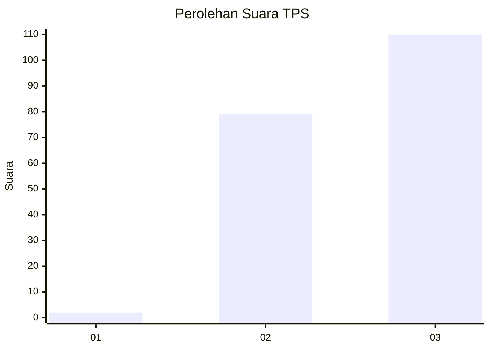
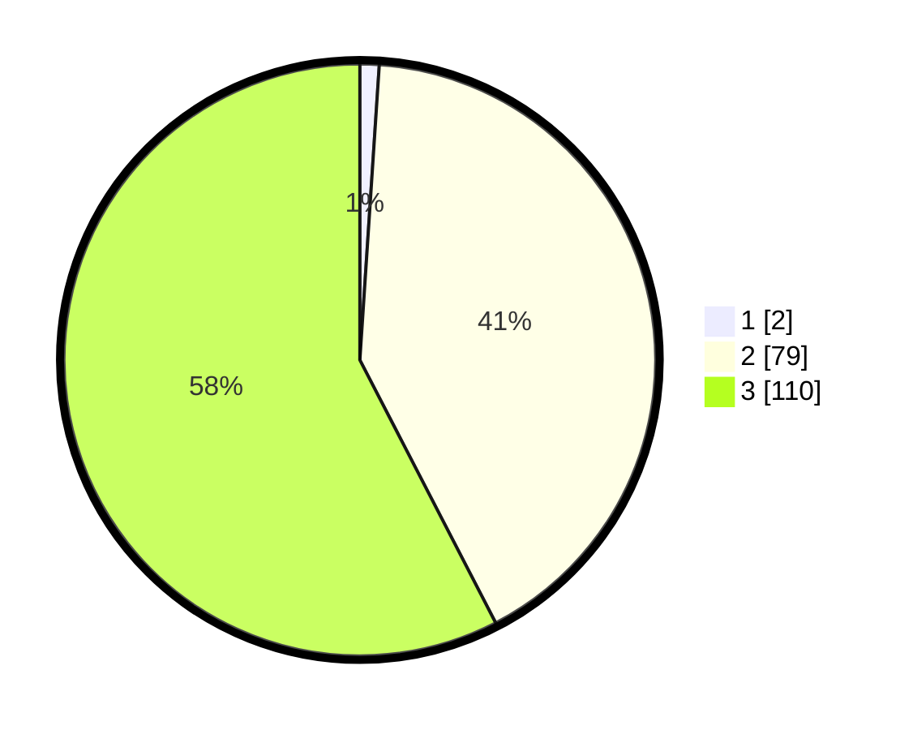

# Hasil

## Grafik

## Tabel

| No. | Nama Paslon    | Suara | Suara (raw) | Persentase |
|:--- |:-------------- | -----:| -----------:| ----------:|
| 1   | ANIES MUHAIMIN | 2     | [2][p-1]    | 1,05       |
| 2   | PRABOWO GIBRAN | 79    | [79][p-2]   | 41,36      |
| 3   | GANJAR MAHFUD  | 110   | [110][p-3]  | 57,59      |

[p-1]: https://github.com/gigit-pemilu/pemilu-2024-51-bali/blob/main/pilpres/hitung-suara/sub/51-bali/sub/04-gianyar/sub/05-ubud/sub/1005-ubud/sub/022-tps/sub/paslon-1.txt
[p-2]: https://github.com/gigit-pemilu/pemilu-2024-51-bali/blob/main/pilpres/hitung-suara/sub/51-bali/sub/04-gianyar/sub/05-ubud/sub/1005-ubud/sub/022-tps/sub/paslon-2.txt
[p-3]: https://github.com/gigit-pemilu/pemilu-2024-51-bali/blob/main/pilpres/hitung-suara/sub/51-bali/sub/04-gianyar/sub/05-ubud/sub/1005-ubud/sub/022-tps/sub/paslon-3.txt

## Foto C Plano

https://sirekap-obj-formc.kpu.go.id/b91a/pemilu/ppwp/51/04/05/10/05/5104051005022-20240214-202809--fcbf8a6d-f0c9-42bc-9aa4-cf0b65265c4e.jpg

https://sirekap-obj-formc.kpu.go.id/b91a/pemilu/ppwp/51/04/05/10/05/5104051005022-20240214-202929--32a40164-4a99-4043-a033-96986105d0ca.jpg

https://sirekap-obj-formc.kpu.go.id/b91a/pemilu/ppwp/51/04/05/10/05/5104051005022-20240214-203152--44806d29-6e9f-4a92-ab22-882bdbceee15.jpg

## Metadata

| Key        | Value               |
| ---------- | ------------------- |
| Time Stamp | 2024-02-15 15:00:29 |

