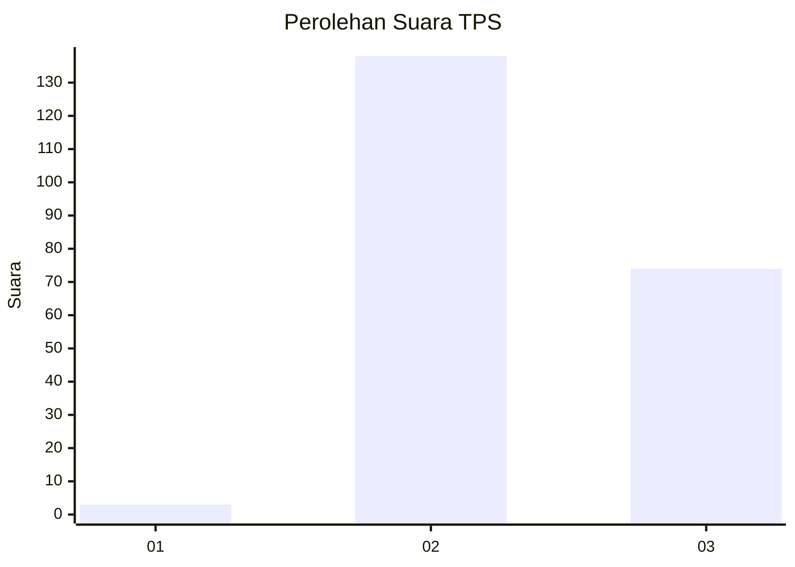
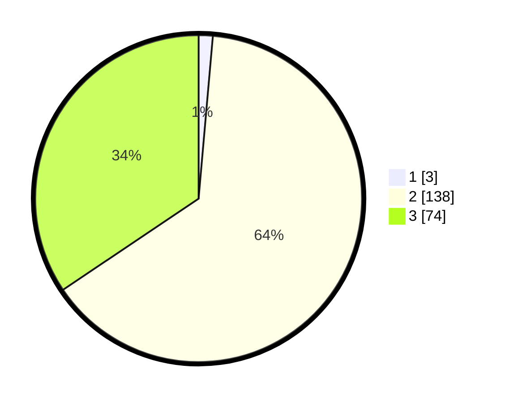

# Hasil

## Grafik

## Tabel

| No. | Nama Paslon    | Suara | Suara (raw) | Persentase |
|:--- |:-------------- | -----:| -----------:| ----------:|
| 1   | ANIES MUHAIMIN | 3     | [3][p-1]    | 1,40       |
| 2   | PRABOWO GIBRAN | 138   | [138][p-2]  | 64,19      |
| 3   | GANJAR MAHFUD  | 74    | [74][p-3]   | 34,42      |

[p-1]: https://github.com/gigit-pemilu/pemilu-2024-51-bali/blob/main/pilpres/hitung-suara/sub/51-bali/sub/04-gianyar/sub/05-ubud/sub/1005-ubud/sub/028-tps/sub/paslon-1.txt
[p-2]: https://github.com/gigit-pemilu/pemilu-2024-51-bali/blob/main/pilpres/hitung-suara/sub/51-bali/sub/04-gianyar/sub/05-ubud/sub/1005-ubud/sub/028-tps/sub/paslon-2.txt
[p-3]: https://github.com/gigit-pemilu/pemilu-2024-51-bali/blob/main/pilpres/hitung-suara/sub/51-bali/sub/04-gianyar/sub/05-ubud/sub/1005-ubud/sub/028-tps/sub/paslon-3.txt

## Foto C Plano

https://sirekap-obj-formc.kpu.go.id/6053/pemilu/ppwp/51/04/05/10/05/5104051005028-20240215-075850--a4b88cc4-2f51-4495-bd44-d193b258a6ec.jpg

https://sirekap-obj-formc.kpu.go.id/6053/pemilu/ppwp/51/04/05/10/05/5104051005028-20240215-085219--e71e91ff-5021-4f11-8c26-4db361a329a3.jpg

https://sirekap-obj-formc.kpu.go.id/6053/pemilu/ppwp/51/04/05/10/05/5104051005028-20240215-080134--5ed70e5f-a226-4aee-a737-5fe6b576255d.jpg

## Metadata

| Key        | Value               |
| ---------- | ------------------- |
| Time Stamp | 2024-02-15 15:00:29 |

