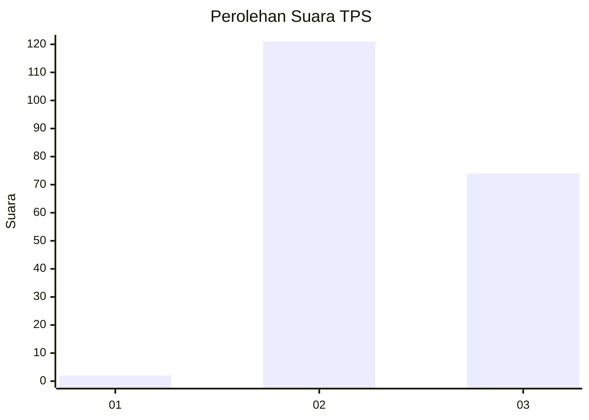
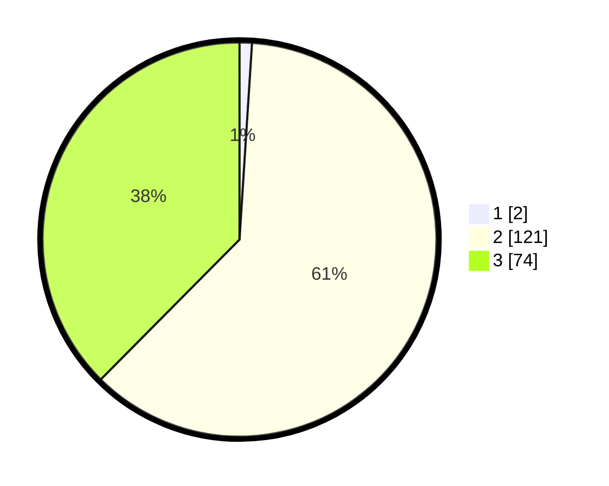

# Hasil

## Grafik

## Tabel

| No. | Nama Paslon    | Suara | Suara (raw) | Persentase |
|:--- |:-------------- | -----:| -----------:| ----------:|
| 1   | ANIES MUHAIMIN | 2     | [2][p-1]    | 1,02       |
| 2   | PRABOWO GIBRAN | 121   | [121][p-2]  | 61,42      |
| 3   | GANJAR MAHFUD  | 74    | [74][p-3]   | 37,56      |

[p-1]: https://github.com/gigit-pemilu/pemilu-2024-51-bali/blob/main/pilpres/hitung-suara/sub/51-bali/sub/04-gianyar/sub/05-ubud/sub/1005-ubud/sub/031-tps/sub/paslon-1.txt
[p-2]: https://github.com/gigit-pemilu/pemilu-2024-51-bali/blob/main/pilpres/hitung-suara/sub/51-bali/sub/04-gianyar/sub/05-ubud/sub/1005-ubud/sub/031-tps/sub/paslon-2.txt
[p-3]: https://github.com/gigit-pemilu/pemilu-2024-51-bali/blob/main/pilpres/hitung-suara/sub/51-bali/sub/04-gianyar/sub/05-ubud/sub/1005-ubud/sub/031-tps/sub/paslon-3.txt

## Foto C Plano

https://sirekap-obj-formc.kpu.go.id/9fdc/pemilu/ppwp/51/04/05/10/05/5104051005031-20240214-195037--a40b738f-d3b9-4df9-a445-657ddf92a998.jpg

https://sirekap-obj-formc.kpu.go.id/9fdc/pemilu/ppwp/51/04/05/10/05/5104051005031-20240214-195041--b8cee72c-4a56-4792-b845-32c436dde43e.jpg

https://sirekap-obj-formc.kpu.go.id/9fdc/pemilu/ppwp/51/04/05/10/05/5104051005031-20240214-195046--68771df4-d306-42cf-91bd-0a8468312b8f.jpg

## Metadata

| Key        | Value               |
| ---------- | ------------------- |
| Time Stamp | 2024-02-15 15:00:29 |

