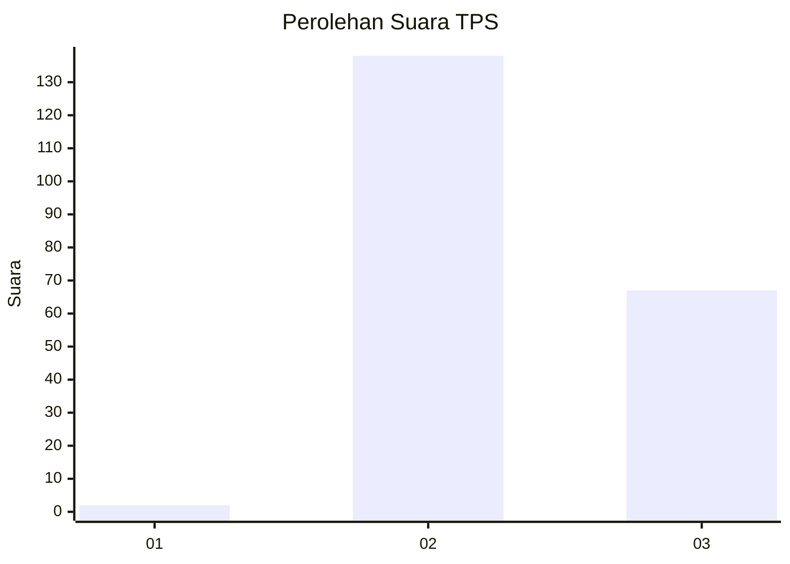
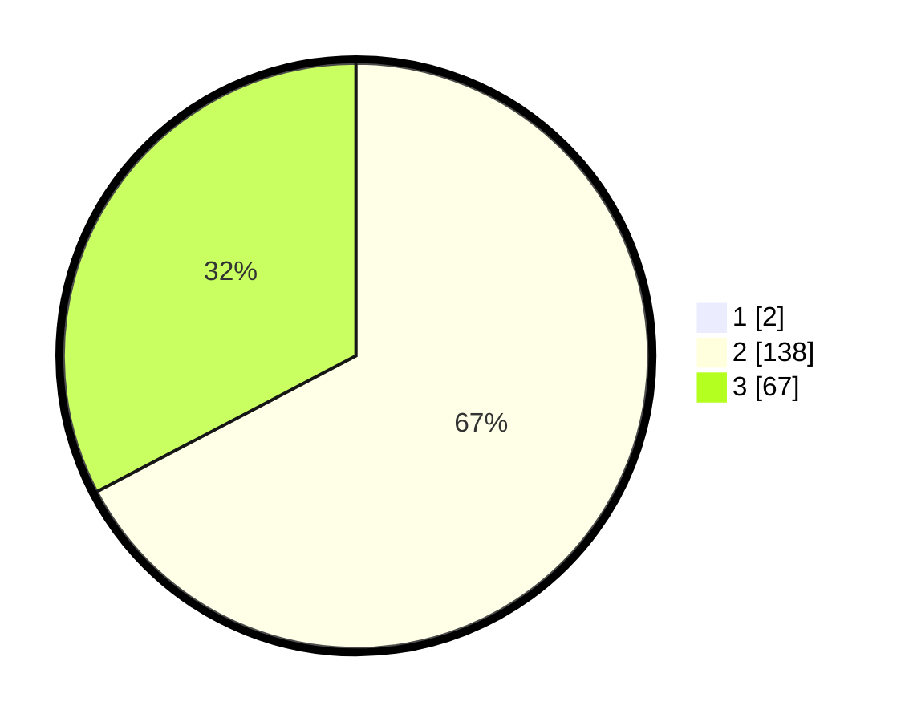

# Hasil

## Grafik

## Tabel

| No. | Nama Paslon    | Suara | Suara (raw) | Persentase |
|:--- |:-------------- | -----:| -----------:| ----------:|
| 1   | ANIES MUHAIMIN | 2     | [2][p-1]    | 0,97       |
| 2   | PRABOWO GIBRAN | 138   | [138][p-2]  | 66,67      |
| 3   | GANJAR MAHFUD  | 67    | [67][p-3]   | 32,37      |

[p-1]: https://github.com/gigit-pemilu/pemilu-2024-51-bali/blob/main/pilpres/hitung-suara/sub/51-bali/sub/04-gianyar/sub/05-ubud/sub/1005-ubud/sub/034-tps/sub/paslon-1.txt
[p-2]: https://github.com/gigit-pemilu/pemilu-2024-51-bali/blob/main/pilpres/hitung-suara/sub/51-bali/sub/04-gianyar/sub/05-ubud/sub/1005-ubud/sub/034-tps/sub/paslon-2.txt
[p-3]: https://github.com/gigit-pemilu/pemilu-2024-51-bali/blob/main/pilpres/hitung-suara/sub/51-bali/sub/04-gianyar/sub/05-ubud/sub/1005-ubud/sub/034-tps/sub/paslon-3.txt

## Foto C Plano

https://sirekap-obj-formc.kpu.go.id/2479/pemilu/ppwp/51/04/05/10/05/5104051005034-20240214-211901--0cdd931d-449b-47b2-9c1f-93a84c47124b.jpg

https://sirekap-obj-formc.kpu.go.id/2479/pemilu/ppwp/51/04/05/10/05/5104051005034-20240214-211956--8ac617a5-8061-4811-bc17-7fab7a833322.jpg

https://sirekap-obj-formc.kpu.go.id/2479/pemilu/ppwp/51/04/05/10/05/5104051005034-20240214-212052--3b088326-e12e-4c8d-9477-1993ff6a2f15.jpg

## Metadata

| Key        | Value               |
| ---------- | ------------------- |
| Time Stamp | 2024-02-15 15:00:29 |

