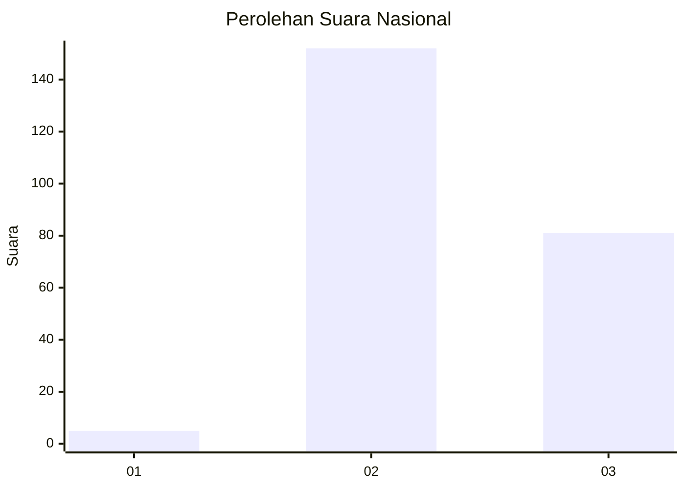
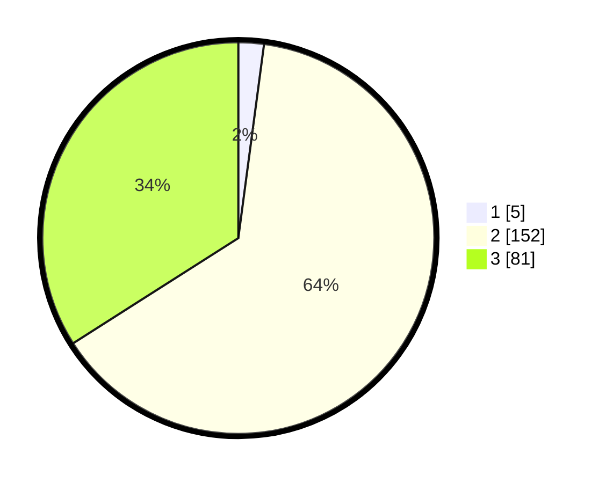

# Hasil

## Grafik

## Tabel

| No. | Nama Paslon    | Suara | Suara (raw) | Persentase |
|:--- |:-------------- | -----:| -----------:| ----------:|
| 1   | ANIES MUHAIMIN | 5     | [5][p-1]    | 2,10       |
| 2   | PRABOWO GIBRAN | 152   | [152][p-2]  | 63,87      |
| 3   | GANJAR MAHFUD  | 81    | [81][p-3]   | 34,03      |

[p-1]: https://github.com/gigit-pemilu/pemilu-2024/blob/main/pilpres/hitung-suara/sub/51-bali/sub/04-gianyar/sub/05-ubud/sub/1005-ubud/sub/038-tps/sub/paslon-1.txt
[p-2]: https://github.com/gigit-pemilu/pemilu-2024/blob/main/pilpres/hitung-suara/sub/51-bali/sub/04-gianyar/sub/05-ubud/sub/1005-ubud/sub/038-tps/sub/paslon-2.txt
[p-3]: https://github.com/gigit-pemilu/pemilu-2024/blob/main/pilpres/hitung-suara/sub/51-bali/sub/04-gianyar/sub/05-ubud/sub/1005-ubud/sub/038-tps/sub/paslon-3.txt

## Foto C Plano

https://sirekap-obj-formc.kpu.go.id/00cf/pemilu/ppwp/51/04/05/10/05/5104051005038-20240215-095913--543b88a5-9026-47bc-9e4c-d71ed25737a6.jpg

https://sirekap-obj-formc.kpu.go.id/00cf/pemilu/ppwp/51/04/05/10/05/5104051005038-20240215-100041--bd0d50fd-e742-4bf4-a1e8-6f77277a2560.jpg

https://sirekap-obj-formc.kpu.go.id/00cf/pemilu/ppwp/51/04/05/10/05/5104051005038-20240214-204534--deec1340-c95d-4d4d-a2c4-e054b0ee9872.jpg

## Metadata

| Key        | Value               |
| ---------- | ------------------- |
| Time Stamp | 2024-02-15 15:00:29 |

