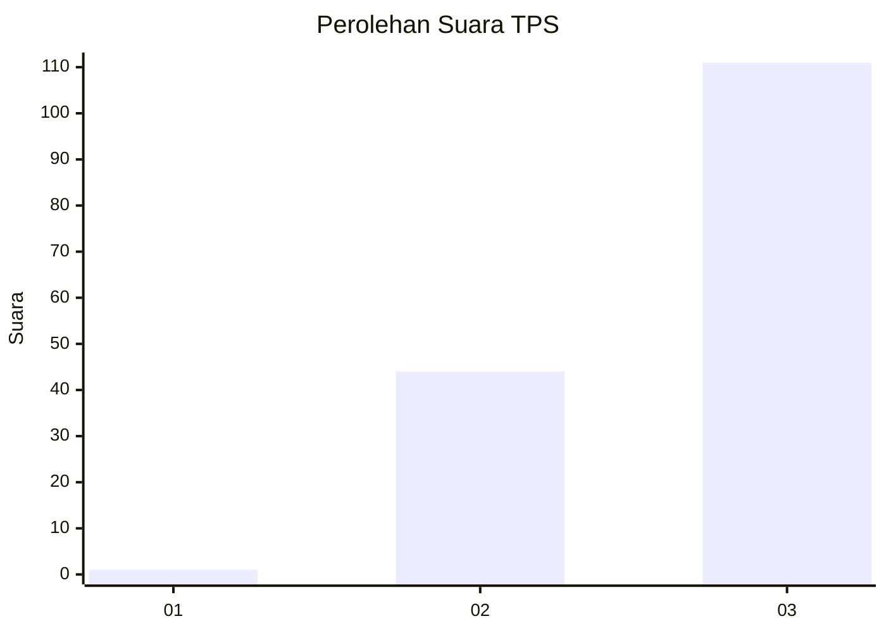
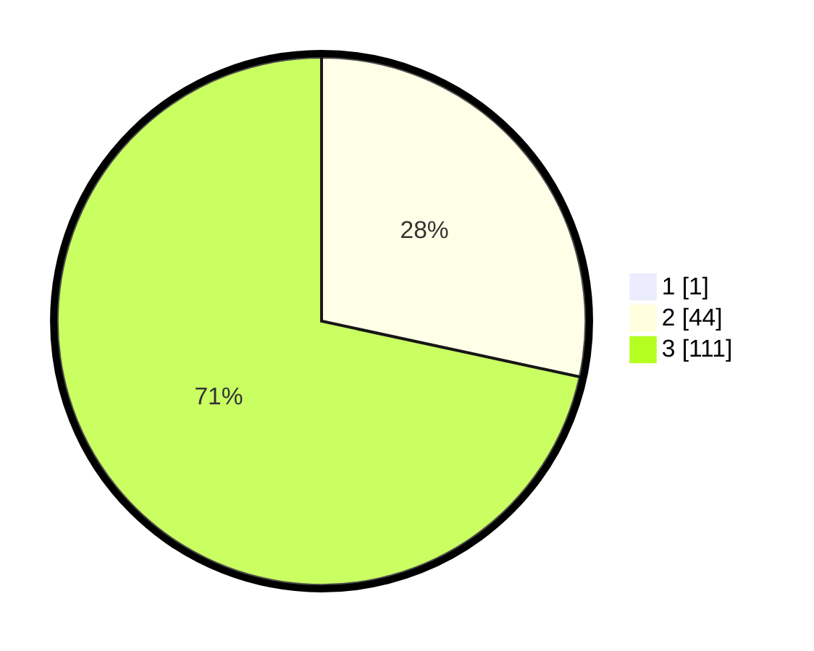

# Hasil

## Grafik

## Tabel

| No. | Nama Paslon    | Suara | Suara (raw) | Persentase |
|:--- |:-------------- | -----:| -----------:| ----------:|
| 1   | ANIES MUHAIMIN | 1     | [1][p-1]    | 0,64       |
| 2   | PRABOWO GIBRAN | 44    | [44][p-2]   | 28,21      |
| 3   | GANJAR MAHFUD  | 111   | [111][p-3]  | 71,15      |

[p-1]: https://github.com/gigit-pemilu/pemilu-2024-51-bali/blob/main/pilpres/hitung-suara/sub/51-bali/sub/04-gianyar/sub/05-ubud/sub/2001-lodtunduh/sub/006-tps/sub/paslon-1.txt
[p-2]: https://github.com/gigit-pemilu/pemilu-2024-51-bali/blob/main/pilpres/hitung-suara/sub/51-bali/sub/04-gianyar/sub/05-ubud/sub/2001-lodtunduh/sub/006-tps/sub/paslon-2.txt
[p-3]: https://github.com/gigit-pemilu/pemilu-2024-51-bali/blob/main/pilpres/hitung-suara/sub/51-bali/sub/04-gianyar/sub/05-ubud/sub/2001-lodtunduh/sub/006-tps/sub/paslon-3.txt

## Foto C Plano

https://sirekap-obj-formc.kpu.go.id/eb02/pemilu/ppwp/51/04/05/20/01/5104052001006-20240214-195858--529dc6f9-8c94-4bbe-b602-cc5a3c9eeb18.jpg

https://sirekap-obj-formc.kpu.go.id/eb02/pemilu/ppwp/51/04/05/20/01/5104052001006-20240214-200536--4465dbe8-f43c-4bcf-b748-10fa09355b13.jpg

## Metadata

| Key        | Value               |
| ---------- | ------------------- |
| Time Stamp | 2024-02-15 15:00:29 |

