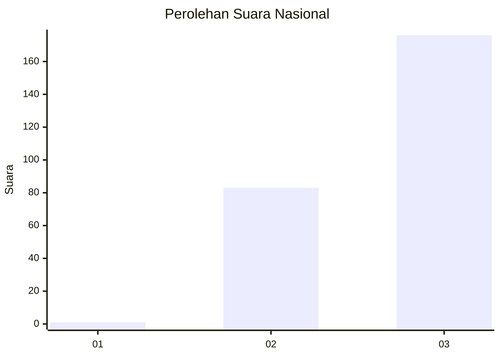
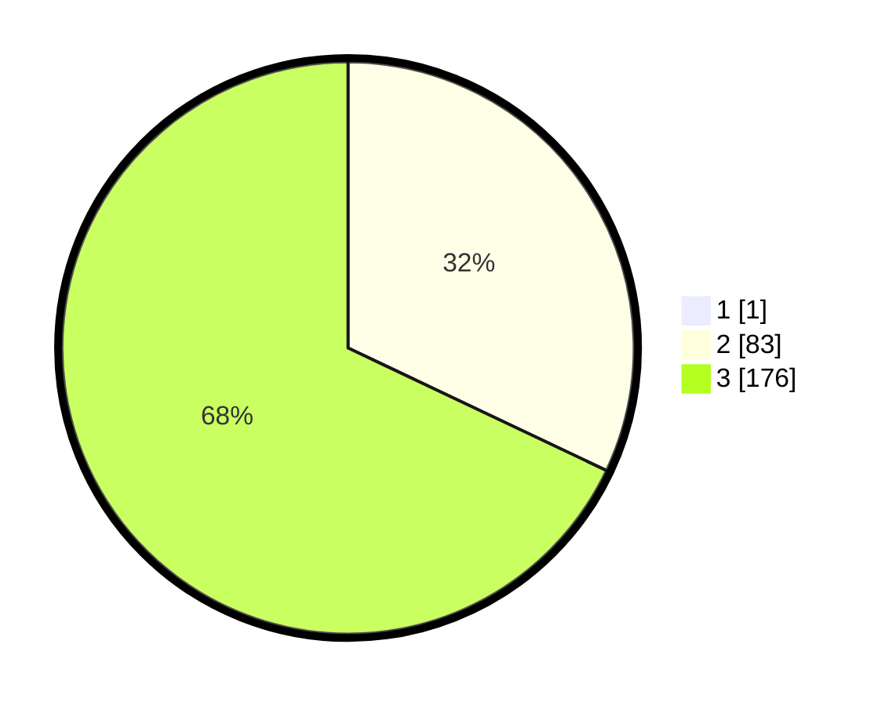

# Hasil

## Grafik

## Tabel

| No. | Nama Paslon    | Suara | Suara (raw) | Persentase |
|:--- |:-------------- | -----:| -----------:| ----------:|
| 1   | ANIES MUHAIMIN | 1     | [1][p-1]    | 0,38       |
| 2   | PRABOWO GIBRAN | 83    | [83][p-2]   | 31,92      |
| 3   | GANJAR MAHFUD  | 176   | [176][p-3]  | 67,69      |

[p-1]: https://github.com/gigit-pemilu/pemilu-2024/blob/main/pilpres/hitung-suara/sub/51-bali/sub/04-gianyar/sub/05-ubud/sub/2001-lodtunduh/sub/010-tps/sub/paslon-1.txt
[p-2]: https://github.com/gigit-pemilu/pemilu-2024/blob/main/pilpres/hitung-suara/sub/51-bali/sub/04-gianyar/sub/05-ubud/sub/2001-lodtunduh/sub/010-tps/sub/paslon-2.txt
[p-3]: https://github.com/gigit-pemilu/pemilu-2024/blob/main/pilpres/hitung-suara/sub/51-bali/sub/04-gianyar/sub/05-ubud/sub/2001-lodtunduh/sub/010-tps/sub/paslon-3.txt

## Foto C Plano

https://sirekap-obj-formc.kpu.go.id/0d5c/pemilu/ppwp/51/04/05/20/01/5104052001010-20240214-204012--afd10df3-6b21-409c-a279-a3aad794d721.jpg

https://sirekap-obj-formc.kpu.go.id/0d5c/pemilu/ppwp/51/04/05/20/01/5104052001010-20240214-201134--7a91b846-9ce3-4dbd-8420-bb0811114ef6.jpg

## Metadata

| Key        | Value               |
| ---------- | ------------------- |
| Time Stamp | 2024-02-15 15:00:29 |

