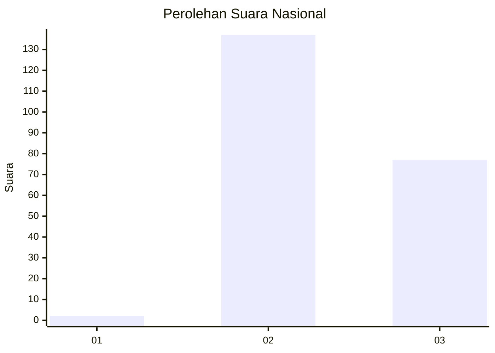
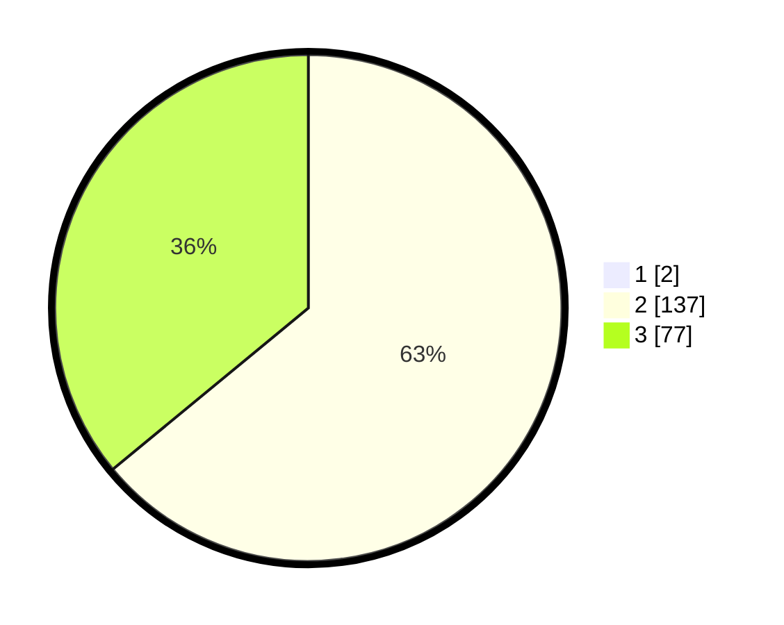

# Hasil

## Grafik

## Tabel

| No. | Nama Paslon    | Suara | Suara (raw) | Persentase |
|:--- |:-------------- | -----:| -----------:| ----------:|
| 1   | ANIES MUHAIMIN | 2     | [2][p-1]    | 0,93       |
| 2   | PRABOWO GIBRAN | 137   | [137][p-2]  | 63,43      |
| 3   | GANJAR MAHFUD  | 77    | [77][p-3]   | 35,65      |

[p-1]: https://github.com/gigit-pemilu/pemilu-2024/blob/main/pilpres/hitung-suara/sub/51-bali/sub/04-gianyar/sub/05-ubud/sub/2001-lodtunduh/sub/017-tps/sub/paslon-1.txt
[p-2]: https://github.com/gigit-pemilu/pemilu-2024/blob/main/pilpres/hitung-suara/sub/51-bali/sub/04-gianyar/sub/05-ubud/sub/2001-lodtunduh/sub/017-tps/sub/paslon-2.txt
[p-3]: https://github.com/gigit-pemilu/pemilu-2024/blob/main/pilpres/hitung-suara/sub/51-bali/sub/04-gianyar/sub/05-ubud/sub/2001-lodtunduh/sub/017-tps/sub/paslon-3.txt

## Foto C Plano

https://sirekap-obj-formc.kpu.go.id/880c/pemilu/ppwp/51/04/05/20/01/5104052001017-20240215-052718--9ce0a04f-7952-4fe2-b63f-a9d87826d408.jpg

https://sirekap-obj-formc.kpu.go.id/880c/pemilu/ppwp/51/04/05/20/01/5104052001017-20240215-052726--1b7526fb-5d8f-49c9-9e01-a416b04cc5c3.jpg

https://sirekap-obj-formc.kpu.go.id/880c/pemilu/ppwp/51/04/05/20/01/5104052001017-20240215-052734--eba66f78-40fb-4c2f-93c9-45a26c6ef84d.jpg

## Metadata

| Key        | Value               |
| ---------- | ------------------- |
| Time Stamp | 2024-02-15 17:30:25 |

## DATA PEMILIH TETAP

Jumlah pemilih dalam DPT: **775**.
 * L: **244**.
 * P: **9**.

## DATA PENGGUNA HAK PILIH

Jumlah pengguna hak pilih dalam DPT: **255**.
 * L: **161**.
 * P: **700**.

Jumlah pengguna hak pilih dalam DPTb: **222**.
 * L: **100**.
 * P: **0**.

Jumlah pengguna hak pilih dalam DPK: **0**.
 * L: **0**.
 * P: **0**.

Jumlah pengguna hak pilih: **500**.
 * L: **0**.
 * P: **0**.

## JUMLAH SUARA SAH DAN TIDAK SAH

JUMLAH SELURUH SUARA SAH: **216**.

JUMLAH SUARA TIDAK SAH: **7**.

JUMLAH SELURUH SUARA SAH DAN SUARA TIDAK SAH: **223**.

