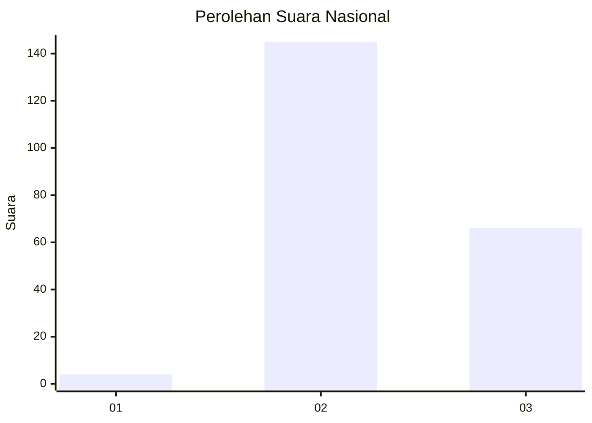
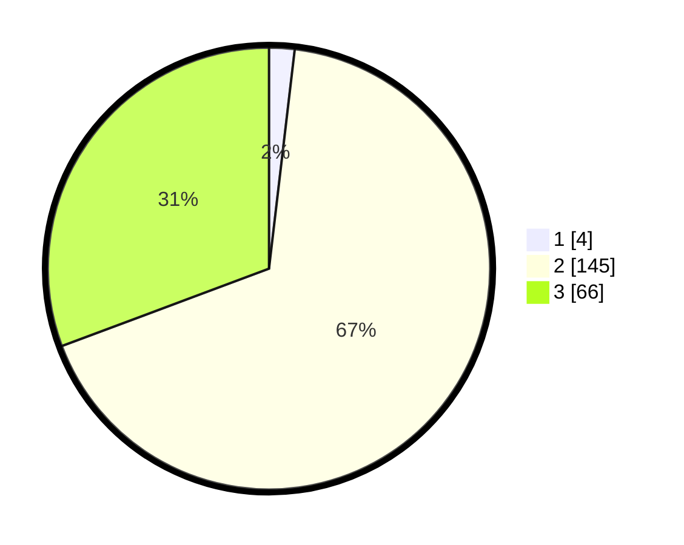

# Hasil

## Grafik

## Tabel

| No. | Nama Paslon    | Suara | Suara (raw) | Persentase |
|:--- |:-------------- | -----:| -----------:| ----------:|
| 1   | ANIES MUHAIMIN | 4     | [4][p-1]    | 1,86       |
| 2   | PRABOWO GIBRAN | 145   | [145][p-2]  | 67,44      |
| 3   | GANJAR MAHFUD  | 66    | [66][p-3]   | 30,70      |

[p-1]: https://github.com/gigit-pemilu/pemilu-2024/blob/main/pilpres/hitung-suara/sub/51-bali/sub/04-gianyar/sub/05-ubud/sub/2001-lodtunduh/sub/018-tps/sub/paslon-1.txt
[p-2]: https://github.com/gigit-pemilu/pemilu-2024/blob/main/pilpres/hitung-suara/sub/51-bali/sub/04-gianyar/sub/05-ubud/sub/2001-lodtunduh/sub/018-tps/sub/paslon-2.txt
[p-3]: https://github.com/gigit-pemilu/pemilu-2024/blob/main/pilpres/hitung-suara/sub/51-bali/sub/04-gianyar/sub/05-ubud/sub/2001-lodtunduh/sub/018-tps/sub/paslon-3.txt

## Foto C Plano

https://sirekap-obj-formc.kpu.go.id/c49c/pemilu/ppwp/51/04/05/20/01/5104052001018-20240215-121851--7124dd2e-8430-454e-baa0-75e7d83e3aef.jpg

https://sirekap-obj-formc.kpu.go.id/c49c/pemilu/ppwp/51/04/05/20/01/5104052001018-20240215-122222--0e744ad5-d1ac-44d2-bb9f-4636c634e4e9.jpg

## Metadata

| Key        | Value               |
| ---------- | ------------------- |
| Time Stamp | 2024-02-15 15:00:29 |

