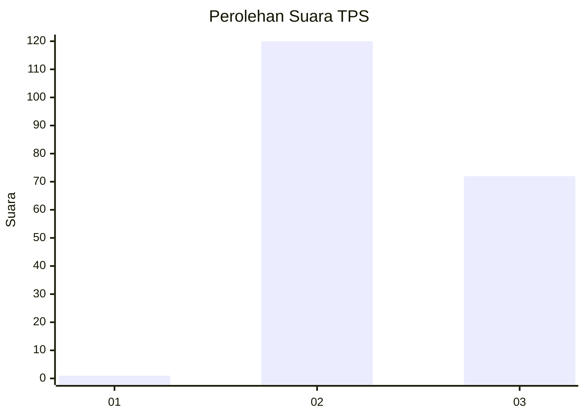
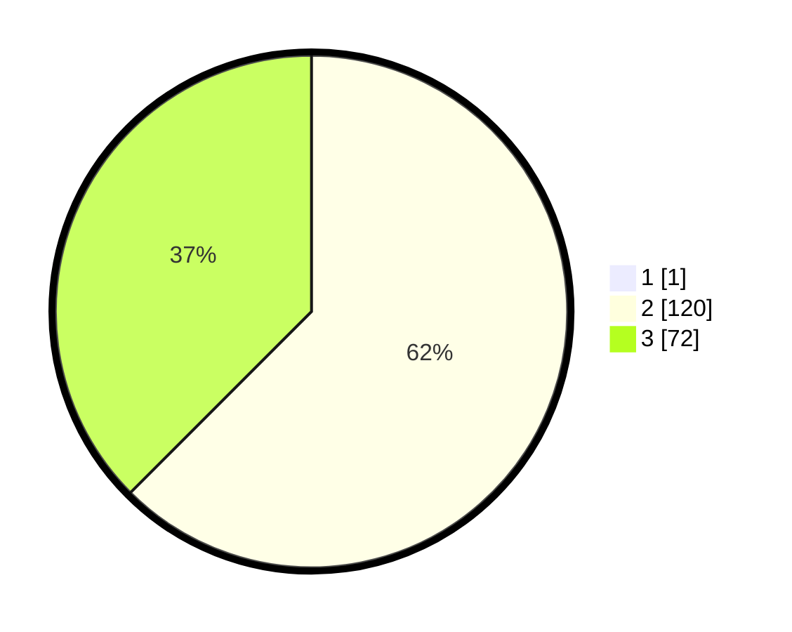

# Hasil

## Grafik

## Tabel

| No. | Nama Paslon    | Suara | Suara (raw) | Persentase |
|:--- |:-------------- | -----:| -----------:| ----------:|
| 1   | ANIES MUHAIMIN | 1     | [1][p-1]    | 0,52       |
| 2   | PRABOWO GIBRAN | 120   | [120][p-2]  | 62,18      |
| 3   | GANJAR MAHFUD  | 72    | [72][p-3]   | 37,31      |

[p-1]: https://github.com/gigit-pemilu/pemilu-2024-51-bali/blob/main/pilpres/hitung-suara/sub/51-bali/sub/04-gianyar/sub/05-ubud/sub/2002-mas/sub/004-tps/sub/paslon-1.txt
[p-2]: https://github.com/gigit-pemilu/pemilu-2024-51-bali/blob/main/pilpres/hitung-suara/sub/51-bali/sub/04-gianyar/sub/05-ubud/sub/2002-mas/sub/004-tps/sub/paslon-2.txt
[p-3]: https://github.com/gigit-pemilu/pemilu-2024-51-bali/blob/main/pilpres/hitung-suara/sub/51-bali/sub/04-gianyar/sub/05-ubud/sub/2002-mas/sub/004-tps/sub/paslon-3.txt

## Foto C Plano

https://sirekap-obj-formc.kpu.go.id/378f/pemilu/ppwp/51/04/05/20/02/5104052002004-20240214-230034--bd6ebf40-ed7c-4a3e-a44a-f018ef898949.jpg

https://sirekap-obj-formc.kpu.go.id/378f/pemilu/ppwp/51/04/05/20/02/5104052002004-20240214-230329--9a1061d6-4bbb-4a2a-a490-932e6f8aaaed.jpg

https://sirekap-obj-formc.kpu.go.id/378f/pemilu/ppwp/51/04/05/20/02/5104052002004-20240214-230435--2113556e-3fcb-4983-8220-90d491160251.jpg

## Metadata

| Key        | Value               |
| ---------- | ------------------- |
| Time Stamp | 2024-02-15 15:00:29 |

