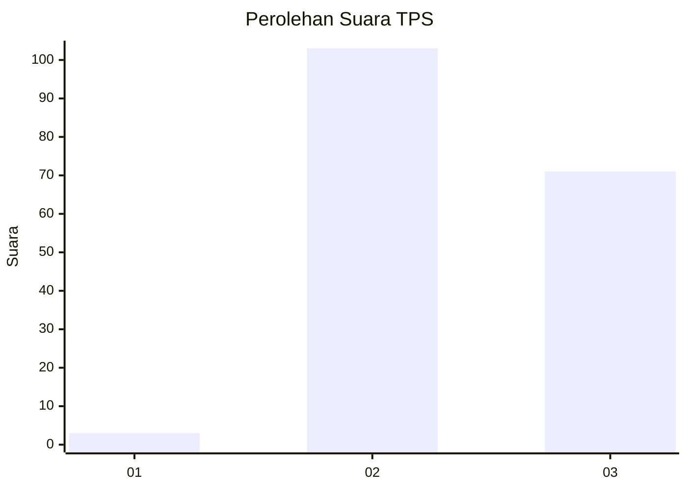
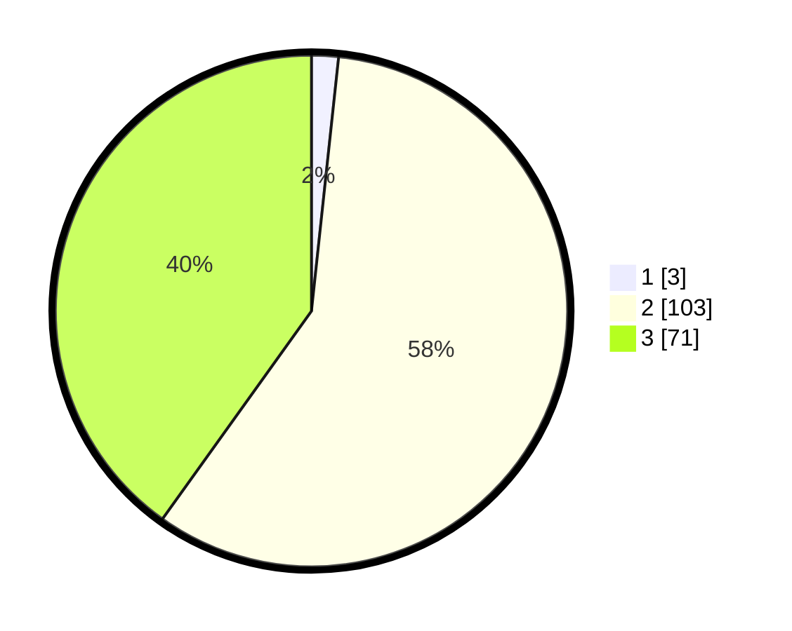

# Hasil

## Grafik

## Tabel

| No. | Nama Paslon    | Suara | Suara (raw) | Persentase |
|:--- |:-------------- | -----:| -----------:| ----------:|
| 1   | ANIES MUHAIMIN | 3     | [3][p-1]    | 1,69       |
| 2   | PRABOWO GIBRAN | 103   | [103][p-2]  | 58,19      |
| 3   | GANJAR MAHFUD  | 71    | [71][p-3]   | 40,11      |

[p-1]: https://github.com/gigit-pemilu/pemilu-2024-51-bali/blob/main/pilpres/hitung-suara/sub/51-bali/sub/04-gianyar/sub/05-ubud/sub/2002-mas/sub/005-tps/sub/paslon-1.txt
[p-2]: https://github.com/gigit-pemilu/pemilu-2024-51-bali/blob/main/pilpres/hitung-suara/sub/51-bali/sub/04-gianyar/sub/05-ubud/sub/2002-mas/sub/005-tps/sub/paslon-2.txt
[p-3]: https://github.com/gigit-pemilu/pemilu-2024-51-bali/blob/main/pilpres/hitung-suara/sub/51-bali/sub/04-gianyar/sub/05-ubud/sub/2002-mas/sub/005-tps/sub/paslon-3.txt

## Foto C Plano

https://sirekap-obj-formc.kpu.go.id/293b/pemilu/ppwp/51/04/05/20/02/5104052002005-20240216-140600--93c078c0-642b-41c4-a91a-2bf99dada5b9.jpg

https://sirekap-obj-formc.kpu.go.id/293b/pemilu/ppwp/51/04/05/20/02/5104052002005-20240216-140507--1d3e8dba-2f06-40c4-9f93-7cb34b5a907e.jpg

https://sirekap-obj-formc.kpu.go.id/293b/pemilu/ppwp/51/04/05/20/02/5104052002005-20240214-231140--7e3a5086-0fc1-4d7d-827b-a54b5f794616.jpg

## Metadata

| Key        | Value               |
| ---------- | ------------------- |
| Time Stamp | 2024-02-24 22:31:28 |

