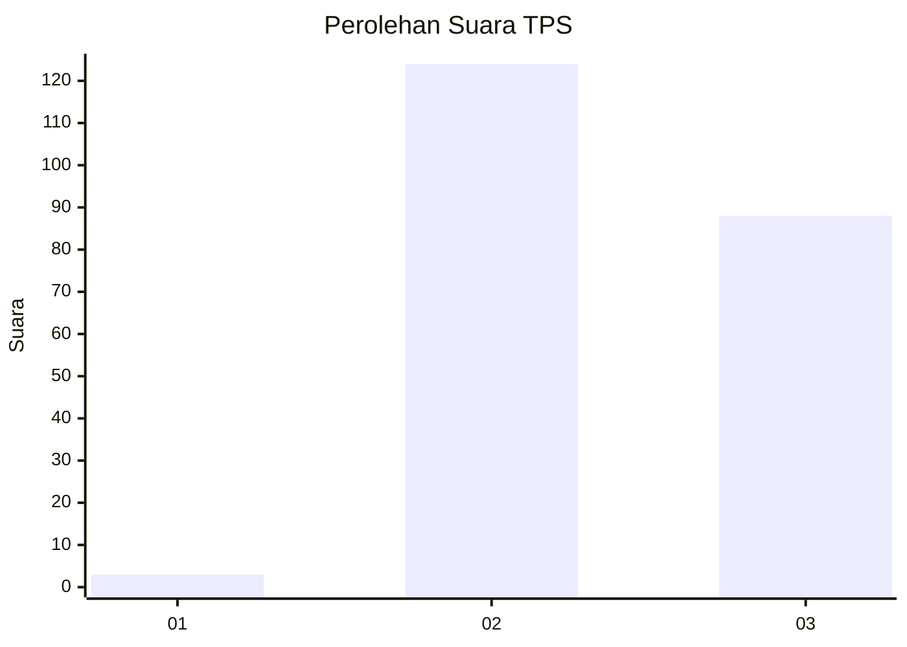
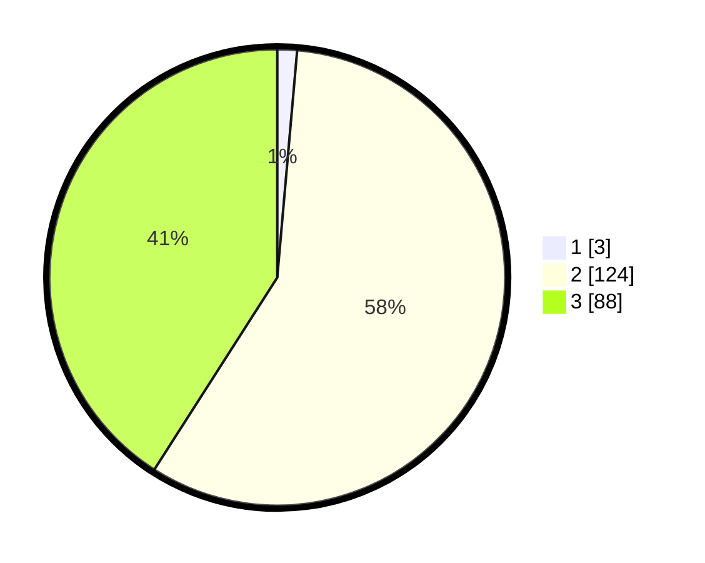

# Hasil

## Grafik

## Tabel

| No. | Nama Paslon    | Suara | Suara (raw) | Persentase |
|:--- |:-------------- | -----:| -----------:| ----------:|
| 1   | ANIES MUHAIMIN | 3     | [3][p-1]    | 1,40       |
| 2   | PRABOWO GIBRAN | 124   | [124][p-2]  | 57,67      |
| 3   | GANJAR MAHFUD  | 88    | [88][p-3]   | 40,93      |

[p-1]: https://github.com/gigit-pemilu/pemilu-2024-51-bali/blob/main/pilpres/hitung-suara/sub/51-bali/sub/04-gianyar/sub/05-ubud/sub/2002-mas/sub/010-tps/sub/paslon-1.txt
[p-2]: https://github.com/gigit-pemilu/pemilu-2024-51-bali/blob/main/pilpres/hitung-suara/sub/51-bali/sub/04-gianyar/sub/05-ubud/sub/2002-mas/sub/010-tps/sub/paslon-2.txt
[p-3]: https://github.com/gigit-pemilu/pemilu-2024-51-bali/blob/main/pilpres/hitung-suara/sub/51-bali/sub/04-gianyar/sub/05-ubud/sub/2002-mas/sub/010-tps/sub/paslon-3.txt

## Foto C Plano

https://sirekap-obj-formc.kpu.go.id/c50c/pemilu/ppwp/51/04/05/20/02/5104052002010-20240214-200229--e0190233-5a73-422f-8501-56f98f6bd71d.jpg

https://sirekap-obj-formc.kpu.go.id/c50c/pemilu/ppwp/51/04/05/20/02/5104052002010-20240214-194526--3e77e42c-b89f-4b55-9a15-8a886a25c3e4.jpg

https://sirekap-obj-formc.kpu.go.id/c50c/pemilu/ppwp/51/04/05/20/02/5104052002010-20240214-221640--a5c575c3-457b-4d7e-81c3-f62e6f2c32ab.jpg

## Metadata

| Key        | Value               |
| ---------- | ------------------- |
| Time Stamp | 2024-02-15 15:00:29 |

