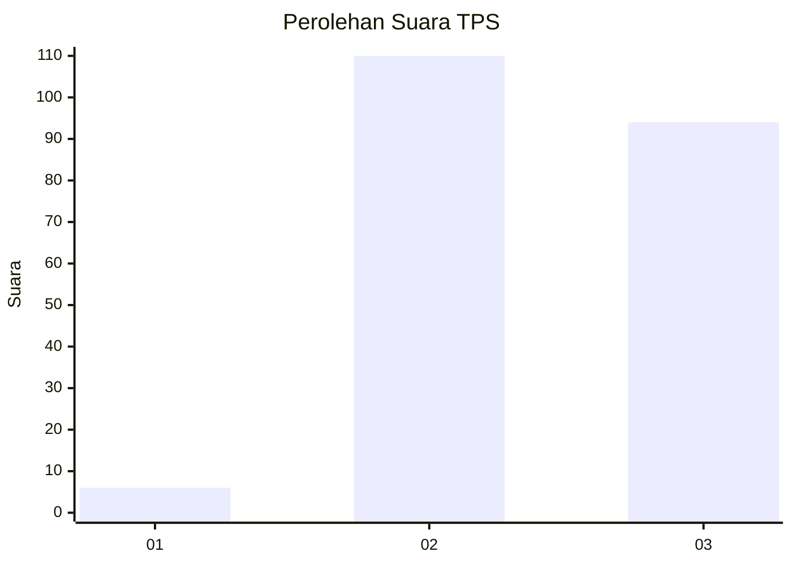
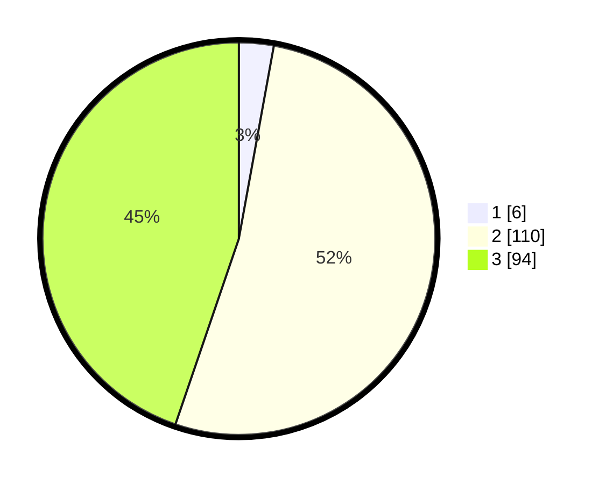

# Hasil

## Grafik

## Tabel

| No. | Nama Paslon    | Suara | Suara (raw) | Persentase |
|:--- |:-------------- | -----:| -----------:| ----------:|
| 1   | ANIES MUHAIMIN | 6     | [6][p-1]    | 2,86       |
| 2   | PRABOWO GIBRAN | 110   | [110][p-2]  | 52,38      |
| 3   | GANJAR MAHFUD  | 94    | [94][p-3]   | 44,76      |

[p-1]: https://github.com/gigit-pemilu/pemilu-2024-51-bali/blob/main/pilpres/hitung-suara/sub/51-bali/sub/04-gianyar/sub/05-ubud/sub/2002-mas/sub/013-tps/sub/paslon-1.txt
[p-2]: https://github.com/gigit-pemilu/pemilu-2024-51-bali/blob/main/pilpres/hitung-suara/sub/51-bali/sub/04-gianyar/sub/05-ubud/sub/2002-mas/sub/013-tps/sub/paslon-2.txt
[p-3]: https://github.com/gigit-pemilu/pemilu-2024-51-bali/blob/main/pilpres/hitung-suara/sub/51-bali/sub/04-gianyar/sub/05-ubud/sub/2002-mas/sub/013-tps/sub/paslon-3.txt

## Foto C Plano

https://sirekap-obj-formc.kpu.go.id/84e3/pemilu/ppwp/51/04/05/20/02/5104052002013-20240215-070639--80bcb218-0791-4c4d-a6de-9d6cae104d7d.jpg

https://sirekap-obj-formc.kpu.go.id/84e3/pemilu/ppwp/51/04/05/20/02/5104052002013-20240215-070641--76e7e213-82dd-4fc3-a7f2-cf633ece37d9.jpg

https://sirekap-obj-formc.kpu.go.id/84e3/pemilu/ppwp/51/04/05/20/02/5104052002013-20240215-070645--e9649b06-8bce-4777-834c-0936766ce5a9.jpg

## Metadata

| Key        | Value               |
| ---------- | ------------------- |
| Time Stamp | 2024-02-15 22:30:27 |

