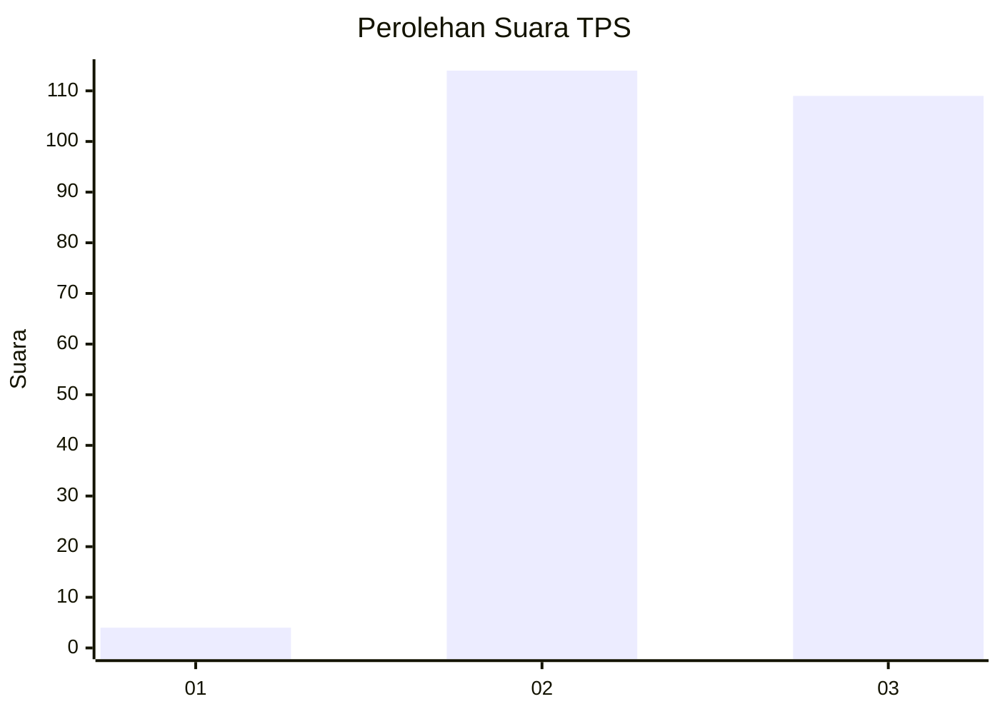
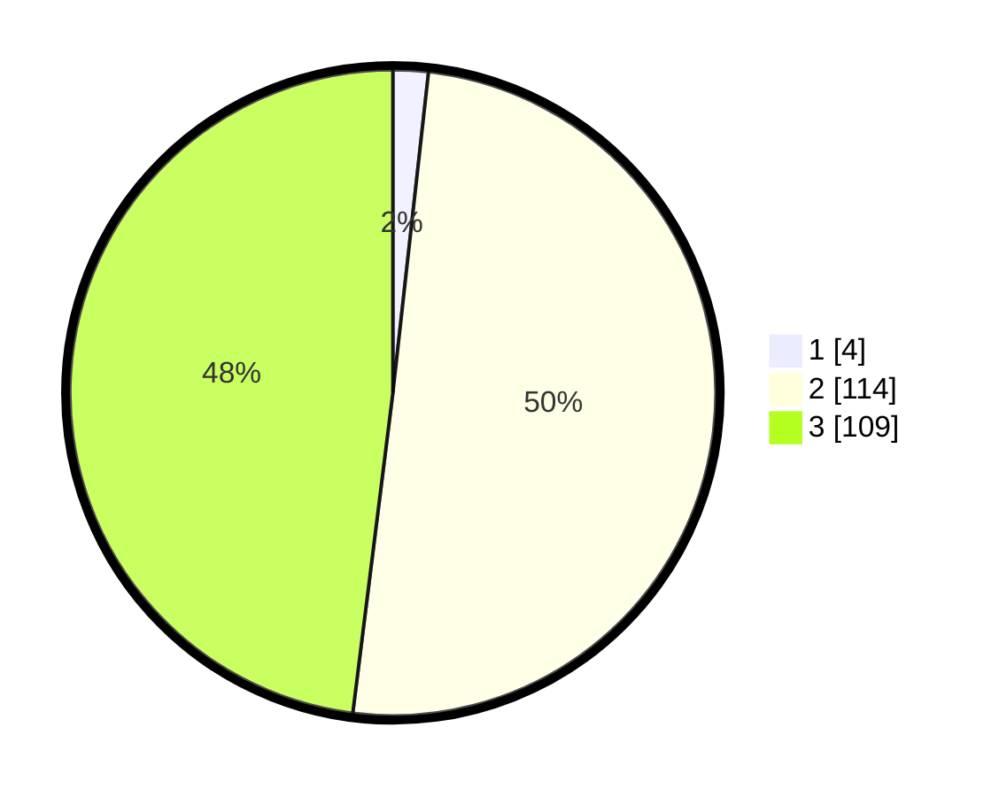

# Hasil

## Grafik

## Tabel

| No. | Nama Paslon    | Suara | Suara (raw) | Persentase |
|:--- |:-------------- | -----:| -----------:| ----------:|
| 1   | ANIES MUHAIMIN | 4     | [4][p-1]    | 1,76       |
| 2   | PRABOWO GIBRAN | 114   | [114][p-2]  | 50,22      |
| 3   | GANJAR MAHFUD  | 109   | [109][p-3]  | 48,02      |

[p-1]: https://github.com/gigit-pemilu/pemilu-2024-51-bali/blob/main/pilpres/hitung-suara/sub/51-bali/sub/04-gianyar/sub/05-ubud/sub/2002-mas/sub/028-tps/sub/paslon-1.txt
[p-2]: https://github.com/gigit-pemilu/pemilu-2024-51-bali/blob/main/pilpres/hitung-suara/sub/51-bali/sub/04-gianyar/sub/05-ubud/sub/2002-mas/sub/028-tps/sub/paslon-2.txt
[p-3]: https://github.com/gigit-pemilu/pemilu-2024-51-bali/blob/main/pilpres/hitung-suara/sub/51-bali/sub/04-gianyar/sub/05-ubud/sub/2002-mas/sub/028-tps/sub/paslon-3.txt

## Foto C Plano

https://sirekap-obj-formc.kpu.go.id/3077/pemilu/ppwp/51/04/05/20/02/5104052002028-20240214-202313--63968ae2-4401-4ec4-b73a-68552a9c85f7.jpg

https://sirekap-obj-formc.kpu.go.id/3077/pemilu/ppwp/51/04/05/20/02/5104052002028-20240214-202316--8e9f792e-a4de-4d5f-b910-ce9f4c2ab00a.jpg

https://sirekap-obj-formc.kpu.go.id/3077/pemilu/ppwp/51/04/05/20/02/5104052002028-20240214-202321--a5a98d80-f6d2-4c34-8f80-9da91404296e.jpg

## Metadata

| Key        | Value               |
| ---------- | ------------------- |
| Time Stamp | 2024-02-15 15:00:29 |

