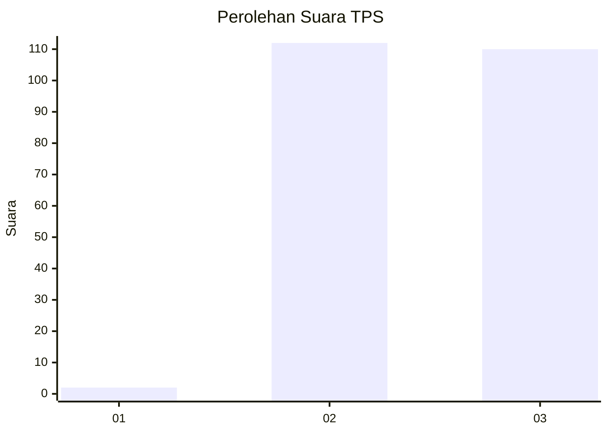
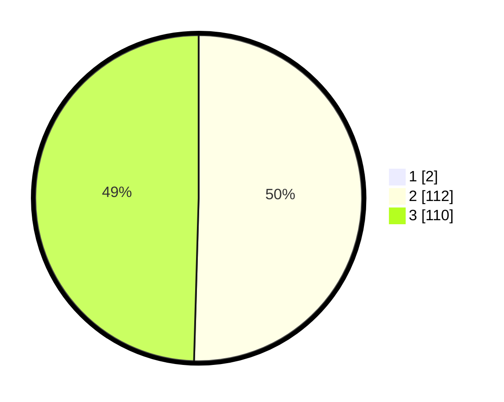

# Hasil

## Grafik

## Tabel

| No. | Nama Paslon    | Suara | Suara (raw) | Persentase |
|:--- |:-------------- | -----:| -----------:| ----------:|
| 1   | ANIES MUHAIMIN | 2     | [2][p-1]    | 0,89       |
| 2   | PRABOWO GIBRAN | 112   | [112][p-2]  | 50,00      |
| 3   | GANJAR MAHFUD  | 110   | [110][p-3]  | 49,11      |

[p-1]: https://github.com/gigit-pemilu/pemilu-2024-51-bali/blob/main/pilpres/hitung-suara/sub/51-bali/sub/04-gianyar/sub/05-ubud/sub/2003-singakerta/sub/004-tps/sub/paslon-1.txt
[p-2]: https://github.com/gigit-pemilu/pemilu-2024-51-bali/blob/main/pilpres/hitung-suara/sub/51-bali/sub/04-gianyar/sub/05-ubud/sub/2003-singakerta/sub/004-tps/sub/paslon-2.txt
[p-3]: https://github.com/gigit-pemilu/pemilu-2024-51-bali/blob/main/pilpres/hitung-suara/sub/51-bali/sub/04-gianyar/sub/05-ubud/sub/2003-singakerta/sub/004-tps/sub/paslon-3.txt

## Foto C Plano

https://sirekap-obj-formc.kpu.go.id/a2d0/pemilu/ppwp/51/04/05/20/03/5104052003004-20240214-210738--7b59f59c-efc8-4544-880b-761c867eae0f.jpg

https://sirekap-obj-formc.kpu.go.id/a2d0/pemilu/ppwp/51/04/05/20/03/5104052003004-20240214-210844--38178b4e-ffe6-4372-91a3-617325838d55.jpg

https://sirekap-obj-formc.kpu.go.id/a2d0/pemilu/ppwp/51/04/05/20/03/5104052003004-20240214-210944--6be41479-6099-44ff-9c63-7031a2a387d3.jpg

## Metadata

| Key        | Value               |
| ---------- | ------------------- |
| Time Stamp | 2024-02-15 15:00:29 |

